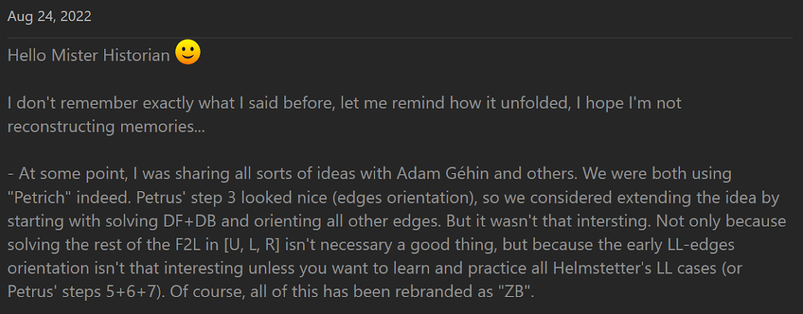
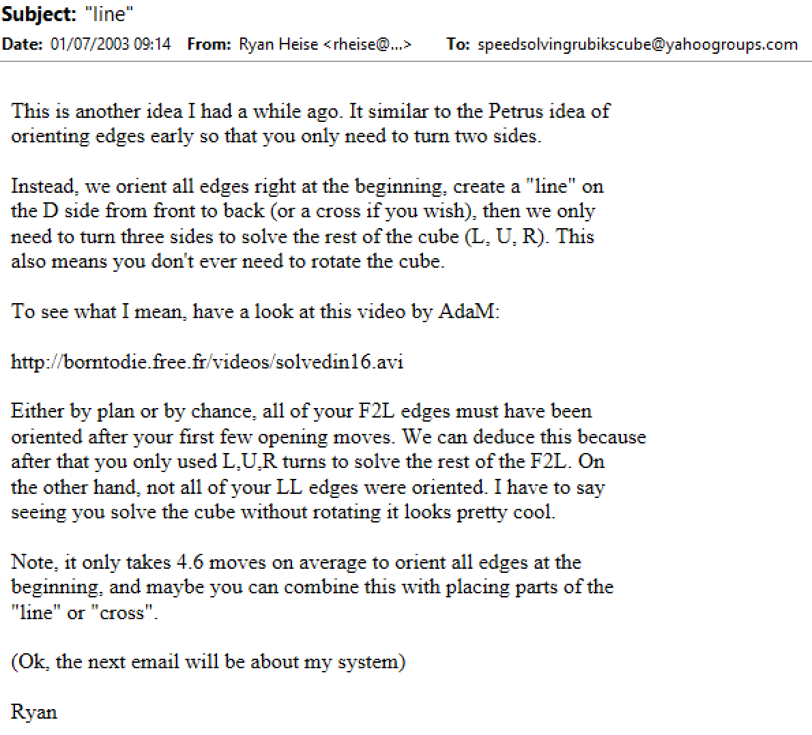
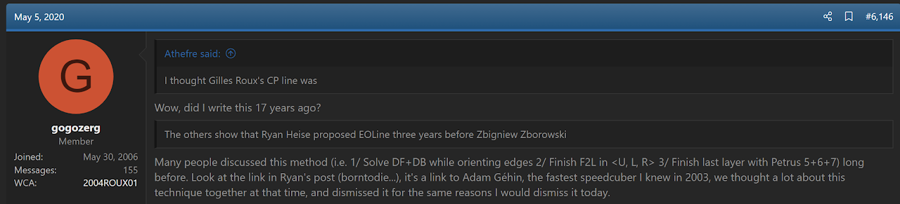
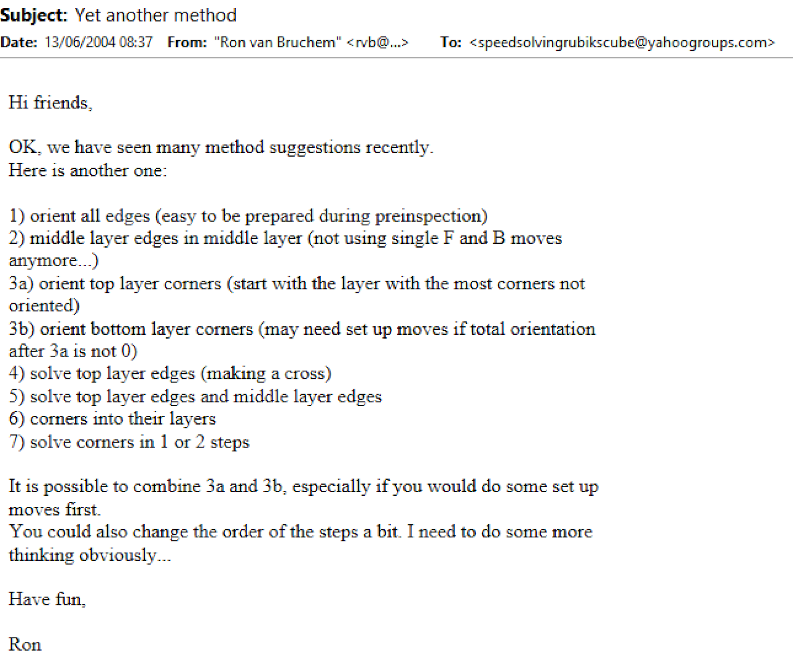
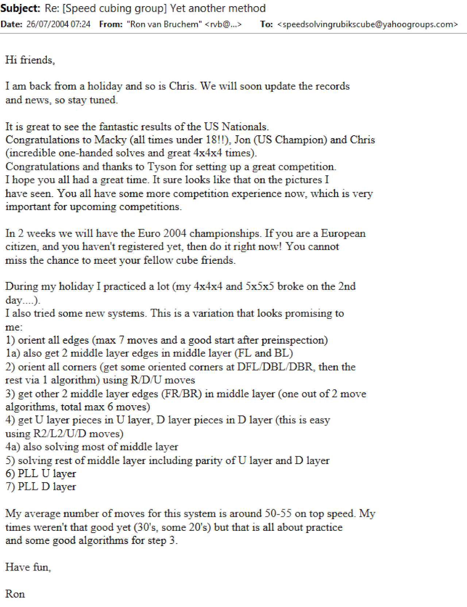
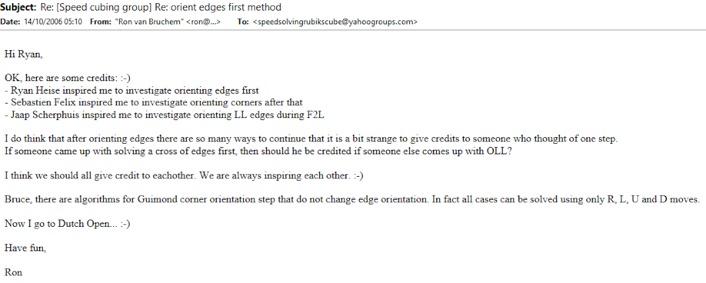
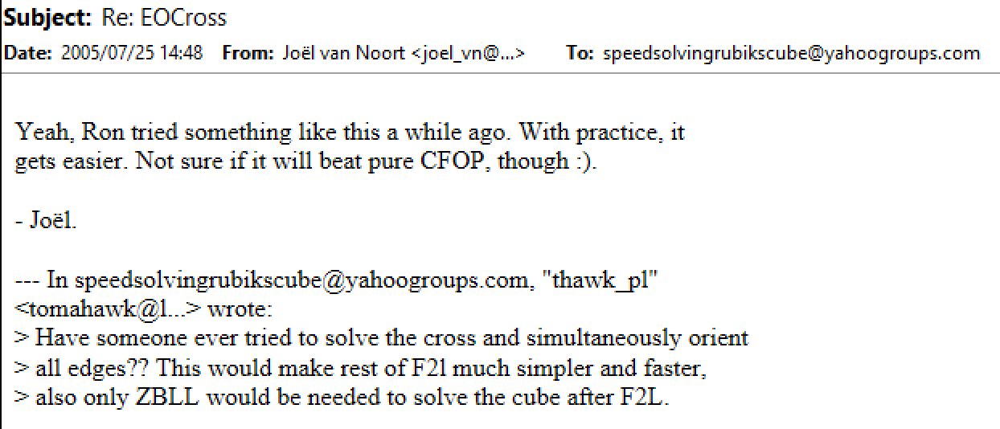

# ZZ

## Description

**Proposer:** [Zbigniew Zborowski](CubingContributors/MethodDevelopers.md#zborowski-zbigniew)

**Proposed:** 2006

**Steps:**

1. Solve the four bottom layer edges while orienting all other edges. This is commonly called EOCross.
2. Solve the four corner and edge pairs of the first two layers.
3. Solve the last layer.

[ZZ Website](https://www.zzmethod.com/)

[Click here for more step details on the SpeedSolving wiki](https://www.speedsolving.com/wiki/index.php/APB)

## Origin

### EOCross and EOLine

Around 2003, or even earlier, Gilles Roux and Adam Géhin began experimenting with solving the DF and DB edges while orienting all other edges (commonly called EOLine). The steps afterward were to complete the first two layers then solve the last layer. Eventually, Géhin placed a video on his website of himself using the method.

>This is from a private conversation between Roux and I.

In January, 2003 Ryan Heise came across the video. Heise noticed that Géhin used only L, U, and R turns to solve the first two layers. Not knowing that it was the exact method already being used in the video, Heise proposed it as a new method. In a message to the Speed Solving Rubik's Cube Yahoo group, Heise suggested both EOLine and EOCross.

The link to the video by Géhin no longer works. However, Roux himself confirmed the contents of the video.[1][1]

In June, 2004, Ron van Bruchem began submitting to the Speed Solving Rubik's Cube Yahoo group method ideas that started with EOLine.

Bruchem credited Heise for the edge orientation idea.

Eventually, Bruchem began experimenting with solving the first two layers after EOLine and EOCross.

At the European Rubik's Games Championship 2004 (August 7-8, 2004)[2][2], Zbigniew Zborowski observed Bruchem demonstrating the methods involving EOLine and or EOCross.[3][1] Zborowski thought the concept was the future of speedcubing, and so he created a website describing the steps of EOLine, first two layers, then last layer and named the method ZZ.

<!-- References -->

[1]: https://www.speedsolving.com/threads/the-new-method-substep-concept-idea-thread.40975/post-1368143
[2]: https://www.worldcubeassociation.org/competitions/Euro2004/results/by_person
[3]: https://web.archive.org/web/20070428175325/http://www.speedcubing.com.pl/nooks_zz.htm#zzspeed