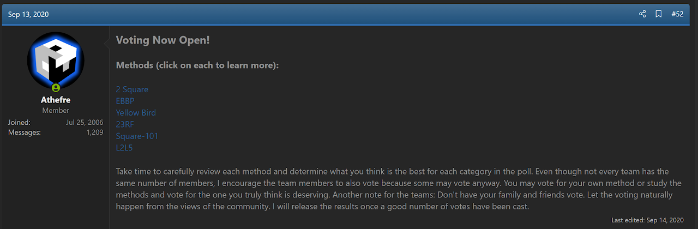
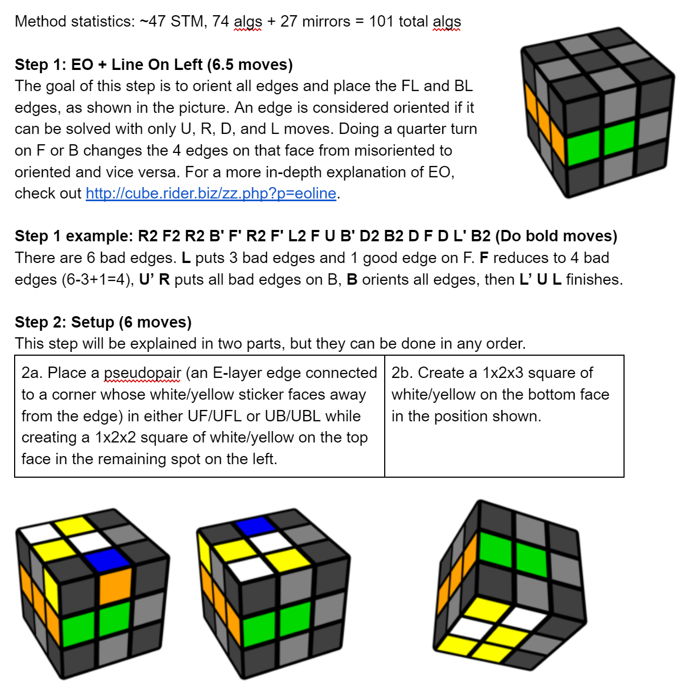
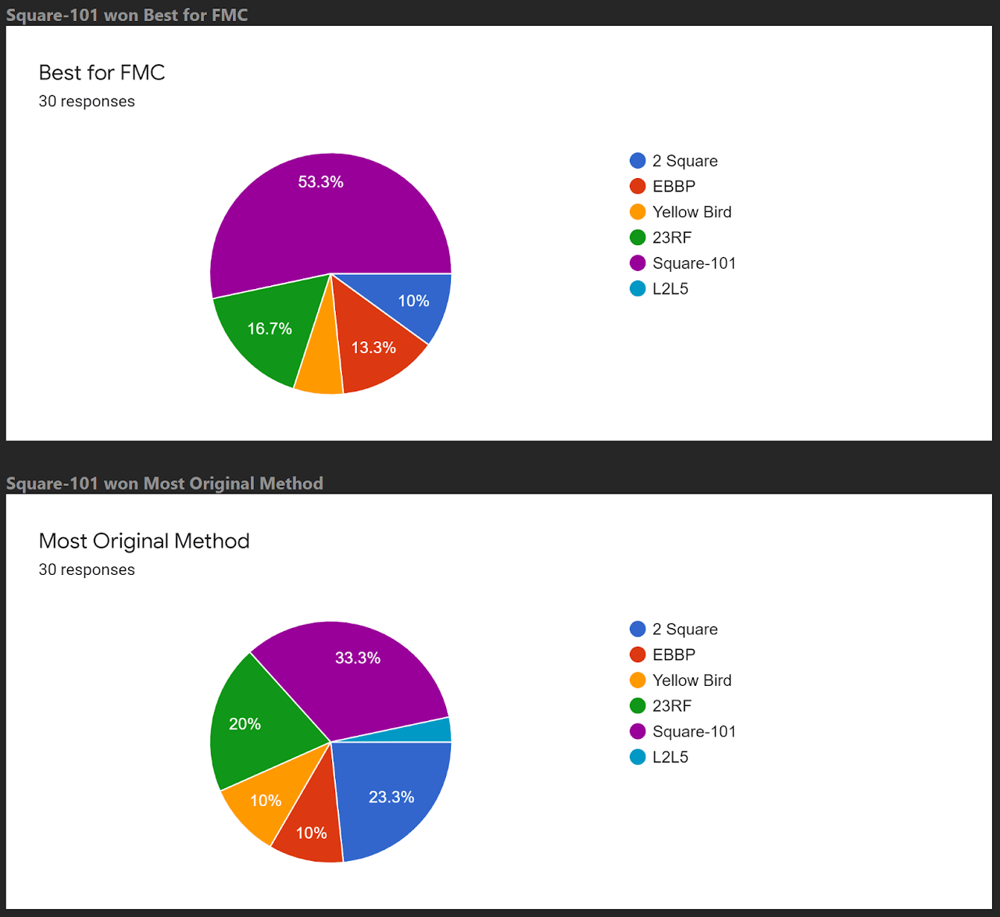

import AnimCube from "@site/src/components/AnimCube";

# Square 101

<AnimCube params="buttonbar=0&position=lluuu&scale=6&hint=10&hintborder=1&borderwidth=10&facelets=wydyyldbdwwyywwdldddddbddlddldrgddddddwdoddddddddrdddd" width="400px" height="400px" />

## Description

**Proposer:** [Vincent Trang](CubingContributors/MethodDevelopers.md#trang-vincent-trangium)

**Proposed:** 2020

**Steps:**

1. Orient all edges while solving the FL and BL edges.
2. Create a 1x2x3 block on the U layer at Ul that consists of a 1x2x2 block of oriented U/D pieces and a corner and edge pair that has an E layer edge and the U/D sticker of the corner facing the left layer.
3. Create a 1x2x3 block of oriented U/D pieces on the bottom layer at Dl.
4. Orient the remaining corners while placing the two E layer edges.
5. Build two pairs in the back on the bottom layer on the left and right (DLb and DRb).
6. Permute the last six corners.
7. Permute the last six edges and adjust the U/D layers as necessary.

[Square 101 Document](https://docs.google.com/document/d/1RSNk6LSQPGwZgh99ykikuBzfyra7tLY9UQiBTibRzLo/edit?usp=sharing)

[Click here for more step details on the SpeedSolving wiki](https://www.speedsolving.com/wiki/index.php?title=Square-101)

## Origin

### Development

In 2020, Vincent Trang joined the August 2020 Method Development Competition. Trang developed Square 101 as the submission. At the end of the competition, Square 101 was chosen by a community vote as the most unique method and the best for FMC [1, 2].

## References

[1] M. J. Straughan, "Method Development Competition - August 2020," SpeedSolving.com, 12 September 2020. [Online]. Available: https://www.speedsolving.com/threads/method-development-competition-august-2020.78368/post-1392585.

[2] M. J. Straughan, "Method Development Competition - August 2020," SpeedSolving.com, 14 September 2020. [Online]. Available: https://www.speedsolving.com/threads/method-development-competition-august-2020.78368/post-1392723.