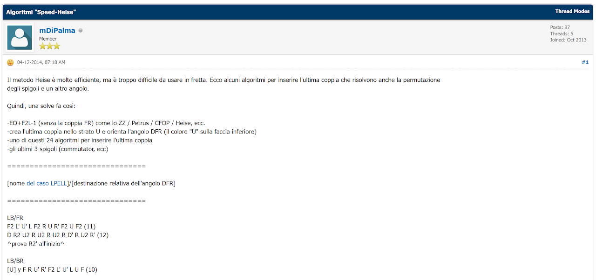
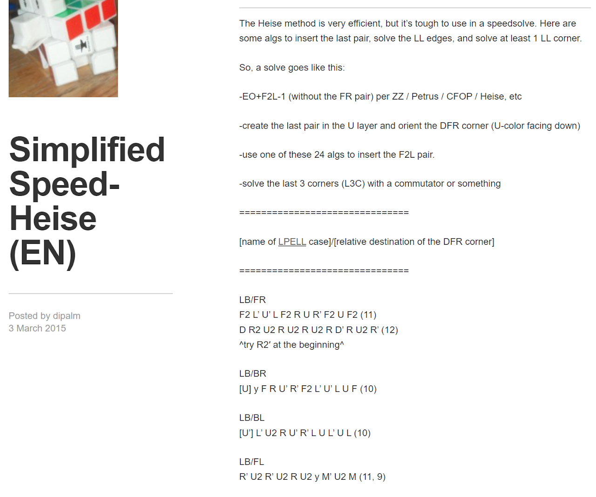
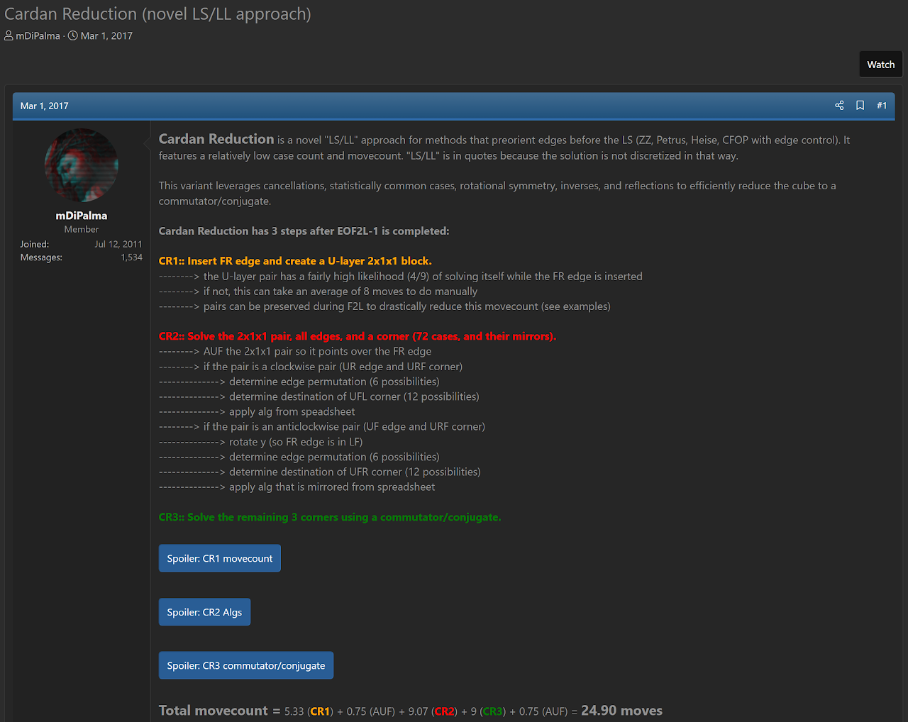

import AnimCube from "@site/src/components/AnimCube";

# DiPalma L3C Reduction

<AnimCube params="config=../../ExhibitConfig.txt&facelets=ryoyyyyybwwwwwwwwwybbbbbbbbygggggggggooooooooyrrrrrrrr" width="400px" height="400px" />

A collection of L3C reduction strategies proposed by [Matt DiPalma](CubingContributors/MethodDevelopers.md#dipalma-matt).

## Speed-Heise

Speed-Heise was first proposed in December, 2014 on the Italian site speedcubing.it [1].

Two versions of Speed-Heise were added to DiPalma's blog in March, 2015. One was called Simplified [2] and the other was called Complete [3].

[Click here for more step details on the SpeedSolving wiki](https://www.speedsolving.com/wiki/index.php/Speed-Heise)

## Tripod Supplement

In March, 2015 DiPalma developed the algorithms for the Tripod method to permute all edges and solve the DFR corner [4].

## Cardan Reduction

In March, 2017 DiPalma proposed Cardan Reduction [5].

## CR†

CR† was proposed in the same post as Cardan Reduction [5].

## SIMPLE

SIMPLE was proposed in August, 2017 [6].

## Early Developments

In July, 2012, DiPalma posted a couple of messages to speedsolving.com that may have been the start of DiPalma's exploration of L3C ideas [7, 8].

## References

[1] M. DiPalma, "Algoritmi "Speed-Heise"," SpeedCubing.it, 4 December 2014. [Online]. Available: https://www.speedcubing.it/forum/Thread-Algoritmi-Speed-Heise.

[2] M. DiPalma, "Simplified Speed-Heise (EN)," WordPress - DiPalma, 3 March 2015. [Online]. Available: https://dipalm.wordpress.com/2015/03/03/speed-heise-algorithms-en/.

[3] M. DiPalma, "Complete Speed-Heise (EN)," WordPress - DiPalma, 4 March 2015. [Online]. Available: https://dipalm.wordpress.com/2015/03/04/complete-speed-heise/.

[4] M. DiPalma, "Tripod Method Supplement (EN)," WordPress - DiPalma, 5 March 2015. [Online]. Available: https://dipalm.wordpress.com/2015/03/05/tripod-method-supplement-en/.

[5] M. DiPalma, "Cardan Reduction (novel LS/LL approach)," SpeedSolving.com, 1 March 2017. [Online]. Available: https://www.speedsolving.com/threads/cardan-reduction-novel-ls-ll-approach.64042/.

[6] M. DiPalma, "[SIMPLE] LL Variant (Revamped 'Fish & Chips')," SpeedSolving.com, 10 August 2017. [Online]. Available: https://www.speedsolving.com/threads/simple-ll-variant-revamped-fish-chips.65978.

[7] M. DiPalma, "ZZ and ZB Discussion," SpeedSolving.com, 30 July 2012. [Online]. Available: https://www.speedsolving.com/threads/zz-and-zb-discussion.20834/post-767013.

[8] M. DiPalma, "ZZ and ZB Discussion," SpeedSolving.com, 30 July 2012. [Online]. Available: https://www.speedsolving.com/threads/zz-and-zb-discussion.20834/post-767137.