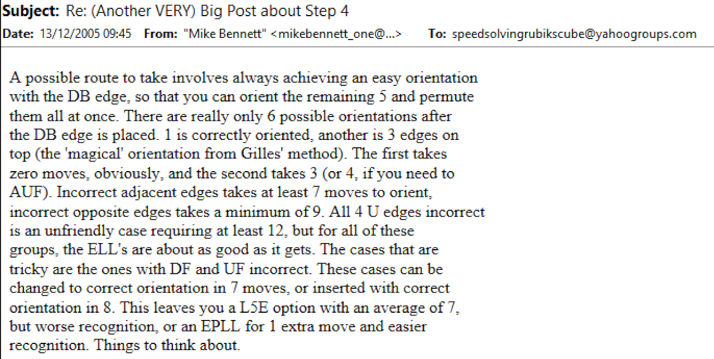
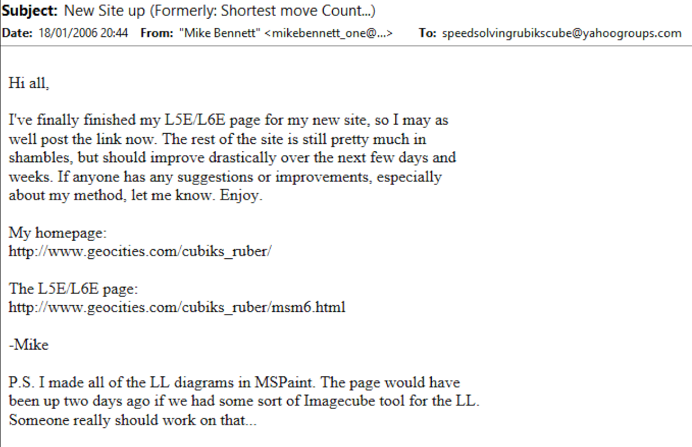
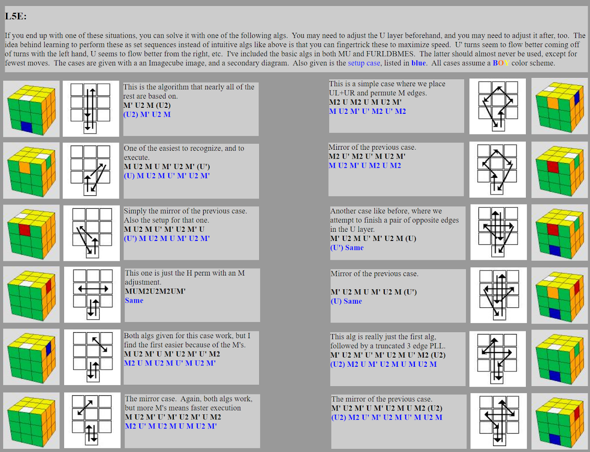
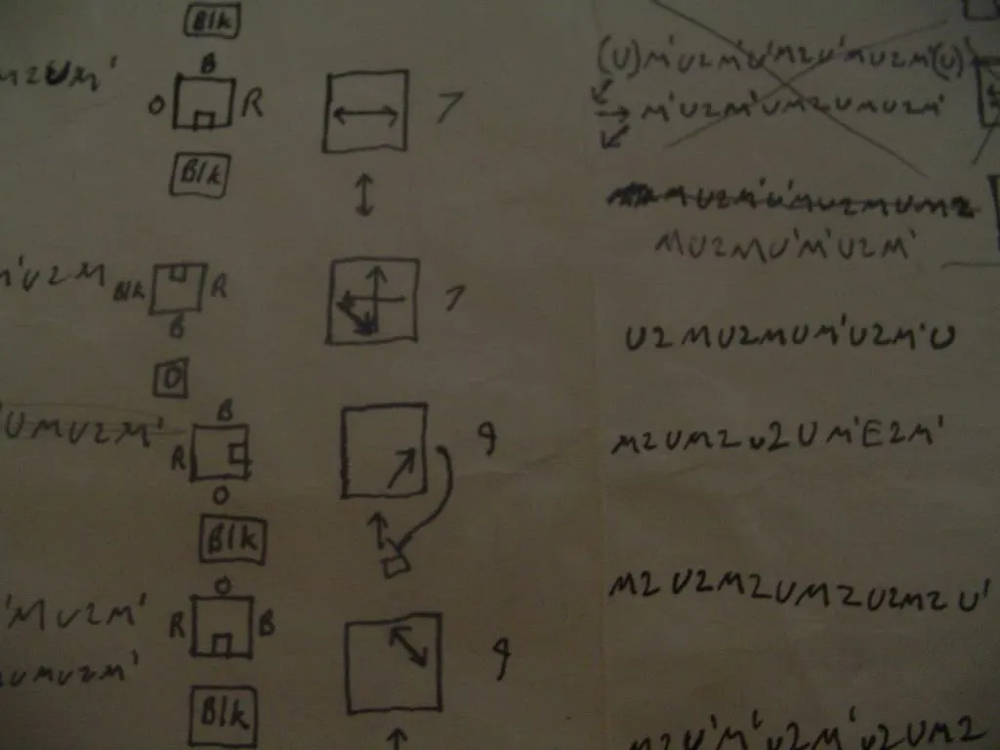
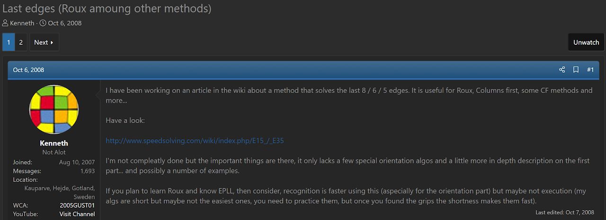
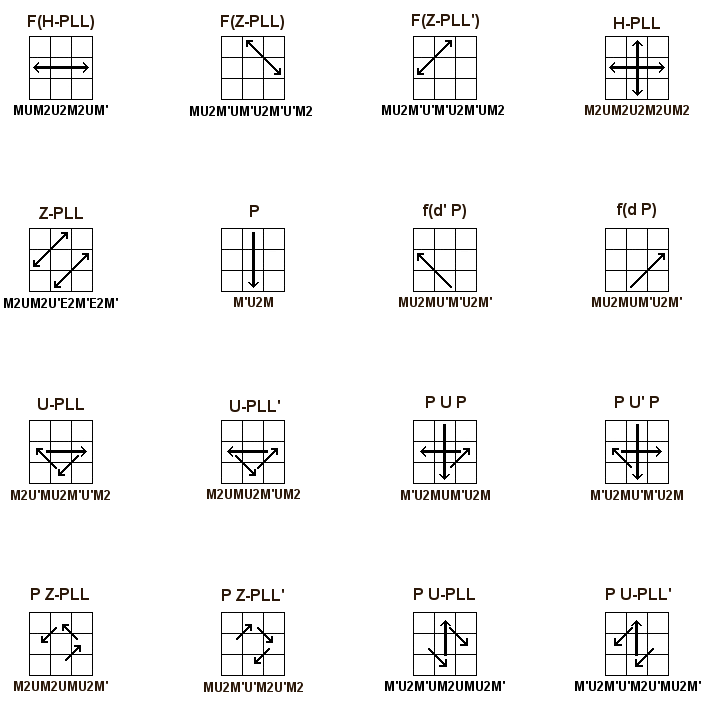
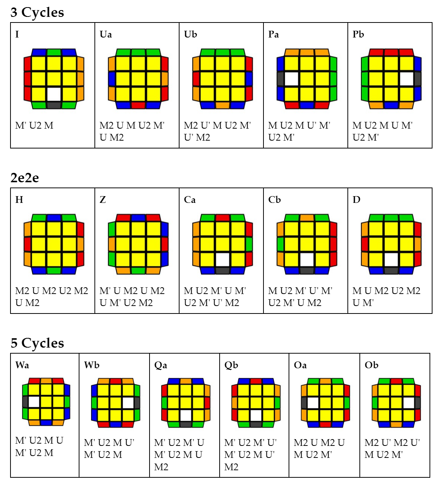

# L5EP

**Proposer:** [Mike Bennett](CubingContributors/MethodDevelopers.md#bennett-mike)

**Proposed:** 2005

[Click here for more step details on the SpeedSolving wiki](https://www.speedsolving.com/wiki/index.php/L5E#L5EP)

## L5EP 4U + 1D

### First Development

L5EP was first proposed by Mike Bennett in December, 2005 on the Speed Solving Rubik's Cube Yahoo group. Mike Bennet developed the algorithms and placed them on a website in January, 2006.[1][1]

### Other Developments and Popularity

#### Second Development

In mid-2006, Michael James Straughan independently had the same idea and developed the algorithms for use in the MI1 method.[2][2]

#### Popularity

In 2008 Kennth Gustavsson developed a naming system for each case.[3][3] [4][4] Within Kenneth's thread, Straughan developed and posted an arrow-based representation image using Kenneth's naming scheme and the algorithms previously developed by Straughan.[5][5] [6][6] The image and the wiki page helped L5EP gain some popularity, eventually making its way into various methods. Some example methods include ZZ-Portico, Hawaiian Kociemba, Mehta, and Squall.

#### Alternate Naming Scheme

An alternate set of names for each case was developed by Andrew Mahovich and Cubingcubecuber.[7][7] [8][8]

## References

1. https://web.archive.org/web/20090807121113/http:/geocities.com/cubiks_ruber/msm6.html
2. https://web.archive.org/web/20110224050936/http://athefre.110mb.com/
3. https://www.speedsolving.com/threads/last-edges-roux-amoung-other-methods.6754/post-91969
4. https://www.speedsolving.com/wiki/index.php/L5E#Semi-advanced_system
5. https://i140.photobucket.com/albums/r25/Athefre/L5EFinal.png
6. https://www.speedsolving.com/threads/last-edges-roux-amoung-other-methods.6754/post-100400
7. https://docs.google.com/document/d/1kb4JFX2WY5mh0gchb9gkbI-RoINaFfX5w0i4VJ1z5ek/edit
8. https://www.speedsolving.com/threads/quest-for-sub-10-hawaiian-kociemba-new-directions.76602/post-1376723

[1]: https://web.archive.org/web/20090807121113/http:/geocities.com/cubiks_ruber/msm6.html
[2]: https://web.archive.org/web/20110224050936/http://athefre.110mb.com/
[3]: https://www.speedsolving.com/threads/last-edges-roux-amoung-other-methods.6754/post-91969
[4]: https://www.speedsolving.com/wiki/index.php/L5E#Semi-advanced_system
[5]: https://i140.photobucket.com/albums/r25/Athefre/L5EFinal.png
[6]: https://www.speedsolving.com/threads/last-edges-roux-amoung-other-methods.6754/post-100400
[7]: https://docs.google.com/document/d/1kb4JFX2WY5mh0gchb9gkbI-RoINaFfX5w0i4VJ1z5ek/edit
[8]: https://www.speedsolving.com/threads/quest-for-sub-10-hawaiian-kociemba-new-directions.76602/post-1376723