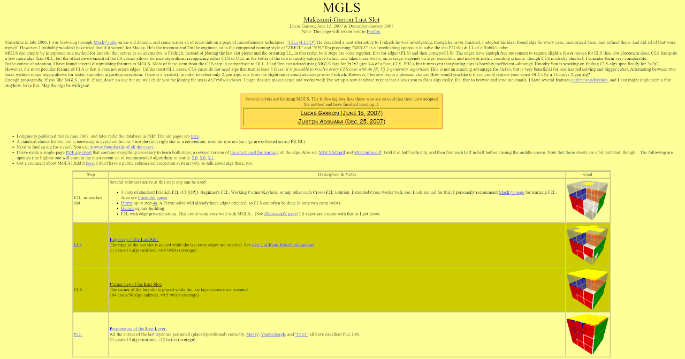
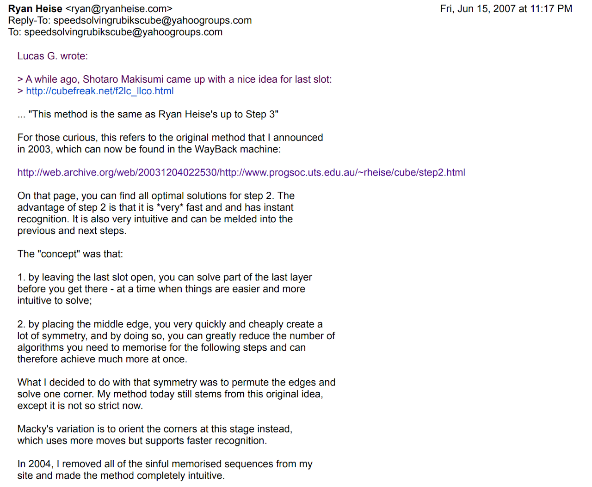
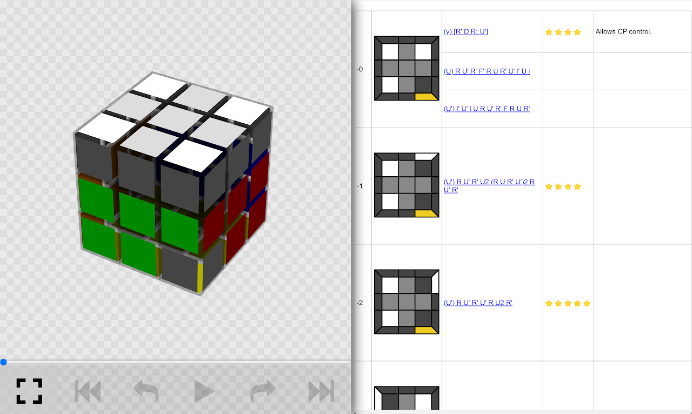
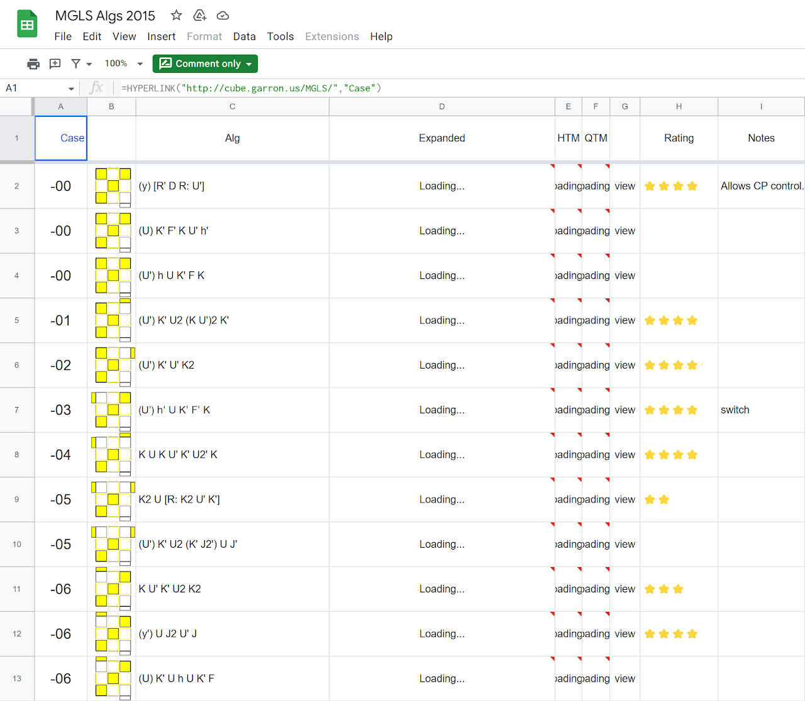
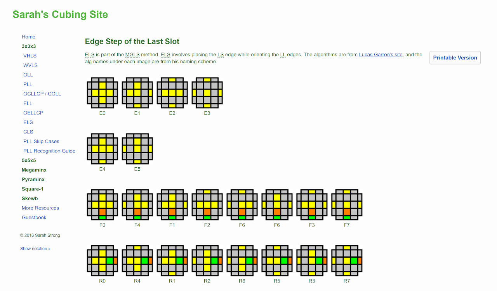
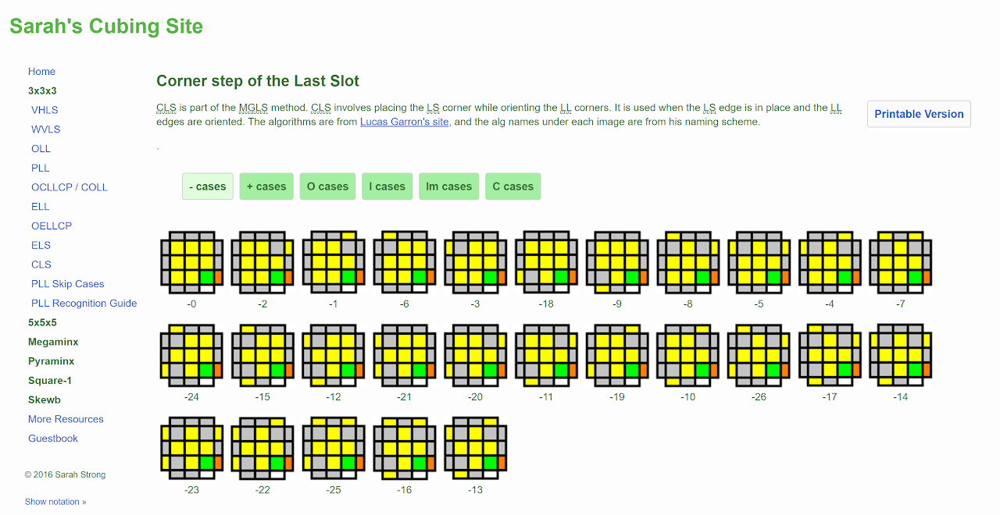
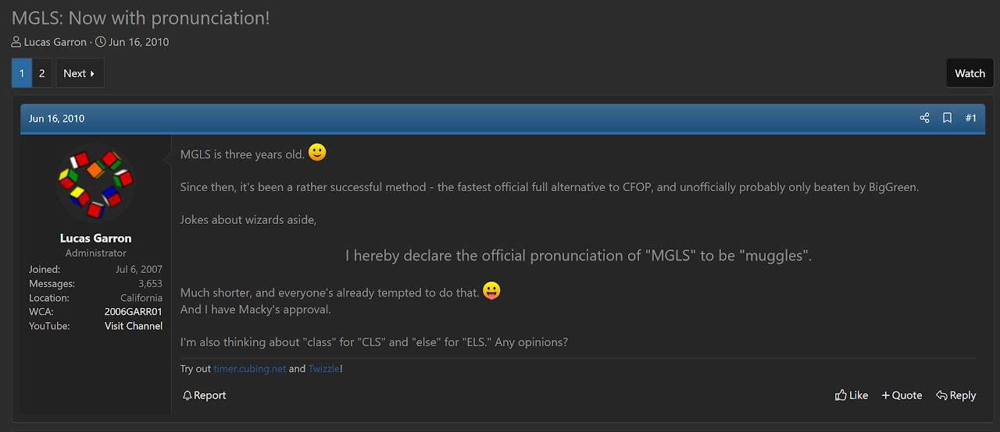

import TwistyPlayer from "@site/src/components/TwistyPlayer";
import Exhibit from "@site/src/components/Exhibit";
import YouTube from "@site/src/components/YouTube";
import ImageCollage from '@site/src/components/ImageCollage';

# MGLS

<Exhibit
stickering={{
    solved: "DFR",
    dim: "U D F B L R DF DL DB DR DFL DBL DBR FR FL BL BR",
    oriented: "UL UF UR UB UFR UFL UBL UBR",
  }}
/>

## Description

MGLS is a system for orienting the last layer while solving the last slot of the first two layers.

**Proposer:** [Shotaro Makisumi](CubingContributors/MethodDevelopers.md#makisumi-shotaro), [Lucas Garron](CubingContributors/MethodDevelopers.md#garron-lucas)

**Proposed:** 2004

**Steps:**

1. Insert the last slot edge while orienting all last layer edges.
2. Insert the last slot corner while orienting all last layer corners.

[Click here for more step details on the SpeedSolving wiki](https://www.speedsolving.com/wiki/index.php/MGLS)

## Origin

Shotaro Makisumi started developing the idea in 2004 [^makisumi-2004].

## Development

From 2006-2007 Lucas Garron completed development and the set of steps were named MGLS after the last names of Makisumi and Garron [^garron-2007-1] [^garron-2007-2]. MGLS is similar to one of the original forms of the Heise method [^heise-2007].

## Other MGLS Information

### Makisumi's Algorithms

[Source](https://cubefreak.net/speed/mgls/f2lc_llco.php)

### Google Sheets

[Source](https://docs.google.com/spreadsheets/d/1e9tPQ0Fl61KkzEkCh3FIkUSUmXtxlpGPp0fMmTipxoM/edit#gid=0)

### Sarah Strong's Algorithms

[ELS](https://sarah.cubing.net/3x3x3/els)
[CLS](https://sarah.cubing.net/3x3x3/cls)

### Pronunciation

In June, 2010, Garron declared the official pronunciation of MGLS to be "muggles" [^garron-2010].

## Credit

Thanks to Lucas Garron for providing links to the sources on this page.

[^makisumi-2004]: S. Makisumi, "F2L Last Corner + LLCO," Makisumi's Website, 2004. [Online]. Available: https://web.archive.org/web/20070913114107/http://cubefreak.net:80/f2lc_llco.html.
[^garron-2007-1]: L. Garron, "MGLS - Makisumi-Garron Last Slot," Garron's Website, 2007. [Online]. Available: https://cube.garron.us/MGLS/.
[^garron-2007-2]: L. Garron, "[Speed cubing group] MGLS speedcubing method," Yahoo! Groups - Speed Solving Rubik's Cube, 15 June 2007. [Online].
[^heise-2007]: R. Heise, "Re: [Speed cubing group] MGLS speedcubing method," Yahoo! Groups - Speed Solving Rubik's Cube, 15 June 2007. [Online].
[^garron-2010]: L. Garron, "MGLS: Now with pronunciation!," SpeedSolving.com, 16 June 2010. [Online]. Available: https://www.speedsolving.com/threads/mgls-now-with-pronunciation.21922/.