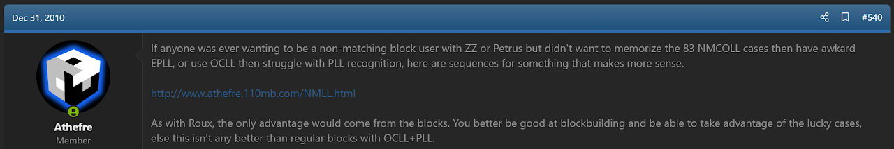
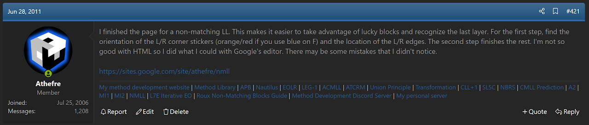
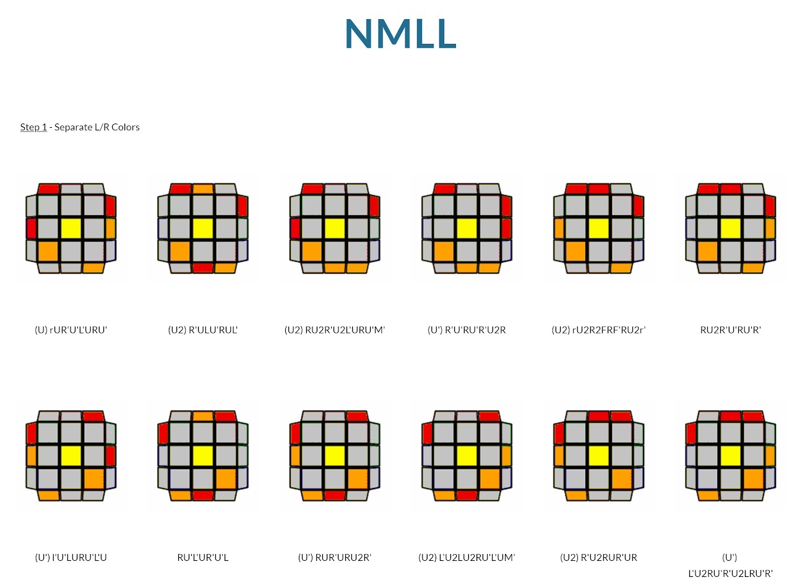
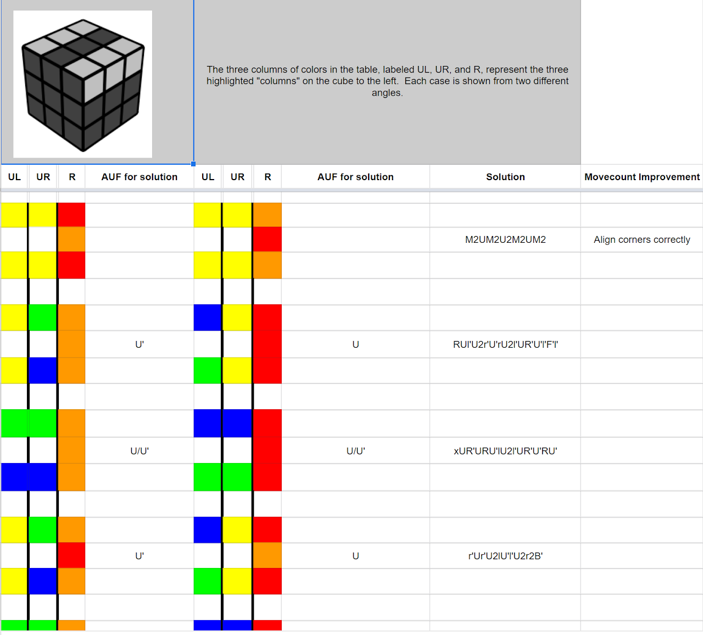

# NMLL

## Description

NMLL is a method for solving the last layer.

**Proposer:** [Michael James Straughan](CubingContributors/MethodDevelopers.md#straughan-michael-james-athefre)

**Proposed:** 2010

**Steps:**

1. Orient the corners relative to the left and right side layers while moving the UL and UR edges to the left and right side.
2. Solve everything.

[Click here for more step details on the SpeedSolving wiki](https://www.speedsolving.com/wiki/index.php/NMLL)

## Proposal and Development

NMLL was proposed and developed by James Straughan in December, 2010.[1][1] [2][2] 

## New Website

NMLL was moved to a Google site in June, 2011.[3][3] [4][4] [5][5] 

[1]: https://www.speedsolving.com/threads/random-cubing-discussion.22862/post-509957
[2]: https://web.archive.org/web/20110224050936/http://athefre.110mb.com/
[3]: https://www.speedsolving.com/threads/zz-and-zb-discussion.20834/post-598864
[4]: https://sites.google.com/site/athefre/steps/nmll?authuser=0
[5]: https://docs.google.com/spreadsheets/d/1Z-rJzroZ7QrGcqd2RvZ5P3OW7DyX7H-GpT-dK-xWZgA/edit?hl=en_US&hl=en_US#gid=0