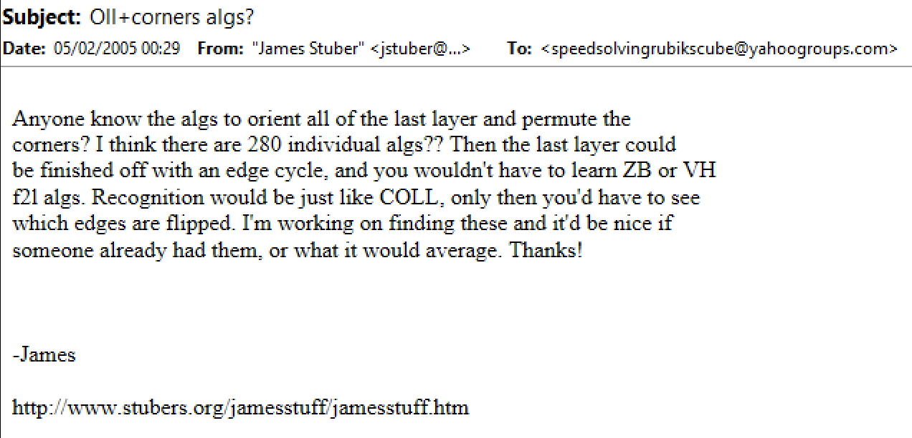
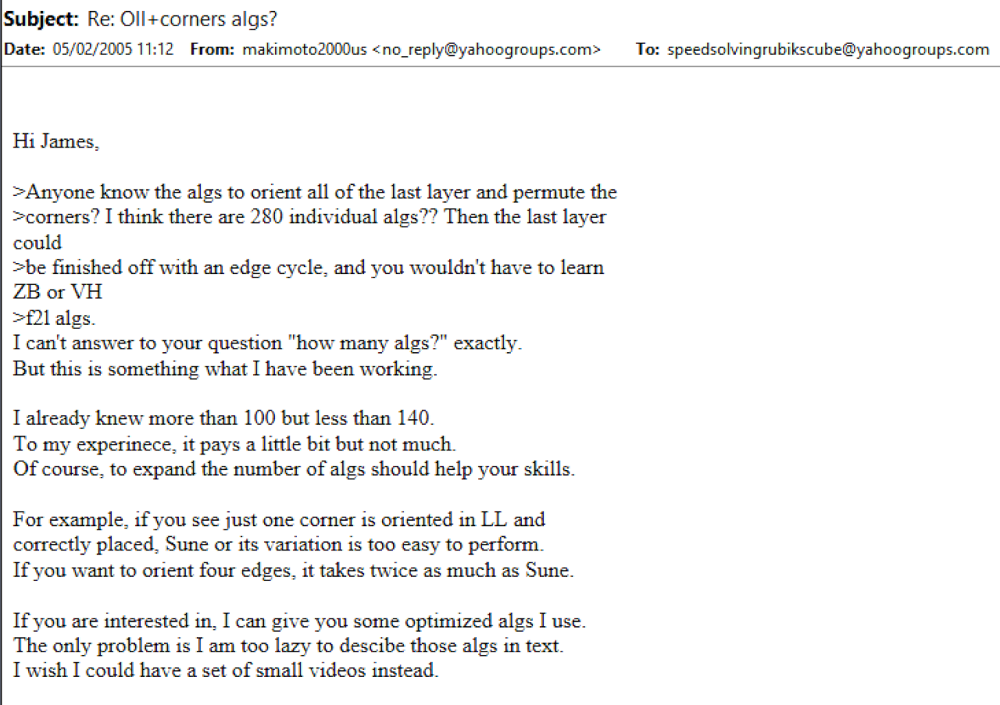
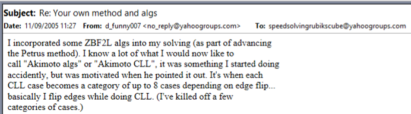
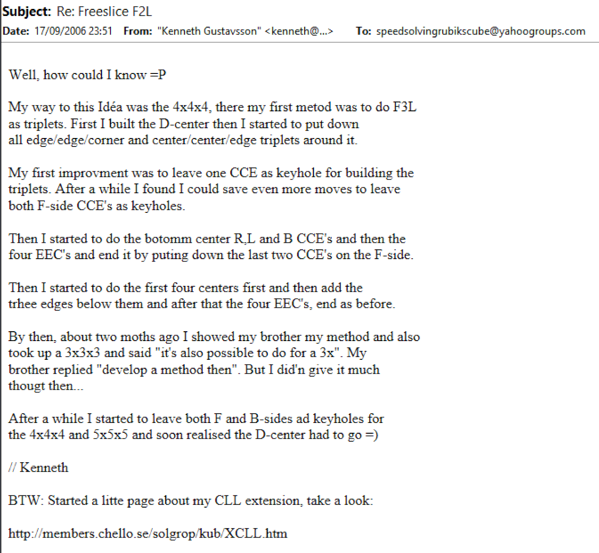
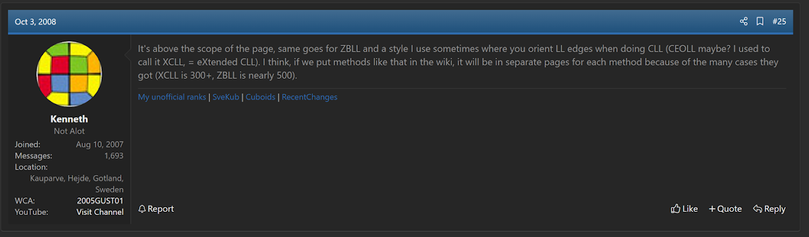
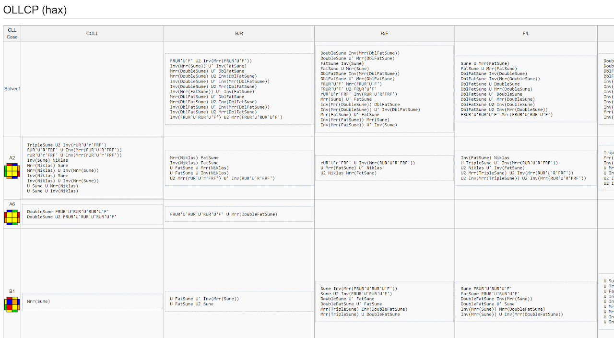
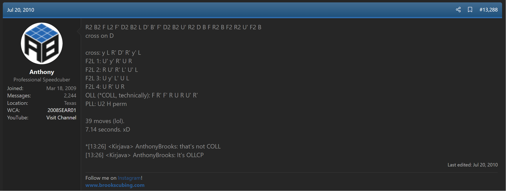

# OLLCP

## Description

OLLCP is a method for solving the last layer.

**Proposer:** [Masayuki Akimoto](CubingContributors/MethodDevelopers.md#akimoto-masayuki), others

**Proposed:** Early 2000s.

**Steps:**

1. Solve the last layer corners and orient all last layer edges.
2. Permute the last layer edges.

[Click here for more step details on the SpeedSolving wiki](https://www.speedsolving.com/wiki/index.php/OLLCP)

## Origin

### Masayuki Akimoto

The first mention of OLLCP is in February 2005. Masayuki Akimoto was in the process of generating the algorithms.

### Kenneth Gustavsson

In the mid-2000s, Kenneth Gustavsson started working on OLLCP as well. Gustavsson's name for the algorithm set was XCLL.[1][1] [2][2]

### Thom Barlow

In 2011, Thom Barlow developed a version of OLLCP that uses combinations of short algorithms to solve each case.[3][3] [4][4]

## Name

As seen in the initial proposals, Gustavsson had given the algorithm set the name XCLL. It was around 2010 that the community began calling it OLLCP.[5][5] [6][6]

## References

1. https://web.archive.org/web/20080701230050/http://web.comhem.se/solgrop/kub/XCLL.htm
2. https://www.speedsolving.com/threads/a-collection-of-cxll-algs.6365/post-91112
3. https://www.speedsolving.com/threads/ollcp-hax.31506/
4. https://web.archive.org/web/20120113073719/https://www.speedsolving.com/wiki/index.php/OLLCP_%28hax%29
5. https://www.speedsolving.com/threads/accomplishment-thread.1688/post-420402
6. https://www.speedsolving.com/threads/cpeoll-fridrich-add-on-method.23005/post-428797

[1]: https://web.archive.org/web/20080701230050/http://web.comhem.se/solgrop/kub/XCLL.htm
[2]: https://www.speedsolving.com/threads/a-collection-of-cxll-algs.6365/post-91112
[3]: https://www.speedsolving.com/threads/ollcp-hax.31506/
[4]: https://web.archive.org/web/20120113073719/https://www.speedsolving.com/wiki/index.php/OLLCP_%28hax%29
[5]: https://www.speedsolving.com/threads/accomplishment-thread.1688/post-420402
[6]: https://www.speedsolving.com/threads/cpeoll-fridrich-add-on-method.23005/post-428797