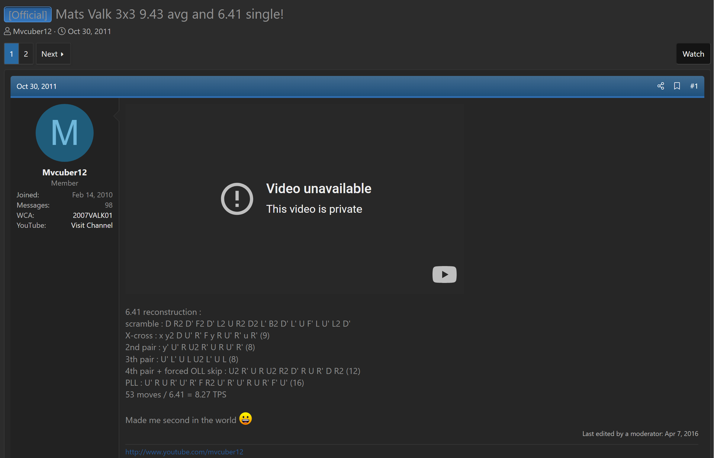
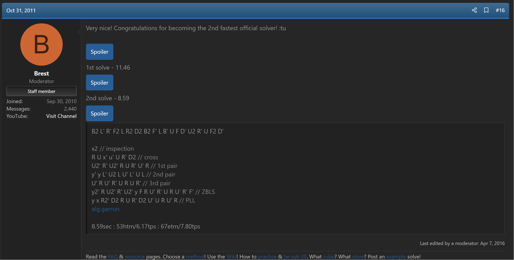
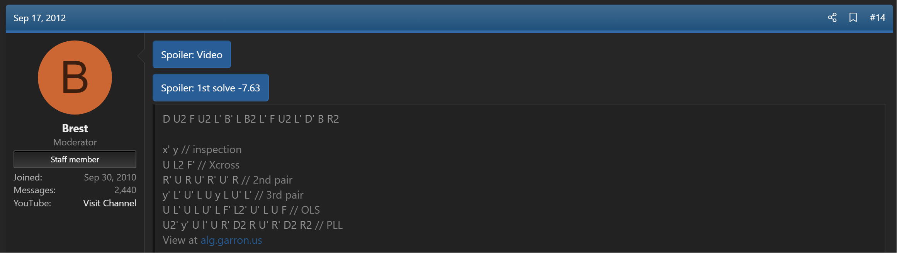

config=../../ExhibitConfig.txtimport AnimCube from "@site/src/components/AnimCube";

# OLS

<AnimCube params="buttonbar=0&position=lluuu&scale=6&hint=10&hintborder=1&borderwidth=10&facelets=llllyllllwwwwwwlwwdbbdbbdlldggdggdggdddoooooodlldrrdrr" width="400px" height="400px" />

## Description

OLS is a collection of systems for orienting the last layer while solving the final corner and edge pair of the first two layers.

[Click here for the general OLS page on the SpeedSolving wiki](https://www.speedsolving.com/wiki/index.php/OLS)

## Vandenberg-Harris Last Slot

<AnimCube params="buttonbar=0&position=lluuu&scale=6&hint=10&hintborder=1&borderwidth=10&facelets=bbddyddddwwwwwwdwwrbbrbbddddggdggdggwddooooooddddrrdrr" width="200px" height="200px" />
<AnimCube params="buttonbar=0&position=lluuu&scale=6&hint=10&hintborder=1&borderwidth=10&facelets=ddddyrddrwwwwwwdwwdbbdbbdddwggdggdggdddoooooodddbrrbrr" width="200px" height="200px" />

<AnimCube params="buttonbar=0&position=lluuu&scale=6&hint=10&hintborder=1&borderwidth=10&facelets=ddrdyddbdwwwwwwdwwdbbdbbbdddggrggdggdddoooooowdddrrdrr" width="200px" height="200px" />
<AnimCube params="buttonbar=0&position=lluuu&scale=6&hint=10&hintborder=1&borderwidth=10&facelets=ddbryddddwwwwwwdwwdbbdbbwdddggdggdggdbdoooooordddrrdrr" width="200px" height="200px" />

### Description

VHLS orients all edges of the last layer when the final F2L pair is already built on the last layer or when the pair is in the three turns away from solved state (R U R' or F' U' F).

### Origin

VHLS was proposed in October, 2003 on the Speed Solving Rubik's Cube Yahoo group by Lars Vandenberg and Dan Harris [1].

## Winter Variation

<AnimCube params="buttonbar=0&position=lluuu&scale=6&hint=10&hintborder=1&borderwidth=10&facelets=bbdyyydydwwwwwwdwwrbbrbbdyddggdggdggwddooooooddddrrdrr" width="400px" height="400px" />

### Description

Winter Variation orients all last layer corners when the final F2L pair is in the pre-built state.

### Origin

Winter Variation was proposed in January, 2005 on the Speed Solving Rubik's Cube Yahoo group by Lucas Winter [2].

## MGLS

<AnimCube params="buttonbar=0&position=lluuu&scale=6&hint=10&hintborder=1&borderwidth=10&facelets=dldlyldldwwwwwwdwwdbbdbbdlddggdggdggdddoooooodlddrrdrr" width="200px" height="200px" />
<AnimCube params="buttonbar=0&position=lluuu&scale=6&hint=10&hintborder=1&borderwidth=10&facelets=lylyyylylwwwwwwlwwdbbdbbdbldggdggdggdddoooooodrldrrdrr" width="200px" height="200px" />

### Description

MGLS consists of two steps. The first step, called ELS, orients the last layer edges while solving the final edge of the first two layers. The second step, called CLS, orients the last layer corners while placing the final corner of the first two layers.

### Origin

Shotaro Makisumi and Lucas Garron developed CLS from 2004 - 2007. See the [MGLS](3x3/Steps/MGLS.md) page for a detailed history.

## Erik Johnson Last Slot

<AnimCube params="buttonbar=0&position=lluuu&scale=6&hint=10&hintborder=1&borderwidth=10&facelets=lylyyylylwwwwwwrwwdbbdbbdbwdggdggdggdddoooooodrbdrrdrr" width="200px" height="200px" />
<AnimCube params="buttonbar=0&position=lluuu&scale=6&hint=10&hintborder=1&borderwidth=10&facelets=lylyyylylwwwwwwbwwdbbdbbdbrdggdggdggdddoooooodrwdrrdrr" width="200px" height="200px" />

### Description

EJLS orients the last layer corners when there is a single misoriented corner in the first two layers and the last layer edges are already oriented. It is similar to the "I" and "Im" subsets of CLS. However, the difference is that the goal is to take advantage of easy situations in blockbuilding in Petrus, ZZ, or even CFOP where a corner can be placed misoriented at any point and save moves versus correctly solving the corner.

### Origin

Erik Johnson proposed EJLS on speedsolving.com in September, 2008 [3, 4].

## Summer Variation

<AnimCube params="buttonbar=0&position=lluuu&scale=6&hint=10&hintborder=1&borderwidth=10&facelets=dyryyydbdwwwwwwdwwdbbdbbbyddggrggdggdddoooooowdddrrdrr" width="400px" height="400px" />

### Description

Summer Variation orients the last layer corners when all edges are already oriented and the final F2L pair is in the three turns away from solved state (R U R').

### Origin

Chester Lian proposed the Summer Variation on speedsolving.com in January, 2009 [5].

## Valk's Last Slot

<AnimCube params="buttonbar=0&position=lluuu&scale=6&hint=10&hintborder=1&borderwidth=10&facelets=bbllyllllwwwwwwlwwrbbrbbdlddggdggdggwddooooooddddrrdrr" width="400px" height="400px" />

### Description

Valk's Last Slot (VLS) orients the last layer edges and corners when the final F2L pair is pre-built.

### Origin

In 2009, Mats Valk began incorporating algorithms that orient the last layer pieces when placing a built F2L pair [6]. Valk had been using the algorithms in solves [7, 8, 9], but didn't publish an algorithm list at the time.

## Hessler's Last Slot

<AnimCube params="buttonbar=0&position=lluuu&scale=6&hint=10&hintborder=1&borderwidth=10&facelets=llrlyllblwwwwwwlwwdbbdbbblddggrggdggdddoooooowdddrrdrr" width="400px" height="400px" />

### Description

HLS orients the last layer pieces when the pair is R U R' away from solved.

### Origin

In 2013, Rowe Hessler had the same idea as Valk for VLS [6]. Hessler developed the algorithms and called them RLS [10]. After publishing the algorithms, Valk contacted Hessler to describe how he had been using the idea and algorithms prior to Hessler's development. They decided to split the idea into two subsets - VLS when the pair is pre-built, and Hessler's Last Slot (HLS) when the pair is R U R' away from solved [11].

## Magic Wondeful

<AnimCube params="buttonbar=0&position=lluuu&scale=6&hint=10&hintborder=1&borderwidth=10&facelets=llbyybyylwwwwwwlwwdbbdbbwlddggdggdggdddoooooorddrrrdrr" width="400px" height="400px" />

### Description

Magic Wondeful orients all last layer pieces when there is an oriented 1x2x2 block of pieces on the last layer and the final F2L pair is pre-built.

### Origin

David Gomes, Jeremy Fleischman, and Devin Corr-Robinett developed the idea in 2011 and it was presented on Shotaro Makisumi's website [12, 13, 14].

## Brooks Last Edge / Jack Johnston Last Slot

<AnimCube params="buttonbar=0&position=lluuu&scale=6&hint=10&hintborder=1&borderwidth=10&facelets=lylyyblylwwwwwwwwwdbbdbbdybdggdggdggdddooooooddrrrrdrr" width="400px" height="400px" />

### Description

BLE / JJLS orients all last layer corners during insertion of the final F2L edge. The prerequisite is that the corner of the final F2L pair is already solved, all edges are already oriented, and the edge of the F2L pair is currently in the last layer.

### Origin

#### Jack Johnston and Michael Gottlieb

Jack Johnston proposed the idea in August, 2013 and Michael Gottlieb developed the algorithms [15, 16, 17].

After development, Johnston presented JJLS to the community in September, 2013 [18].

#### Anthony Brooks

In 2014, Anthony Brooks independently proposed and developed the first two layer edge placement and last layer corner orientation step of JJLS [19, 20].

## References

[1] L. Vandenbergh and D. Harris, "Some thoughts on learning the ZB system," Yahoo! Groups - Speed Solving Rubik's Cube, 27 October 2003. [Online]. 

[2] L. Winter, "A variation on the Petrus Method.," Yahoo! Groups - Speed Solving Rubik's Cube, 27 January 2005. [Online]. 

[3] E. Johnson, "Secret Petrus technique REVEALED," SpeedSolving.com, 8 September 2008. [Online]. Available: https://www.speedsolving.com/threads/secret-petrus-technique-revealed.6276/.

[4] E. Johnson, "Secret Petrus technique REVEALED," SpeedSolving.com, 9 September 2008. [Online]. Available: https://www.speedsolving.com/threads/secret-petrus-technique-revealed.6276/post-84523.

[5] C. Lian, "COLS/"Summer Variation"/set of algs without a name," SpeedSolving.com, 19 January 2009. [Online]. Available: https://www.speedsolving.com/threads/cols-summer-variation-set-of-algs-without-a-name.8820/.

[6] R. Hessler, "OLS (VLS + HLS) Algorithms: by Mats Valk and Rowe Hessler," SpeedSolving.com, 30 October 2013. [Online]. Available: https://www.speedsolving.com/threads/ols-vls-hls-algorithms-by-mats-valk-and-rowe-hessler.44642/.

[7] M. Valk, "Mats Valk 3x3 9.43 avg and 6.41 single!," SpeedSolving.com, 30 October 2011. [Online]. Available: https://www.speedsolving.com/threads/mats-valk-3x3-9-43-avg-and-6-41-single.33243/post-662179.

[8] R. Stuart and M. Valk, "Mats Valk 3x3 9.43 avg and 6.41 single!," SpeedSolving.com, 31 October 2011. [Online]. Available: https://www.speedsolving.com/threads/mats-valk-3x3-9-43-avg-and-6-41-single.33243/post-662386.

[9] R. Stuart and M. Valk, "Mats Valk 3x3 average: 7.77," SpeedSolving.com, 17 September 2012. [Online]. Available: https://www.speedsolving.com/threads/mats-valk-3x3-average-7-77.38613/post-782931.

[10] R. Hessler, "RLS," Hessler's Website, 2013. [Online]. Available: https://rowe.cubing.net/rls/.

[11] R. Hessler and M. Valk, "Introduction," YouTube, 30 October 2013. [Online]. Available: https://www.youtube.com/watch?v=dDLv3duiu5o.

[12] S. Makisumi, "Introducing Magic Wondeful," SpeedSolving.com, 20 May 2011. [Online]. Available: https://www.speedsolving.com/threads/introducing-magic-wondeful.29464/.

[13] D. Gomes, J. Fleischman, D. Corr-Robinett and S. Makisumi, "Magic Wondeful," Makisumi's Website, 20 May 2011. [Online]. Available: http://cubefreak.net/speed/advancedf2l/mw.php.

[14] C. Olson, "Magic Wondeful," Olson's Website, [Online]. Available: http://www.cyotheking.com/magic-wondeful/.

[15] J. Johnston and M. Gottlieb, "JJLS," Johnston's Website, [Online]. Available: https://web.archive.org/web/20130919142035/https://johnstoncubing.webs.com/jjls.htm.

[16] J. Johnston and M. Gottlieb, "STEP 1: F2L CORNER + EO," Johnston's Website, [Online]. Available: https://web.archive.org/web/20131209052835/https://johnstoncubing.webs.com/jjlsstep1f2lcornereo.htm.

[17] J. Johnston and M. Gottlieb, "STEP 2: F2L EDGE + CO," Johnston's Website, [Online]. Available: https://web.archive.org/web/20210119190659/https://johnstoncubing.webs.com/jjlsstep2f2ledgeco.htm.

[18] J. Johnston, "New(?) LS + LL Approach," SpeedSolving.com, 4 September 2013. [Online]. Available: https://www.speedsolving.com/threads/new-ls-ll-approach.43862/.

[19] A. Brooks, "Brooks Last Edge (BLE)," Brooks' Website, [Online]. Available: https://web.archive.org/web/20140913231837/http://www.brookscubing.com/ble-brooks-last-edge.html.

[20] J. Johnston, "2-look LS+LL combinations," SpeedSolving.com, 11 August 2015. [Online]. Available: https://www.speedsolving.com/threads/2-look-ls-ll-combinations.36468/post-1108339.