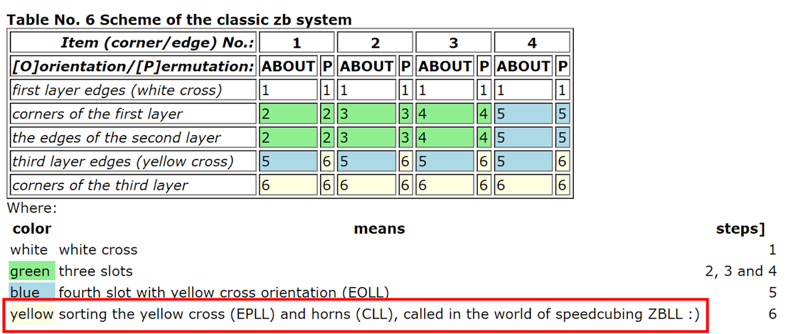

# ZBLL / HPLL

## Description

ZBLL solves the last layer in one step when all last layer edges are oriented.

**Proposer:** [Lars Petrus](CubingContributors/MethodDevelopers.md#petrus-lars), [Bernard Helmstetter](CubingContributors/MethodDevelopers.md#helmstetter-bernard)

**Proposed:** 1981, 2000.

[Click here for more step details on the SpeedSolving wiki](https://www.speedsolving.com/wiki/index.php/ZBLL)

## Origin

### Petrus Method

In 1981, Lars Petrus developed the [Petrus method](3x3/Methods/Petrus.md), a method that intentionally orients all of the last layer edges early in the solve. The last layer can be solved in a single step. However, the algorithms hadn't yet been developed.

### Bernard Helmstetter

From 2000 to 2001, Bernard Helmstetter generated the algorithms to solve the last layer in one step when all edges are oriented.[1][1] The algorithms were specifically targeting the Petrus method.

### Lars Petrus Comments

In May, 2003, stated on the Speed Solving Rubik's Cube Yahoo group that Helmstetter's algorithms would be a great way to exploit the Petrus method's advantage of having all last layer edges already oriented. Petrus had planned to learn the algorithm set to use at an upcoming competition, but felt that he no longer had time.

Petrus also has Helmstetter's algorithms linked on the Petrus method website.[2][2]

## ZB

### Edge Orientation

In 2001, Zbigniew Zborowski and Ron van Bruchem incorporated edge orientation into the last layer of CFOP, similar to the Petrus method. Zborowski and Bruchem independently had the idea to orient all last layer edges while solving the final pair of the first two layers.

### Zborowski and Bruchem Credit Helmstetter

#### Zborowski

Zborowski stated on his website for ZBLS for readers of the site to use Helmstetter's algorithms that were developed for the Petrus method.[3][3] Zborowski stated "The conception of [solving the last layer in one step] is not new! Bernard Helmstetter has created this for Lars Petrus a few years ago. This is the Helmstetter index called 'Lars method steps 5, 6, and 7 simultaneously." Zborowski then links to Helmstetter's website and algorithms.

#### Bruchem

In the early 2000s, Helmstetter's algorithms were added to speedcubing.com, a site owned by Ron van Bruchem.[4][4]

## Name

### Acronym

The community eventually started calling the step ZBLL. The first known use of the acronym is by Shotaro Makisumi. However, the acronym may have been used even earlier during the 1.5 year time period of message that were deleted from the Speed Solving Rubik's Cube Yahoo group.

### Zborowski Adopts Acronym

Zborowski starts using the acronym despite having previously acknowledged that Helmstetter and Petrus are who put in the work to create it.[5][5]

## Summary

Although the Petrus method already existed with an all edges oriented last layer, Bernard Helmstetter generated all of the algorithms to solve the Petrus method's last layer in a single step, and both Zborowski and Bruchem provided and recommended Helmstetter's algorithms on their own websites, the community named the step ZBLL. This is likely due to the popularity of CFOP at the time, the excitement at the time by CFOP users for ZBLS / ZBF2L, and some being unaware of Helmstetter's algorithms. There was more interest at the time for ZBLS / ZBF2L, so the CFOP community misnamed the last layer step ZBLL to match with ZBLS / ZBF2L.

If using people's names, the step should have been named after Helmstetter and Petrus. Petrus had the original method with all edges oriented on the last layer and was an influence for EO being integrated into CFOP. Helmstetter put in the work to generate all of the algorithms for the Petrus method to solve the all edges oriented last layer in a single step that were being used and promoted by both Zborowski and Bruchem. Therefore, HPLL or PHLL would be a more fitting name if named after people.

## References

1. https://web.archive.org/web/20030404233432/http://www.ai.univ-paris8.fr/~bh/cube/
2. https://web.archive.org/web/20020305024947/https://lar5.com/cube/xMain.html
3. https://web.archive.org/web/20031004211939/http://www.zborowski.republika.pl/expert3x3x3methodstep3.html
4. https://web.archive.org/web/20020219153732/http://www.speedcubing.com:80/finallayer.html
5. https://web.archive.org/web/20070428175325/http://www.speedcubing.com.pl/nooks_zz.htm#wprowadzenie_systemy_zb

[1]: https://web.archive.org/web/20030404233432/http://www.ai.univ-paris8.fr/~bh/cube/
[2]: https://web.archive.org/web/20020305024947/https://lar5.com/cube/xMain.html
[3]: https://web.archive.org/web/20031004211939/http://www.zborowski.republika.pl/expert3x3x3methodstep3.html
[4]: https://web.archive.org/web/20020219153732/http://www.speedcubing.com:80/finallayer.html
[5]: https://web.archive.org/web/20070428175325/http://www.speedcubing.com.pl/nooks_zz.htm#wprowadzenie_systemy_zb