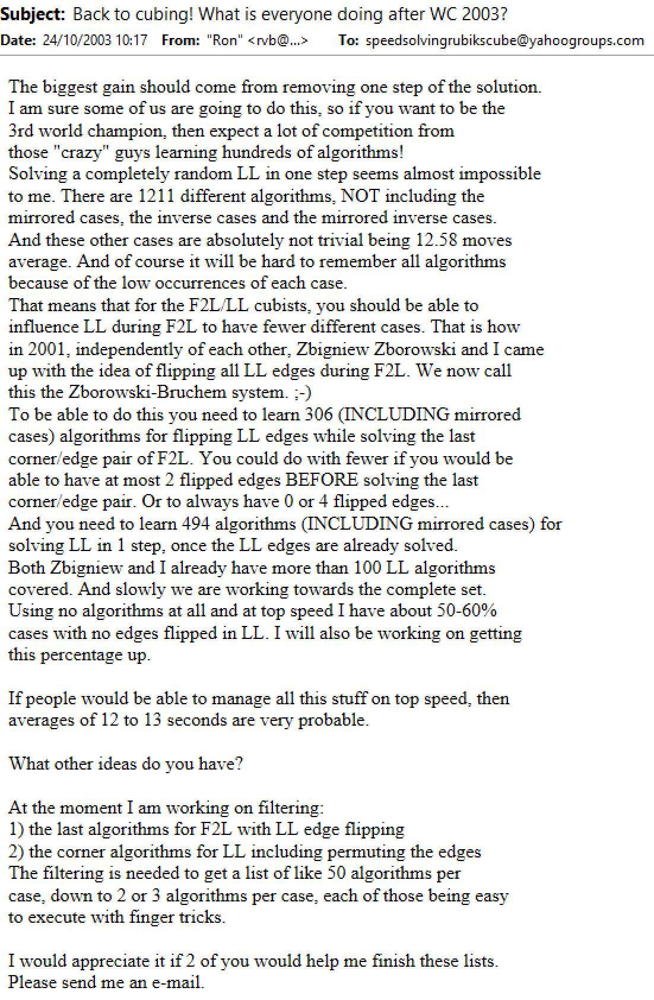

import TwistyPlayer from "@site/src/components/TwistyPlayer";
import Exhibit from "@site/src/components/Exhibit";
import YouTube from "@site/src/components/YouTube";
import ImageCollage from '@site/src/components/ImageCollage';

# ZBLS

<Exhibit
stickering={{
    solved: "DFR FR",
    dim: "U D F B L R DF DL DB DR DFL DBL DBR FL BL BR",
    oriented: "UL UF UR UB",
  }}
/>

## Description

**Proposer:** [Zbigniew Zborowski](CubingContributors/MethodDevelopers.md#zborowski-zbigniew), [Ron van Bruchem](CubingContributors/MethodDevelopers.md#bruchem-ron-van)

**Proposed:** 2001

[Click here for more step details on the SpeedSolving wiki](https://www.speedsolving.com/wiki/index.php/ZBLS)

## Origin

In October, 2003, Ron van Bruchem described the origin as himself and Zbigniew Zborowski independently having had the idea around the same time [^bruchem-zborowski-2003]. This was posted to the Speed Solving Rubik's Cube Yahoo group. 1.5 years of messages were deleted from the group sometime prior to Bruchem's message. This means that some of the origin is no longer viewable.

## Resources

Provided are some of the early resources for ZBLS.

- https://web.archive.org/web/20030814141549/http://www.zborowski.republika.pl/expert3x3x3method.html
- https://www.speedcubing.com/chris/zb.html
- https://web.archive.org/web/20081203232042/http://jmbaum.110mb.com/zb.htm
- https://archive.md/f6YtJ
- http://www.cubezone.be/zbf2l.html
- https://www.speedcubingtips.eu/zbls-zborowski-bruchem-last-slot/

## Author Comments

ZBLS was originally proposed as the ZB method, a complete 3x3 method of its own that consisted of two steps. The first step was ZBLS (or ZBF2L as it was called around the time of proposal), and ZBLL. Nowadays the classification is more complicated. There are many methods that use F2L-1 as the base then the last slot and last layer are solved in some order. Winter Variation, MGLS, L5C > L5E, and various other ways of orienting/permuting the F2L corner/edge while manipulating the last layer pieces. In recent years the community has moved more into classifying each of these as last slot last layer (LSLL) systems to be used with CFOP + CFCE, ZZ, or other distinct and established ways of reaching the F2L-1 state. So for that reason, ZBLS is placed as a step on the website. Otherwise there would be hundreds or thousands of methods which are simply F2L -1 > solve the last slot and last layer in some way.

[^bruchem-zborowski-2003]: R. v. Bruchem and Z. Zborowski, "Back to cubing! What is everyone doing after WC 2003?," Yahoo! Groups - Speed Solving Rubik's Cube, 24 October 2003. [Online].