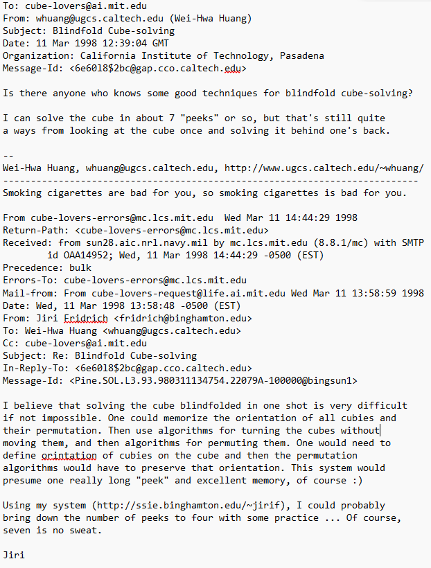

import ReconViewer from "@site/src/components/ReconViewer";
import YouTube from "@site/src/components/YouTube";
import ReactPlayer from 'react-player'
import ImageCollage from '@site/src/components/ImageCollage';

# 3OP

<ReconViewer
scramble="D' B' F R' F2 U F L2 D2 B' U2 R2 D' L2 F R' D' F U L' F U' R B2 U'"
solution={`z' U' R' U R U' R' U L' U' R U R' U' R U L z . // Orient UFR + UFL
x2 z' U' R U R' U' R U R' L' U' R U R' U' R U R' L' U' R U R' U' R U R' L2 z x2 . // Orient D corners
x d D r R d D r R d D r R x' . // U + D edge 8 flip
z' R M U M U M U M U R' z . // Orient BL + FL + FR + DF
U' D z' R' U R' U' R' U' R' U R U R2 z D' U . // UF - BR - DF
F2 x2 U' R' U R' U' R' U' R' U R U R2 U x2 F2 . // UF - DR - DB
L' U2 R2 U' R' U' R U R U R U' R U2 L . // UF - UR - FL
U R U L R L U2 R' L' F' B' U2 F B L' U' R' U' . // UF - FR, UL - BL
D2 R2 U' R B' R F2 R' B R F2 R2 U R2 D2 . // UFL - DFL - UBL
D B2 R B' R F2 R' B R F2 R2 B2 D' . // UFL - UFR - DBR
D' R2 D2 B2 R B' R F2 R' B R F2 R2 B2 D2 R2 D // UFL - DFR - UBR`}
/>
**Example solve from Shotaro Makisumi**

## Description

**Creator:** [Richard Carr](CubingContributors/MethodDevelopers.md#carr-richard), [Olly Hayden](CubingContributors/MethodDevelopers.md#hayden-olly)

**Created:** ~2002

**Steps:**

1. Orient corners and edges separately.
2. Permute corners and edges separately using three-cycles.

[Click here for more step details on the SpeedSolving wiki](https://www.speedsolving.com/wiki/index.php?title=3OP)

## Original Development (Richard Carr)

Around 2001 to 2002, Richard Carr developed a blindfold solving method that involved first separately orienting all corners and edges [^carr-2002-1]. The corners are then permuted using simple one move setups in combination with a corner three cycle algorithm executed on the U layer. Carr’s method was placed on Jessica Fridrich’s website.

<ImageCollage
images={[
{ src: require("@site/docs/BlindfoldSolving/img/3OP/Carr1.png").default},
{ src: require("@site/docs/BlindfoldSolving/img/3OP/Carr2.png").default}
]}
/>

## Expanded Development (Olly Hayden)

In 2002, Olly Hayden presented a similar method on his website [^hayden-2002-1]. The method contains the same general steps as Carr’s method. The primary difference is in the permutation setup moves and algorithms. In Hayden’s development, pieces are moved to the U or D layer using the group `U, D, F2, B2, R2, L2`. After the setup moves, a permutation algorithm is used to cycle the corners, then the setup moves are undone. A complete guide with better algorithms was later developed by Shotaro Makisumi [^makisumi-2008].

<ImageCollage
images={[
{ src: require("@site/docs/BlindfoldSolving/img/3OP/Hayden.png").default},
{ src: require("@site/docs/BlindfoldSolving/img/3OP/Makisumi.png").default}
]}
/>

## Discussion Between Carr and Hayden

In August 2002, Carr and Hayden had a conversation comparing the difference in the permutation styles [^carr-2002-2] [^hayden-2002-2] [^carr-2002-3]. Carr stated that he had considered the way as described on Hayden’s site, but found it difficult.

<ImageCollage
images={[
{ src: require("@site/docs/BlindfoldSolving/img/3OP/Carr3.png").default},
{ src: require("@site/docs/BlindfoldSolving/img/3OP/Hayden2.png").default},
{ src: require("@site/docs/BlindfoldSolving/img/3OP/Carr4.png").default}
]}
/>

## Earlier Proposal (Jessica Fridrich)

On March 11, 1998, Wei-Hwa Huang asked the Cube Lovers mailing group if there were any techniques for blindfold solving [^huang-1998]. Jessica Fridrich responded by suggesting that it may be possible to first orient all pieces, preserving their permutation, then permute all pieces, preserving their orientation [^fridrich-1998].

[^carr-2002-1]: R. Carr, "Blindfold cubing," 2002. [Online]. Available: http://www.ws.binghamton.edu/fridrich/Richard/BC.html.
[^hayden-2002-1]: O. Hayden, "Blindfold Cubing," February 2002. [Online]. Available: https://web.archive.org/web/20020221054757/http://homepage.ntlworld.com/angela.hayden/cube/blindfold_frontpage.html.
[^makisumi-2008]: S. Makisumi, "A 3-Cycle Guide to 3x3x3 Blindfold Cubing," 1 January 2008. [Online]. Available: https://www.cubefreak.net/bld/3op_guide.php.
[^carr-2002-2]: R. Carr, "Re: [Speed Solving Rubik's Cube] Blindfold," Speed Solving Rubik's Cube Yahoo Group, 16 August 2002. [Online].
[^hayden-2002-2]: O. Hayden, "Re: [Speed Solving Rubik's Cube] Blindfold," Speed Solving Rubik's Cube Yahoo Group, 19 August 2002. [Online].
[^carr-2002-3]: R. Carr, "Re: [Speed Solving Rubik's Cube] Blindfold," Speed Solving Rubik's Cube Yahoo Group, 19 August 2002. [Online].
[^huang-1998]: W.-H. Huang, "Blindfold Cube-solving," Cube Lovers, 11 March 1998. [Online].
[^fridrich-1998]: J. Fridrich, "Re: Blindfold Cube-solving," Cube Lovers, 11 March 1998. [Online].