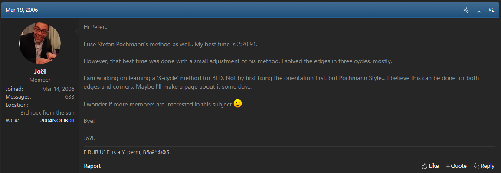

import AnimCube from "@site/src/components/AnimCube";
import ReactPlayer from 'react-player'
import ImageCollage from '@site/src/components/ImageCollage';

# 3-Style

<AnimCube params="config=../../ReconstructionConfig.txt &initmove=B L2 D B2 D2 B2 D2 L U2 R2 U' L' U2 F U' L R' D r' u2 z y'&move={Scramble: B L2 D B2 D2 B2 D2 L U2 R2 U' L' U2 F U' L R' D r' u2 z y'}.{Rotate: z}z.{UB-DL-LB: U' E' L E L2 E' L U E}U' E' L E L2 E' L U E.{UB-RU-RF: S' U' L E' L' U L E L' S}S' U' L E' L' U L E L' S.{UB-BR-FL: R U R E R2 E' R U' R'}R U R E R2 E' R U' R'.{UF-RD-BD: U' S L' D' L S' L' D L U}U' S L' D' L S' L' D L U.{UF-DF-UL: R' F R S R' F2 R S' R' F R}R' F R S R' F2 R S' R' F R.{UFR-UBR-DRB: U' R D R' U R D' R'}U' R D R' U R D' R'.{UFR-FDR-UFL: U' D' R' D R U R' D' R D}U' D' R' D R U R' D' R D.{UFR-UBR-LBU: R U R D R' U' R D' R2}R U R D R' U' R D' R2.{UFR-BUL [LDB] (LTCT): D' U R2 D' R U R' D R2 U R' U2 R D}D' U R2 D' R U R' D R2 U R' U2 R D" width="600px" height="400px" />
**Solve from 14.05 world record mean by Tommy Cherry. Reconstruction by Andy Wong.**

## Description

**Creator:** [Hao Cheng](CubingContributors/MethodDevelopers.md#cheng-hao), [Joël van Noort](CubingContributors/MethodDevelopers.md#noort-joël-van), [Chris Hardwick](CubingContributors/MethodDevelopers.md#hardwick-chris), [Daniel Beyer](CubingContributors/MethodDevelopers.md#beyer-daniel), others

**Created:** 2005 - 2009

**Steps:** Use freestyle commutators to solve two pieces at once.

[Click here for more step details on the SpeedSolving wiki](https://www.speedsolving.com/wiki/index.php?title=3-Style)

## Origin

Some solvers, such as Stefan Pochmann and Chris Hardwick, were using freestyle 3-cycles to blindfold solve Megaminx and big cubes. More can be read in [Blindfold Solving Origins](BlindfoldSolving/BlindfoldSolvingOrigins.md). The application of the technique to 3x3 came a little later, with the idea having been suggested by several members of the community.

### 程浩 (Hao Cheng)

In March 2006, 程浩 (Hao Cheng) posted the idea of solving two pieces at a time using simple setups and 3-cycles [^1]. The initial posts included the idea applied to both corners and edges. This is the earliest known mention of the idea of freestyle 3-cycle blindfold solving on the 3x3x3. Cheng mentions that it was also considered to set up three pieces on the U layer, perform a 3-cycle, then undo the setup – similar to the TuRBo method developed by Erik Akkersdijk in 2007.

View an English translation of the first page of the thread [here](hao-cheng-3style).

> Thanks to crystalcuber for finding this early proposal of 3-Style and for the translation.

### Joël van Noort

On March 19 2006, just one day after the thread created by Hao Cheng, Joël van Noort suggested the same idea [^2]. In a post to SpeedSolving.com Noort stated that he was working on a 3-cycle method for the corners and edges as an upgrade to the Classic Pochmann method.

### Chris Hardwick

#### 4x4x4 Use

The earliest mentions of freestyle 3-cycles in blindfold solving can be traced back to 4x4x4 blindfold solving discussions by Chris Hardwick. Hardwick had been placing a focus on minimal setup moves and solving edges using commutators devised in the moment [^3]. At the same time, Pochmann had been solving 4x4x4 edges individually using a similar technique to his original 3x3x3 blindfold solving method, Classic Pochmann [^4]. This eventually led to discussions between Hardwick and Pochmann, comparing the current solve times and potential of the individual methods.

<ImageCollage
images={[
{ src: require("@site/docs/BlindfoldSolving/img/3-Style/Hardwick1.png").default},
{ src: require("@site/docs/BlindfoldSolving/img/3-Style/Pochmann1.png").default},
{ src: require("@site/docs/BlindfoldSolving/img/3-Style/Hardwick2.png").default},
{ src: require("@site/docs/BlindfoldSolving/img/3-Style/Hardwick3.png").default},
{ src: require("@site/docs/BlindfoldSolving/img/3-Style/Hardwick4.png").default},
{ src: require("@site/docs/BlindfoldSolving/img/3-Style/Hardwick5.png").default}
]}
/>

#### Application to 3x3

In January 2007, Hardwick described that he had started using the freestyle cycling techniques within 3x3x3 solves [^5]. His suggestion was that it could be a 3x3x3 blindfold solving method that has potential. In October of the same year, Hardwick detailed his process of using freestyle commutators to solve the corners of the 3x3x3 [^6].

<ImageCollage
images={[
{ src: require("@site/docs/BlindfoldSolving/img/3-Style/Hardwick6.png").default},
{ src: require("@site/docs/BlindfoldSolving/img/3-Style/Hardwick7.png").default},
{ src: require("@site/docs/BlindfoldSolving/img/3-Style/Hardwick8.png").default},
{ src: require("@site/docs/BlindfoldSolving/img/3-Style/Hardwick9.png").default},
{ src: require("@site/docs/BlindfoldSolving/img/3-Style/Hardwick10.png").default}
]}
/>

### Daniel Beyer

In late 2006, Daniel Beyer started experimenting with 3 cycles in 4x4x4 blindfold solving [^7]. Beyer mentioned developing a commutator guide and having it hosted on Chris Hardwick’s website [^8]. This can be seen as sort of a start to the collaboration between Hardwick and Beyer that eventually led to the closely related blindfold solving method named BH.

<ImageCollage
images={[
{ src: require("@site/docs/BlindfoldSolving/img/3-Style/Beyer1.png").default},
{ src: require("@site/docs/BlindfoldSolving/img/3-Style/Beyer2.png").default}
]}
/>

## Popularity Growth

In the months following Hardwick’s mentions of using freestyle commutators in 3x3x3 blindfold solving, the idea began to grow. Several members of the community started implementing the strategy into their solves or, at the very least, mentioning it alongside blindfold solving methods that were popular at the time. Two branching paths eventually emerged. One being the BH method with its focus on move optimal algorithms and the other being the speed optimal algorithm focused 3-Style.

<ImageCollage
images={[
{ src: require("@site/docs/BlindfoldSolving/img/3-Style/Tim.png").default},
{ src: require("@site/docs/BlindfoldSolving/img/3-Style/Pedro1.png").default},
{ src: require("@site/docs/BlindfoldSolving/img/3-Style/Pedro2.png").default},
{ src: require("@site/docs/BlindfoldSolving/img/3-Style/Garron.png").default}
]}
/>

## Evolution

### Buffers

In the earlier years of 3-Style, the buffers that blindfold solvers used had more variation among solvers. Eventually the majority of solvers switched to UF and UFR as the primary edge and corner buffer locations. This is due to a community consensus that the two positions produce algorithms with better quality ergonomics compared to other buffer positions. It is thought that Gianfranco Huanqui popularized the use of these buffer positions [^9], with Huanqui stating that he used UF and UFR buffers due to the ergonomics and because the two positions are a natural focal point when looking at the cube [^10].

A buffer style created by Yifan Wang, called "Nightmare", maintains popularity in China. The philosophy behind this style is to primarily use the right hand for algorithms [^11]. This is accomplished through eliminating the use of turns of the left side layer and any D2 moves, and also restricting D and D’ turns to appear in algorithms only if they alternate. The UR position is used as the edge buffer in this style.

## Comparison With BH

The difference between 3-Style and BH is commonly stated to be that 3-Style uses speed optimal algorithms and BH uses move optimal algorithms. The original webpages for the BH method also state the use of move optimal algorithms [^12] [^13]. However, Hardwick once stated that he and Beyer were developing speed optimal algorithms for the method [^14]. A related message can be found during Beyer and Hardwick’s development of the BH method. Pochmann suggested that using speed optimal algorithms may be a better strategy [^15]. Daniel Beyer replied saying that the reason for the use of commutators was to ensure that the algorithms can also be used on big cubes [^16]. In 2010, Aron Puddy-Mathew posted a list of opinions related to how BH should be defined. One of the provided opinions is that the BH algorithms don’t need to be move optimal in order for the method to be considered BH, and that longer, more ergonomic algorithms don’t change the name of the method [^17]. Chris Hardwick replied to the post in agreement stating “BH to me is the foundational idea, and any change from that is just a variation to the method.” [^18]

<ImageCollage
images={[
{ src: require("@site/docs/BlindfoldSolving/img/3-Style/BHSiteCorners.png").default},
{ src: require("@site/docs/BlindfoldSolving/img/3-Style/BHSiteEdges.png").default}
]}
/>

<ImageCollage
images={[
{ src: require("@site/docs/BlindfoldSolving/img/3-Style/Hardwick11.png").default},
{ src: require("@site/docs/BlindfoldSolving/img/3-Style/Pochmann2.png").default},
{ src: require("@site/docs/BlindfoldSolving/img/3-Style/Beyer3.png").default}
]}
/>

<ImageCollage
images={[
{ src: require("@site/docs/BlindfoldSolving/img/3-Style/aronpm3.png").default},
{ src: require("@site/docs/BlindfoldSolving/img/3-Style/Hardwick13.png").default}
]}
/>

## 3-Style Name

In April 2011, Arlen Tan posted a question to the Random Blindfold Cubing Discussion thread on SpeedSolving.com, asking other forum members various questions, including the method that they use [^19]. Alexander Yu replied that they use “free(three) cycle” [^20]. Amos Tay Swee Hui replied to Yu’s post saying that it should be the name of the method [^21], with Chris Hardwick replying in agreement [^22]. Aron Puddy-Mathew replied with a further refinement of “threestyle” [^23] [^24]. The first known appearance of the shortened version – its current name 3-Style – comes from Zane Carney in a post in September 2011 [^25].

<ImageCollage
images={[
{ src: require("@site/docs/BlindfoldSolving/img/3-Style/Tan.png").default},
{ src: require("@site/docs/BlindfoldSolving/img/3-Style/Yu.png").default},
{ src: require("@site/docs/BlindfoldSolving/img/3-Style/Amos.png").default},
{ src: require("@site/docs/BlindfoldSolving/img/3-Style/Hardwick12.png").default},
{ src: require("@site/docs/BlindfoldSolving/img/3-Style/aronpm1.png").default},
{ src: require("@site/docs/BlindfoldSolving/img/3-Style/aronpm2.png").default},
{ src: require("@site/docs/BlindfoldSolving/img/3-Style/Carney.png").default}
]}
/>

[^1]: H. Cheng, "三循环同时解决位置和方向（思路）," 18 March 2006. [Online]. Available: http://bbs.mf8-china.com/forum.php?mod=viewthread&tid=2101&extra=&page=1.

[^2]: J. v. Noort, "What is your BLD method?," SpeedSolving.com, 19 March 2006. [Online]. Available: https://www.speedsolving.com/threads/what-is-your-bld-method.46/post-187.

[^3]: C. Hardwick, "Re: more 4x4x4 BLD," Blindfold Solving Rubik's Cube Yahoo! Group, 15 November 2005. [Online].

[^4]: S. Pochmann, "Re: 4x4 edges - time ?," Blindfold Solving Rubik's Cube Yahoo! Group, 15 December 2005. [Online].

[^5]: C. Hardwick, "Treating the 3x3x3 as part of a 5x5x5," Blindfold Solving Rubik's Cube Yahoo! Group, 21 January 2007. [Online].

[^6]: C. Hardwick, "My commutator BLD corner method," SpeedSolving.com, 12 October 2007. [Online]. Available: https://www.speedsolving.com/threads/my-commutator-bld-corner-method.1692/.

[^7]: D. Beyer, "Re: Sub-3 4x4x4 BLD solve (just the solving phase)!!!!," Blindfold Solving Rubik's Cube Yahoo! Group, 24 November 2006. [Online].

[^8]: D. Beyer, "Centers Method Coming Soon," Blindfold Solving Rubik's Cube Yahoo! Group, 2 December 2006. [Online].

[^9]: J. Macdiarmid, "Personal Communication," 10 October 2024. [Online].

[^10]: G. Huanqui, "Personal Communication," 28 March 2025. [Online].

[^11]: Z. Wang and C. Sun, "BLDDB Documentation," 12 June 2022. [Online]. Available: https://docs.blddb.net/en/.

[^12]: C. Hardwick and D. Beyer, "Beyer-Hardwick Corner Algorithms," 2009. [Online]. Available: https://www.speedcubing.com/chris/bhcorners.html.

[^13]: C. Hardwick and D. Beyer, "Beyer-Hardwick Edge Algorithms," 2009. [Online]. Available: https://www.speedcubing.com/chris/bhedges.html.

[^14]: C. Hardwick, "Rowe's 51 solve reconstructed," SpeedSolving.com, 2007 February 2008. [Online]. Available: https://www.speedsolving.com/threads/rowes-51-solve-reconstructed.3060/post-36284.

[^15]: S. Pochmann, "Free Edges," SpeedSolving.com, 15 February 2008. [Online]. Available: https://www.speedsolving.com/threads/free-edges.2457/post-34009.

[^16]: D. Beyer, "Free Edges," SpeedSolving.com, 15 February 2008. [Online]. Available: https://www.speedsolving.com/threads/free-edges.2457/post-34107.

[^17]: A. Puddy-Mathew, "DIADEM Method," SpeedSolving.com, 24 September 2010. [Online]. Available: https://www.speedsolving.com/threads/diadem-method.18677/post-459344.

[^18]: C. Hardwick, "DIADEM Method," SpeedSolving.com, 24 September 2010. [Online]. Available: https://www.speedsolving.com/threads/diadem-method.18677/post-459410.

[^19]: A. Tan, "Random Blindfold Cubing Discussion," SpeedSolving.com, 19 April 2011. [Online]. Available: https://www.speedsolving.com/threads/random-blindfold-cubing-discussion.27436/post-562538.

[^20]: A. Yu, "Random Blindfold Cubing Discussion," SpeedSolving.com, 19 April 2009. [Online]. Available: https://www.speedsolving.com/threads/random-blindfold-cubing-discussion.27436/post-562625.

[^21]: A. T. S. Hui, "Random Blindfold Cubing Discussion," SpeedSolving.com, 19 April 2009. [Online]. Available: https://www.speedsolving.com/threads/random-blindfold-cubing-discussion.27436/post-562642.

[^22]: C. Hardwick, "Random Blindfold Cubing Discussion," SpeedSolving.com, 19 April 2009. [Online]. Available: https://www.speedsolving.com/threads/random-blindfold-cubing-discussion.27436/post-562654.

[^23]: A. Puddy-Mathew, "Random Blindfold Cubing Discussion," SpeedSolving.com, 19 April 2009. [Online]. Available: https://www.speedsolving.com/threads/random-blindfold-cubing-discussion.27436/post-562779.

[^24]: A. Puddy-Mathew, "Blindsolving Discussion and Help," SpeedSolving.com, 23 June 2011. [Online]. Available: https://www.speedsolving.com/threads/blindsolving-discussion-and-help.27353/post-596515.

[^25]: Z. Carney, "3x3 BLD - my first sub-30," SpeedSolving.com, 18 September 2011. [Online]. Available: https://www.speedsolving.com/threads/3x3-bld-my-first-sub-30.32392/.