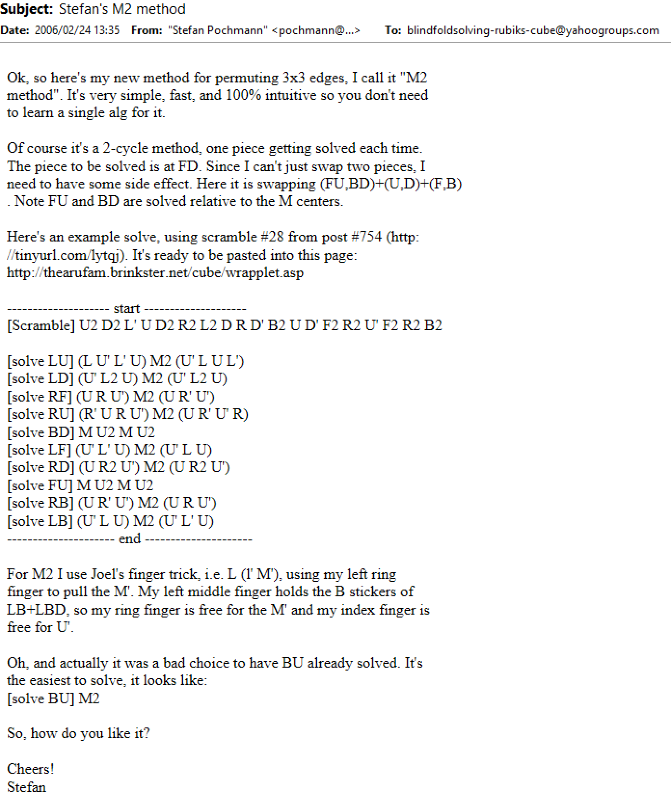
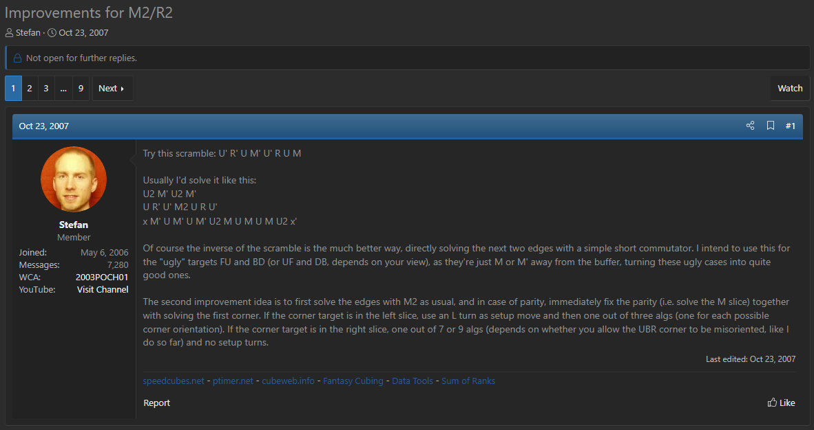

import ReconViewer from "@site/src/components/ReconViewer";
import YouTube from "@site/src/components/YouTube";
import ReactPlayer from 'react-player'
import ImageCollage from '@site/src/components/ImageCollage';

# M2/R2

<ReconViewer
scramble="L U L' B' D2 U R' F2 B' D' U B' R2 U' D' F R D' F' U R B2 D B' D'"
solution={`M U2 M U2 . // DB
M2 . // UB
U' L2 U M2 U' L2 U . // DL
R' U R U' M2 U R' U' R . // UR
x' U L2' U' M2 U L2 U' x . // LF
M U2 M U2 . // DB
U R' U' M2 U R U' . // BR
x' U' R2 U M2 U' R2 U x . // RF
M2 . // BU
L F (M' U M' U M' U2 M U M U M U2) F' L' . // Orient UB + UL
L' U' L' U R2 U' L U L . // LUF
R2 . // UBR
U' L2 U R2 U' L2 U . // DLF
(R U R' D r2 U') (R U r2' U') (D' R) . // BDR
(R' U R2 U' R' F' R U R2 U' R' F) . // RBD
R2 . // BRU
U' L U R2 U' L' U . // BLD
U' L' U R2 U' L U . // LBU
L U' F' L2' F U R2 U' F' L2' F U L' L2 . // DBL
(y') (R' U' l' L U' L U) (L' r' U) (l U') (F R U) // Orient UBR + DFR and fix parity`}
/>
**Example solve from Stefan Pochmann**

## Description

**Creator:** [Stefan Pochmann](CubingContributors/MethodDevelopers.md#pochmann-stefan)

**Created:** 2006-2007

**Steps:**

1. Solve the edges one at a time using setup moves and M2 turns.
2. Solve the corners one at a time using setup moves and R2 turns.

[Click here for more step details on the SpeedSolving wiki](https://www.speedsolving.com/wiki/index.php?title=M2/R2)

## 4x4 Edge Solving Origin

In December 2005, Stefan Pochmann posted to the Blindfold Solving Rubik’s Cube Yahoo group a technique for solving the edges of the 4x4x4 puzzle. The idea was to use UBr and URf as buffer positions, set up an edge position, then use R U R' U' r U R U' r' and its inverse to solve edges. Pochmann had yet to reveal this new way of solving the edges. As a test of the potential of the idea, Pochmann created a thread in the Yahoo group asking others how long it takes them to solve the edges of the 4x4x4 sighted using a blindsolving method [^pochmann-2005-1]. After several responses Pochmann revealed this new edge solving idea [^pochmann-2005-2]. Eventually the technique was changed from the use of inner slice quarter turns to half turns. After additional development, the moves were changed to a form such as U L' U' r2 U L U' with DFr being used as the buffer position [^pochmann-2007-1].

<ImageCollage
images={[
{ src: require("@site/docs/BlindfoldSolving/img/M2R2/4x4.png").default},
{ src: require("@site/docs/BlindfoldSolving/img/M2R2/4x4-2.png").default}
]}
/>

## Application to 3x3

After developing the 4x4x4 edge solving technique, Pochmann realized that it could be used on the 3x3x3. In January 2022, Pochmann started another thread in the same Yahoo group [^pochmann-2006-1]. This time Pochmann challenged others to perform sighted blindfold style solving of 3x3x3 edges. In one response to the thread, Pochmann revealed that he had a new method in development. Around a month later in response to someone asking for blindsolving advice, Pochmann teased the new idea by suggesting an edge solving solution that used setups in combination with M2 turns [^pochmann-2006-2].

<ImageCollage
images={[
{ src: require("@site/docs/BlindfoldSolving/img/M2R2/3x3Edges.png").default},
{ src: require("@site/docs/BlindfoldSolving/img/M2R2/Tease.png").default}
]}
/>

## M2 Reveal

On February 24 2006, Pochmann fully revealed the new 3x3 blindfold edge solving idea [^pochmann-2006-3]. The method was simply called M2, naming it after the move that the method is based on. At this point the R2 corner solving method had yet to be developed.

## R2 Reveal and M2/R2 Completion

In February 2007 Pochmann mentioned that he had been working on R2, a corner solving method to accompany M2 [^pochmann-2007-2]. On June 3 2007 Pochmann added both M2 and R2 to his website, completing the development of M2/R2 as a blindfold solving method [^pochmann-2007-3].

<ImageCollage
images={[
{ src: require("@site/docs/BlindfoldSolving/img/M2R2/R2Development.png").default},
{ src: require("@site/docs/BlindfoldSolving/img/M2R2/R2Development2.png").default},
{ src: require("@site/docs/BlindfoldSolving/img/M2R2/M2R2Publication.png").default}
]}
/>

## Interesting Coincidence

After the reveal of the M2 edge solving method, Erik Akkersdijk had the idea to apply it to the 4x4 for solving the edges [^akkersdijk-2007-1] [^akkersdijk-2007-2]. This brought everything full circle since the original idea that led Pochmann to develop M2/R2 was to use the r2 technique for solving the 4x4 edges.

<ImageCollage
images={[
{ src: require("@site/docs/BlindfoldSolving/img/M2R2/Akkersdijk1.png").default},
{ src: require("@site/docs/BlindfoldSolving/img/M2R2/Akkersdijk2.png").default}
]}
/>

## Advanced M2

The blindfold solving community eventually added techniques from the 3-Style method to M2/R2. Most significant is the use of algorithms to solve two pieces at a time using the DF edge as the buffer. Pochmann himself partially explored this idea, with a post on SpeedSolving.com mentioning the use of commutators for the worst cases of the solve [^pochmann-2007-4].

## Sources

Pochmann himself describes the history of M2/R2 on the page for the method [^pochmann-2007-1]. That served as a starting point for research for this page.

<ImageCollage
images={[
{ src: require("@site/docs/BlindfoldSolving/img/M2R2/PochmannHistory1.png").default},
{ src: require("@site/docs/BlindfoldSolving/img/M2R2/PochmannHistory2.png").default}
]}
/>

[^pochmann-2005-1]: S. Pochmann, "4x4 edges - time ?," Blindfold Solving Rubik's Cube Yahoo Group, 13 December 2005. [Online].
[^pochmann-2005-2]: S. Pochmann, "Re: 4x4 edges - time ?," Blindfold Solving Rubik's Cube Yahoo Group, 15 December 2005. [Online].
[^pochmann-2007-1]: S. Pochmann, "M2/R2 blindcubing methods," Stefan Pochmann's Website, 6 June 2007. [Online]. Available: https://web.archive.org/web/20100821202226/http://www.stefan-pochmann.de/spocc/blindsolving/M2R2#history.
[^pochmann-2006-1]: S. Pochmann, "Re: 3x3 edges - sighted BLD style - time ?," Blindfold Solving Rubik's Cube Yahoo Group, 22 January 2006. [Online].
[^pochmann-2006-2]: S. Pochmann, "Re: Looking for advice for freestyling EO+EP," Blindfold Solving Rubik's Cube, 24 February 2006. [Online].
[^pochmann-2006-3]: S. Pochmann, "Stefan's M2 method," Blindfold Solving Rubik's Cube Yahoo Group, 24 February 2006. [Online].
[^pochmann-2007-2]: S. Pochmann, "Re: blindsolving memorisation method-1," Blindfold Solving Rubik's Cube Yahoo Group, 6 February 2007. [Online].
[^pochmann-2007-3]: S. Pochmann, "Blindsolving methods M2 and R2," Blindfold Solving Rubik's Cube Yahoo Group, 3 June 2007. [Online].
[^akkersdijk-2007-1]: E. Akkersdijk, "r2 method," SpeedSolving.com, 5 June 2007. [Online]. Available: https://www.speedsolving.com/threads/r2-method.1008/.
[^akkersdijk-2007-2]: E. Akkersdijk, "Blindfolded solving of 4x4," Erik Akkersdijk's Website, 5 June 2007. [Online]. Available: https://web.archive.org/web/20071021093935/http://erikku.er.funpic.org/rubik/r2.html.
[^pochmann-2007-4]: S. Pochmann, "Improvements for M2/R2," SpeedSolving.com, 23 October 2007. [Online]. Available: https://www.speedsolving.com/threads/improvements-for-m2-r2.1768/.