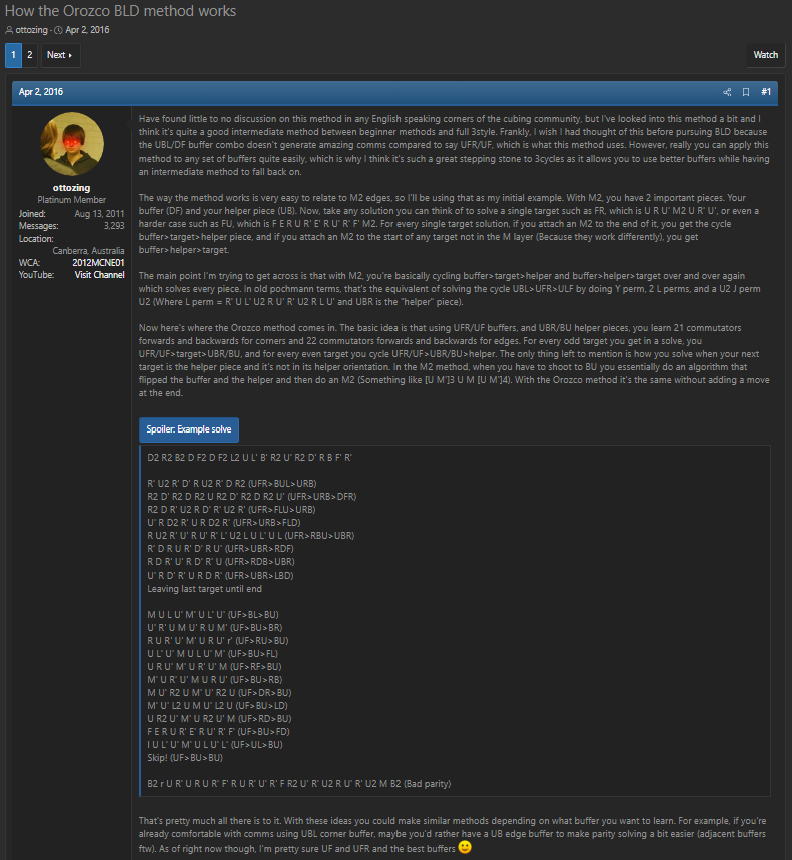
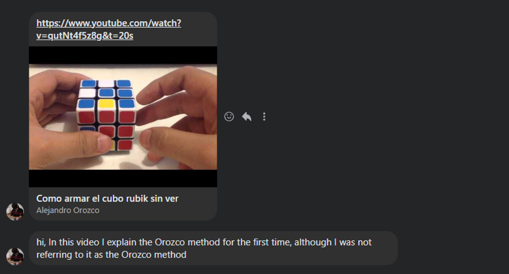

import AnimCube from "@site/src/components/AnimCube";
import ReactPlayer from 'react-player'
import ImageCollage from '@site/src/components/ImageCollage';
import YouTube from "@site/src/components/YouTube";

# Orozco

<AnimCube params="config=../../ReconstructionConfig.txt&initmove=L R2 D' U B2 U2 F D' B2 F' L2 U2 F' D U' B D' U R D' U' F2 D' R D2&move={Scramble: L R2 D' U B2 U2 F D' B2 F' L2 U2 F' D U' B D' U R D' U' F2 D' R D2}{URF-LUF-UBR: R' U' R' D' R U R' D R2}R' U' R' D' R U R' D R2.{URF-UBR-DLF: U' R D2 R' U R D2 R'}U' R D2 R' U R D2 R'.{URF-DFR-UBR: D' l U R' D2 R U' R' D2 x D}D' l U R' D2 R U' R' D2 x D.{URF-UBR-BRU: U L' U' L U L' U' R' U L U' L' U L U' R}U L' U' L U L' U' R' U L U' L' U L U' R.{URF-DRB-UBR: D x D2 R' U' R D2 R' U l D'}D x D2 R' U' R D2 R' U l D'.{URF-UBR-LBU: R U R D R' U' R D' R2}R U R D R' U' R D' R2.{UF-LB-UB: U' L U M' U' L' U M}U' L U M' U' L' U M.{UF-UB-BR: M' U R' U' M U R U'}M' U R' U' M U R U'.{UF-BD-UB: D' U R2 U' M' U R2 U' M D}D' U R2 U' M' U R2 U' M D.{UF-UB-DR: M' U R2 U' M U R2 U'}M' U R2 U' M U R2 U'.{UF-UR-UB: R U R' U' M' U R U' r'}R U R' U' M' U R U' r'.{UF-UB-FD: D U' R2 U M U' R2 U M' D'}D U' R2 U M U' R2 U M' D'.{UF-LD-UB: U' L2 U M' U' L2 U M}U' L2 U M' U' L2 U M.{UF-UB-RF: U' R U M U' R' U M'}U' R U M U' R' U M'.{UF + UB flip: M U M U M U2 M' U M' U M' U2}M U M U M U2 M' U M' U M' U2.{UF-UB-UR: r U R' U' M U R U' R'}r U R' U' M U R U' R'.{UF-UL-UB: L' U' L U M' U' L' U l}L' U' L U M' U' L' U l.{UF-UB-LF: M' U' L' U M U' L U}M' U' L' U M U' L U.{Parity: y' L2 R' U2 R U2 R' F R U R' U' R' F' R2' U' L2 y}y' L2 R' U2 R U2 R' F R U R' U' R' F' R2' U' L2 y" width="600px" height="400px" />
**Example solve from Gabriel Alejandro Orozco Casillas**

## Description

**Creator:** [Gabriel Alejandro Orozco Casillas](CubingContributors/MethodDevelopers.md#orozco-casillas-gabriel-alejandro)

**Created:** 2013

**Steps:**

1. With UFR as the buffer and UBR as the helper, solve the corners using a set of 21 algorithms.
2. With UF as the buffer and UB as the helper, solve the edges using a set of 22 algorithms.

[Click here for more step details on the SpeedSolving wiki](https://www.speedsolving.com/wiki/index.php?title=Orozco_method)

## Origin

In June of 2012, Gabriel Alejandro Orozco Casillas posted a thread to SpeedSolving.com describing a blindfold corner solving method called D2 [^1]. This was a translation of the R2 method to instead use D2 as the solving move. In December of the same year, he posted a thread presenting a variant of the method called “U2” [^2]. The idea was to take the M2/R2 method and to instead use U2 for solving both the corners and the edges. 21 algorithms are used for the corners and 22 algorithms are used for the edges. The same method was again proposed in 2017 by Yuri Alexandrovich [^3].

<ImageCollage
images={[
{ src: require("@site/docs/BlindfoldSolving/img/Orozco/D2.png").default},
{ src: require("@site/docs/BlindfoldSolving/img/Orozco/U2.png").default}
]}
/>

<ImageCollage
images={[
{ src: require("@site/docs/BlindfoldSolving/img/Orozco/Alexandrovich1.png").default},
{ src: require("@site/docs/BlindfoldSolving/img/Orozco/Alexandrovich2.png").default}
]}
/>

## Development

On November 9, 2013, Gabriel Alejandro Orozco Casillas posted a video of a new blindfold solving method, which eventually became known as Orozco [^3]. Elements of his previously proposed U2 method can be seen within Orozco, so it is possible that the idea of Orozco arose from the thought process behind the U2 method. It took some time before the Orozco method reached the non-Spanish speaking community. It is likely that the rest of the community first learned of the method through a thread by Jayden McNeill on SpeedSolving.com. In the thread, McNeill described the method, compared and contrasted it with the M2 method, and included an example solve [^4].

<YouTube embedId="qutNt4f5z8g" />

<ImageCollage
images={[
{ src: require("@site/docs/BlindfoldSolving/img/Orozco/Orozco1.png").default},
{ src: require("@site/docs/BlindfoldSolving/img/Orozco/Orozco2.png").default}
]}
/>

## Credit

The original video of the method was provided in a private message by Gabriel Alejandro Orozco Casillas.

[^1]: G. A. O. Casillas, "D2 method," SpeedSolving.com, 17 June 2012. [Online]. Available: https://www.speedsolving.com/threads/d2-method.37354/.

[^2]: G. A. O. Casillas, "U2 method for corners and edges," SpeedSolving.com, 31 December 2012. [Online]. Available: https://www.speedsolving.com/threads/u2-method-for-corners-and-edges.39840/.

[^3]: G. A. O. Casillas, "Como armar el cubo rubik sin ver," YouTube, 9 November 2013. [Online]. Available: https://www.youtube.com/watch?v=qutNt4f5z8g.

[^4]: J. McNeill, "How the Orozco BLD method works," SpeedSolving.com, 2 April 2018. [Online]. Available: https://www.speedsolving.com/threads/how-the-orozco-bld-method-works.60487/.