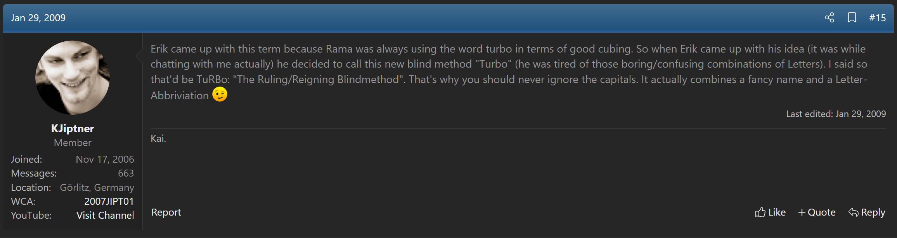

import AnimCube from "@site/src/components/AnimCube";
import ReactPlayer from 'react-player'
import ImageCollage from '@site/src/components/ImageCollage';

# TuRBo

<AnimCube params="config=../../ReconstructionConfig.txt&initmove=B F' D U2 F2 U' R' F U2 F2 L' U2 B' D' U2 F2 D' U2 L' B F' L2 D2 B2 L'&move={Scramble: B F' D U2 F2 U' R' F U2 F2 L' U2 B' D' U2 F2 D' U2 L' B F' L2 D2 B2 L'}{FRD > ULB: F' B L B' R B L' B' R' F}F' B L B' R B L' B' R' F.{URF > LBU: D L U2 F' L' B' L F L' B L U2 L' D'}D L U2 F' L' B' L F L' B L U2 L' D'.{ULB > URF: L' F x R2 D2 R U R' D2 R U' R x' F' L}L' F x R2 D2 R U R' D2 R U' R x' F' L.{BUL > URF: L R2 D' R U2 R' D R U2 R L'}L R2 D' R U2 R' D R U2 R L'.{BL > RD: L R2 U L' U' L U M' U' L' U l U' R2 L'}L R2 U L' U' L U M' U' L' U l U' R2 L'.{RB > DF: R' D' L2 U l' U' L U M U' L' U L U' L2 D R}R' D' L2 U l' U' L U M U' L' U L U' L2 D R.{FR > LF: R L' U' R U R' U' M' U R U' r' U L R'}R L' U' R U R' U' M' U R U' r' U L R'.{UB > BD: B R' L U' r U R' U' M U R U' R' U L' R B'}B R' L U' r U R' U' M U R U' R' U L' R B'.{DL > LU: b' U' r U R' U' M U R U' R' U b}b' U' r U R' U' M U R U' R' U b.{Orient UF and UR: R' U2 R2 U R' U' R' U2 L F R F' L'}R' U2 R2 U R' U' R' U2 L F R F' L'." width="600px" height="400px" />
**Example solve from Erik Akkersdijk**

## Description

**Creator:** [Erik Akkersdijk](CubingContributors/MethodDevelopers.md#akkersdijk-erik)

**Created:** 2007

**Steps:**

- Corners: Solve two corners at once by setting them up to ULB and URF, perform a cycle algorithm, then undo the setup moves.
- Edges: Solve two edges at once by setting them up to UL and UR, perform a cycle algorithm, then undo the setup moves.

[Click here for more step details on the SpeedSolving wiki](https://www.speedsolving.com/wiki/index.php?title=TuRBo)

## Origin and Reveal

Erik Akkersdijk first publicly mentioned the TuRBo method in August 2007 within a weekly competition thread on speedsolving.com [1]. After several other mentions of the method’s development, Akkersdijk revealed the steps of the method on October 8 2007 [2, 3, 4, 5].

<ImageCollage
images={[
{ src: require("@site/docs/BlindfoldSolving/img/TuRBo/Erik1.png").default},
{ src: require("@site/docs/BlindfoldSolving/img/TuRBo/Erik2.png").default},
{ src: require("@site/docs/BlindfoldSolving/img/TuRBo/Erik3.png").default},
{ src: require("@site/docs/BlindfoldSolving/img/TuRBo/Erik4.png").default}
]}
/>

The TuRBo method maintained a relatively large amount of popularity for several years in the community. Because of the simplicity it was often recommended to blindfold solving newcomers.

<ImageCollage
images={[
{ src: require("@site/docs/BlindfoldSolving/img/TuRBo/Popularity1.png").default},
{ src: require("@site/docs/BlindfoldSolving/img/TuRBo/Popularity2.png").default}
]}
/>

## Name Origin

The name “TuRBo” comes from the fact that Akkersdijk found it amusing that Rama Temmink used the term “turbo” when describing something as being good. Kai Jiptner then suggested to use it as an acronym and have it stand for “The Ruling Blindfold Method” [6].

## References

[1] "Weekly competition 2007-28 (2,3,3OH,4,5,BF,SQ1,MG,FMC,MM,PM)," SpeedSolving.com, 20 August 2007. [Online]. Available: https://www.speedsolving.com/threads/weekly-competition-2007-28-2-3-3oh-4-5-bf-sq1-mg-fmc-mm-pm.1332/post-12904.

[2] "TuRBo method," SpeedSolving.com, 8 October 2007. [Online]. Available: https://www.speedsolving.com/threads/turbo-method.1671/.

[3] E. Akkersdijk, "Edge solving for BLD with TuRBo method," Erik Akkersdijk's Website, October 2007. [Online]. Available: https://web.archive.org/web/20071028172925/http://erikku.er.funpic.org/rubik/turboedges.html.

[4] "Corner solving for BLD with TuRBo method," Erik Akkersdijk's Website, October 2007. [Online]. Available: https://web.archive.org/web/20071112092629/http://erikku.er.funpic.org/rubik/turbocorners.html.

[5] E. Akkersdijk, "The Ruling Blindfold method (TuRBo)," Erik Akkersdijk's Website, 2008. [Online]. Available: https://web.archive.org/web/20081217163953/http://www.erikku.110mb.com/TuRBo.html.

[6] K. Jiptner, "Turbo?," SpeedSolving.com, 29 January 2009. [Online]. Available: https://www.speedsolving.com/threads/turbo.9049/post-129348.
