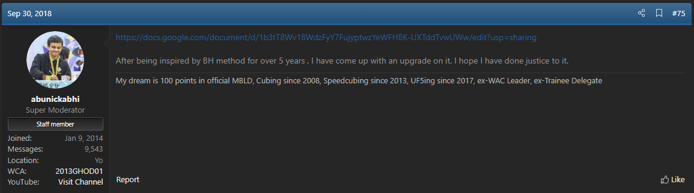
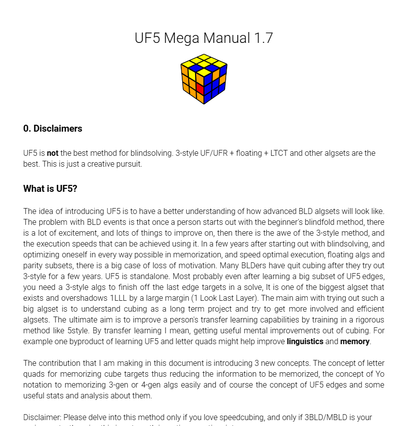

import ReconViewer from "@site/src/components/ReconViewer";
import YouTube from "@site/src/components/YouTube";
import ReactPlayer from 'react-player'
import ImageCollage from '@site/src/components/ImageCollage';

# UF5

<ReconViewer
scramble="B' D L' U2 R2 B D' F' R U2 D2 B R2 F' U2 F' B' R2 L2 U2"
solution={`z2 y . // Rotate
U L' S L2 S2 S' L S2 L2 U' . // UF-UB-FL-DL-DR
M U M U2 M2 U M' U M U' . // UF-RU-FD-BD-UL
f' U L' E L E' U' f . // UF-BL-RB-RF-UL
D' R U R' D R U R' D' R U' U' R' D . // UFR-LBU-RDF
U R D2 R U' R' D2 R U R' R' U' . // UFR-BLD-DRB
U' R' U2 R' D' R U2 R' D R R U . // UFR-UFL-RUB
D U' F' R U R' U' R' F R2 U' R' U' R U R' U D' // Parity`}
/>

**Example solve by Abhijeet Ghodgaonkar.**

## Description

**Creator:** [Abhijeet Ghodgaonkar](CubingContributors/MethodDevelopers.md#ghodgaonkar-abhijeet), others

**Created:** 2018

**Steps:** Use freestyle 5-cycles to simultaneously solve four edges at a time.

[Click here for more step details on the SpeedSolving wiki](https://www.speedsolving.com/wiki/index.php?title=5-style)

## Early Proposals

The suggestion of the idea of the use of 5-cycles can be seen throughout the puzzle community starting not long after the adoption of the 3-Style method. In October 2012 one SpeedSolving.com member, Mantas Sidabras, suggested that a method based around 5-cycles would allow for breaking the sub-20 barrier [^1]. At the time of the post the world record was around 23 seconds [^2]. Around six months later a discussion was started in which several members of SpeedSolving.com debated the viability of the use of 5-cycles [^3]. In August 2014 Cale Schoon posted an example solve showing the efficiency difference between 5-style and 3-style [^4]. The solve made use of `M U` based 5-cycles that had been developed by Oleg Gritsenko in 2013 [^5] [^6]. Some other users asked if a 5-cycle method was possible or if any algorithms had been developed [^7] [^8].

<ImageCollage
images={[
{ src: require("@site/docs/BlindfoldSolving/img/UF5/5Cycle1.png").default},
{ src: require("@site/docs/BlindfoldSolving/img/UF5/5CycleDebate.png").default},
{ src: require("@site/docs/BlindfoldSolving/img/UF5/5Cycle2.png").default},
{ src: require("@site/docs/BlindfoldSolving/img/UF5/5Cycle3.png").default},
{ src: require("@site/docs/BlindfoldSolving/img/UF5/5Cycle4.png").default},
{ src: require("@site/docs/BlindfoldSolving/img/UF5/Gritsenko.png").default}
]}
/>

## Development

### Method

Although the idea had been suggested numerous times in the past, it hadn’t been formally developed into a structured method. In 2014, Abhijeet Ghodgaonkar began thinking about the method after having a conversation with another blindfold solver while attending a competition [^9]. In 2018 Ghodgaonkar authored a document detailing the use of 5-cycles as a method and its potential [^10]. Ghodgaonkar mentions that both he and Yongqiang Peng had been developing it for around two years [^11].

### Notation

In June 2018, Ghodgaonkar posted a video to YouTube detailing a new way to memorize blindfold solving algorithms [^12]. Then, in January 2019, he announced that he was developing it into a mnemonic system called “Yo Notation” that is intended to make algorithm memorization easier [^13]. The notation document was developed and published in February 2019 [^14] [^15] [^16].

<YouTube embedId="y56Ljj4TeEg" />

<ImageCollage
images={[
{ src: require("@site/docs/BlindfoldSolving/img/UF5/Yo1.png").default},
{ src: require("@site/docs/BlindfoldSolving/img/UF5/Yo2.png").default},
{ src: require("@site/docs/BlindfoldSolving/img/UF5/YoDocument.png").default}
]}
/>

### Algorithms

Soon after the development of Yo Notation, Ghodgaonkar created a thread on SpeedSolving.com dedicated to discussion of the method. The thread included various details about the method and links to relevant documents, including a new document providing a learning plan [^17]. In June 2019, Ghodgaonkar published a document including algorithms for several cases [^18] [^19]. Ghodgaonkar also maintains a YouTube channel dedicated to UF5 discussion and algorithm development [^20].

<ImageCollage
images={[
{ src: require("@site/docs/BlindfoldSolving/img/UF5/ProvingUF5.png").default},
{ src: require("@site/docs/BlindfoldSolving/img/UF5/LearningPlan.png").default},
{ src: require("@site/docs/BlindfoldSolving/img/UF5/AlgSheet1.png").default},
{ src: require("@site/docs/BlindfoldSolving/img/UF5/AlgSheet2.png").default}
]}
/>

## Viability

The question of viability can be seen even in the very beginning of the appearance of the idea of 5-cycles [^21]. Ghodgaonkar himself has expressed doubts as to the viability of the method. In February 2017, around a year before becoming a developer of the method, Ghodgaonkar stated that it is “impossible”, “worthless”, that there are too many algorithms which will take a long time to develop, and that it is better to focus on improving 3-Style algorithms and execution [^22]. After starting development Ghodgaonkar was much more confident in the idea as seen by the large amount of created documentation. Upon promoting the method to the community, however, he received feedback that was similar to his previous doubts [^23] [^24] [^25] [^26].

<ImageCollage
images={[
{ src: require("@site/docs/BlindfoldSolving/img/UF5/Doubt1.png").default},
{ src: require("@site/docs/BlindfoldSolving/img/UF5/Doubt2.png").default},
{ src: require("@site/docs/BlindfoldSolving/img/UF5/Doubt3.png").default},
{ src: require("@site/docs/BlindfoldSolving/img/UF5/Doubt4.png").default}
]}
/>

<ImageCollage
images={[
{ src: require("@site/docs/BlindfoldSolving/img/UF5/Facebook1.png").default},
{ src: require("@site/docs/BlindfoldSolving/img/UF5/Facebook2.png").default},
{ src: require("@site/docs/BlindfoldSolving/img/UF5/Facebook3.png").default},
{ src: require("@site/docs/BlindfoldSolving/img/UF5/Facebook4.png").default},
{ src: require("@site/docs/BlindfoldSolving/img/UF5/Facebook5.png").default}
]}
/>

<YouTube embedId="-SantOHuPcs" />
 

Ghodgaonkar even went as far as compiling a survey to ask the community how they felt about UF5 [^27] [^28]. Many responses reflected the negative opinions expressed in the message board posts and Facebook groups. Some respondents, both to the surveys and online message boards and groups, were more optimistic, comparing it to the ZBLL and ZBLS algorithm sets [^29] [^27] [^28]. It was noted that for several years after the proposals of ZBLL and ZBLS many doubted the viability of learning and recalling the large number of algorithms, yet the two algorithm sets are now being learned and implemented into competition solves. After putting effort into development, practice, and considering the feedback from the community, Ghodgaonkar settled on a mixed opinion [30]:

> I was in two minds always, one mind thinking that method will not give any returns, and the other was that this method will just restructure the human brain, as to how we consume information and the thin line between memorisation and understanding a thing fully that we are able to reconstruct it.

<YouTube embedId="Le8dVjF5Jog" />
<YouTube embedId="F8VSVnCXx5k" />
 

<ImageCollage
images={[
{ src: require("@site/docs/BlindfoldSolving/img/UF5/Survey1.png").default},
{ src: require("@site/docs/BlindfoldSolving/img/UF5/Survey2.png").default},
{ src: require("@site/docs/BlindfoldSolving/img/UF5/Survey3.png").default},
{ src: require("@site/docs/BlindfoldSolving/img/UF5/Survey4.png").default}
]}
/>

[^1]: M. Sidabras, "Speedcubing - What are the limits?," SpeedSolving.com, 1 October 2012. [Online]. Available: https://www.speedsolving.com/threads/speedcubing-what-are-the-limits.38766/post-787128.
[^2]: WCA, "Records," World Cube Association, [Online]. Available: https://www.worldcubeassociation.org/results/records?event_id=333bf&show=history.
[^3]: randomtypos, "What do you think is the absolute human limit of 3BLD?," SpeedSolving.com, 30 April 2013. [Online]. Available: https://www.speedsolving.com/threads/what-do-you-think-is-the-absolute-human-limit-of-3bld.41783/.
[^4]: C. Schoon, "Random Blindfold Cubing Discussion," SpeedSolving.com, 17 August 2014. [Online]. Available: https://www.speedsolving.com/threads/random-blindfold-cubing-discussion.27436/post-1008573.
[^5]: O. Gritsenko, "What do you think is the absolute human limit of 3BLD?," SpeedSolving.com, 1 May 2013. [Online]. Available: https://www.speedsolving.com/threads/what-do-you-think-is-the-absolute-human-limit-of-3bld.41783/post-848844.
[^6]: O. Gritsenko, "MU 5-cycles," 1 May 2013. [Online]. Available: https://docs.google.com/spreadsheets/d/1GR_1q5lrBbkCGIcziMhN5UjrhpILwmrRd3v59-8wTyA/edit?gid=0#gid=0.
[^7]: fp4316, "5cyles," SpeedSolving.com, 16 July 2016. [Online]. Available: https://www.speedsolving.com/threads/5cyles.61725/.
[^8]: T. D. G. Cuevas, "5 edge commutators," SpeedSolving.com, 6 August 2018. [Online]. Available: https://www.speedsolving.com/threads/5-edge-commutators.70664/.
[^9]: M. J. Straughan and A. Ghodgaonkar, Personal Communication, 6 May 2025. [Online].
[^10]: A. Ghodgaonkar, "Thoughts about the BH method," SpeedSolving.com, 30 September 2018. [Online]. Available: https://www.speedsolving.com/threads/thoughts-about-the-bh-method.11909/post-1302959.
[^11]: A. Ghodgaonkar, "5cyles," SpeedSolving.com, 11 March 2019. [Online]. Available: https://www.speedsolving.com/threads/5cyles.61725/post-1313931.
[^12]: A. Ghodgaonkar, "How to Memorise Algorithms?," YouTube, 15 June 2018. [Online]. Available: https://www.youtube.com/watch?v=y56Ljj4TeEg.
[^13]: A. Ghodgaonkar, "Converting algorithms to letters?," SpeedSolving.com, 27 January 2019. [Online]. Available: https://www.speedsolving.com/threads/converting-algorithms-to-letters.72367/post-1311081.
[^14]: A. Ghodgaonkar, "Converting algorithms to letters?," SpeedSolving.com, 3 February 2019. [Online]. Available: https://www.speedsolving.com/threads/converting-algorithms-to-letters.72367/post-1311583.
[^15]: A. Ghodgaonkar, "Archived\*UFR_Abhi," 28 January 2019. [Online]. Available: https://docs.google.com/spreadsheets/d/1XiNdbdbj14t6p-38t_IfRyLEyjYZzR6D1M16dTZudpM/edit?gid=0#gid=0.
[^16]: A. Ghodgaonkar, "Yo Notation: A turn-based encoding notation system for memorizing 3x3 algs (non-trivial algs only)," 3 February 2019. [Online]. Available: https://docs.google.com/document/d/1bfDsydw6pxBftd8Xwik95FNjILGkdrJMBO5EORbftII/edit?tab=t.0.
[^17]: A. Ghodgaonkar, "Proving UF5," SpeedSolving.com, 31 March 2019. [Online]. Available: https://www.speedsolving.com/threads/proving-uf5.73119/.
[^18]: A. Ghodgaonkar, "5cyles," SpeedSolving.com, 5 June 2019. [Online]. Available: https://www.speedsolving.com/threads/5cyles.61725/post-1320963.
[^19]: A. Ghodgaonkar, "Abhi_Algs_Public," 5 June 2019. [Online]. Available: https://docs.google.com/spreadsheets/d/158F-jyu8ld8kbdD4I_Lqy4fsX5vvp_MQOq7Ofg8NdSI/edit?gid=1229717195#gid=1229717195.
[^20]: "Abhijeet Ghodgaonkar," YouTube, [Online]. Available: https://www.youtube.com/channel/UCa7dTclUqnR9VwSeOCpRwAQ/videos.
[^21]: E. Jernqvist, "Speedcubing - What are the limits?," SpeedSolving.com, 1 October 2012. [Online]. Available: https://www.speedsolving.com/threads/speedcubing-what-are-the-limits.38766/post-787129.
[^22]: A. Ghodgaonkar, "is anyone going to develop 5style soon?," Facebook - BLD Support Group, 10 February 2017. [Online]. Available: https://www.facebook.com/groups/BLDSupportGroup/permalink/1209669535820466/?rdid=utLcedabIX1HSjKk#.
[^23]: Various, "Would partial uf5 ever be viable?," Facebook - BLD Support Group, 16 October 2023. [Online]. Available: https://www.facebook.com/groups/BLDSupportGroup/posts/6751340631653301/?__cft__[^0]=AZXTWhyfMnQ74q9P59C75lZBZaWY-Hc3yTLaGqYQbRxBMqhuYFaqZUPw_azv-17oPiQtAqyNdPuMI8g4JU3jKsQjmhOVJ3eCh32Le_1RwKhsOkGhi02rEVowsAzlWTx6AjRGcsEPnav6BJO-TOhHDYV0&__tn__=%2CO%2CP-R-R.
[^24]: Various, Facebook - BLD Support Group, 8 January 2022. [Online]. Available: https://www.facebook.com/groups/BLDSupportGroup/posts/4749882598465791/?__cft__[^0]=AZVcWo0qkIsLkpc5S4W2BK2rnzzB5TKuYFXf_SoH0JYHzVSQu77-KfihYyL5tvcR7_FxmAkbw4aTLNSJ*-x7F7cwIxlR393w9yon0ZHYyI4egEzFcmoB4ZjLOrgvVRUwjrO2HCSoBFzmsrKNt4O992Hc&**tn**=%2CO%2CP-R-R.
[^25]: Various, Facebook - BLD Support Group, 13 May 2024. [Online]. Available: https://www.facebook.com/groups/BLDSupportGroup/posts/7577352269052129/.
[^26]: T. Cherry and A. Ghodgaonkar, "Tommy Cherry: Why UF5 is not viable algset at all? | Euros 2024," YouTube, 1 August 2024. [Online]. Available: https://www.youtube.com/watch?v=-SantOHuPcs.
[^27]: A. Ghodgaonkar, "UF5 Feedback Part 1," YouTube, 6 August 2019. [Online]. Available: https://www.youtube.com/watch?v=Le8dVjF5Jog.
[^28]: A. Ghodgaonkar, "UF5 Feedback Part 2," YouTube, 13 January 2022. [Online]. Available: https://www.youtube.com/watch?v=F8VSVnCXx5k.
[^29]: X. Zhu, Facebook - BLD Support Group, 13 May 2024. [Online]. Available: https://www.facebook.com/groups/BLDSupportGroup/posts/7577352269052129/?comment_id=7577634859023870&__cft__[^0]=AZXrCdYIQApmYMXSkjoVWY8ENaZi1S7Y_VgME36kKx2JMH_tWE0IDA1p_NrW__fAcrYUFW6HrvLC3dv20dBZ5XG07obEpOVm2D5p_A432Z0o6zGa30TJuU5g-QuKfDF8MyO2B4IPNacmCSF8.
[^30]: A. Ghodgaonkar, "Proving UF5," SpeedSolving.com, 21 September 2020. [Online]. Available: https://www.speedsolving.com/threads/proving-uf5.73119/post-1394069.