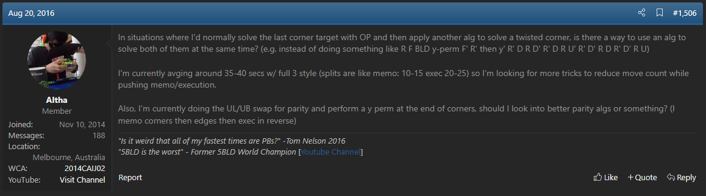
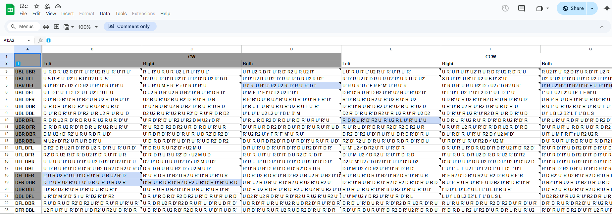
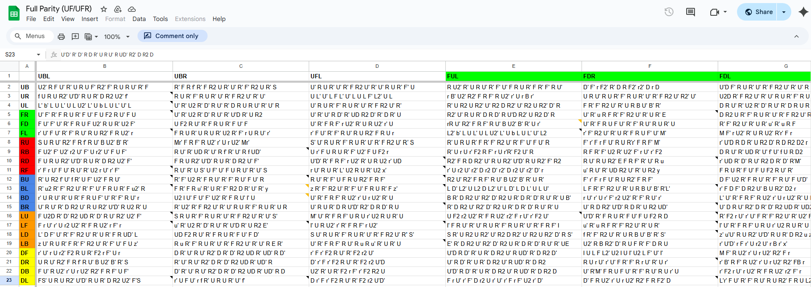

import AnimCube from "@site/src/components/AnimCube";
import ReactPlayer from 'react-player'
import ImageCollage from '@site/src/components/ImageCollage';

# Techniques

## Floating Buffer

### Description

If the buffer piece happens to become solved during a blindfold solve, the basic process is to use a cycle to remove the solved buffer piece. With floating buffers, the solver switches to a different buffer position if the current one becomes solved.

**Creator:** Various

**Created:** Late 2000s

### Origin

In blindfold solving, it sometimes occurs that the buffer piece becomes solved. To deal with this issue, people used to unsolve the piece, which is called “breaking into a new cycle”. In the late 2000s a new technique emerged, called floating buffers. With floating buffers, instead of unsolving the buffer piece, the solver sets a new piece as the buffer position and continues the solve from that point. Before this technique was introduced, Chris Hardwick had been using a related idea at the start of solves. If the buffer piece was solved in the current scramble, Hardwick would choose a different piece to become the buffer position. This becomes sort of a “starting floating buffer” technique [1, 2, 3].

<ImageCollage
images={[
{ src: require("@site/docs/BlindfoldSolving/img/Techniques/Hardwick1.png").default},
{ src: require("@site/docs/BlindfoldSolving/img/Techniques/Hardwick2.png").default},
{ src: require("@site/docs/BlindfoldSolving/img/Techniques/Hardwick3.png").default}
]}
/>

Soon after BH and 3-Style started gaining popularity, some in the community weren’t sure what they were supposed to do if their buffer piece gets solved at some point in the solve. At the time, the answer was to break into a new cycle by unsolving the solved piece. However, some questioned the efficiency of unsolving pieces [4, 5, 6]. This eventually led to a new line of thinking and the idea of switching to the use of a new buffer if the current one becomes solved [7]. Due to the mentioned confusion as to how to handle a solved buffer piece, some, such as Rowe Hessler and Gianfranco Huanqui, even assumed from the start that they were supposed to switch to a new buffer position [8, 9]. The first known video recorded use of this technique in competition is by Rowe Hessler in 2008 [10].

<ImageCollage
images={[
{ src: require("@site/docs/BlindfoldSolving/img/Techniques/Ville.png").default},
{ src: require("@site/docs/BlindfoldSolving/img/Techniques/Pedro.png").default},
{ src: require("@site/docs/BlindfoldSolving/img/Techniques/cubeRemi.png").default}
]}
/>

  <iframe loading="lazy" width="100%" height="100%"
    src="https://www.youtube.com/embed/hpxOIQ6j0rk"
    frameborder="0" allowfullscreen
    style={{position: 'absolute', top: 0, left: 0}}>
  </iframe>

### Popularization

Many blindfold solvers implemented floating buffers into their solves starting in the late 2010s. However, widespread use of the technique can be traced to at least one point in time. In January 2016, Gianfranco Huanqui achieved a 3x3 blindfold solving continental record time of 21.51 seconds [11]. In the solve, Huanqui made use of the technique, catching the attention of several people in the community. One of those people who took notice of the solve was Jayden McNeill. Impressed by the use of floating buffers within such a high level solve in competition, McNeill posted a thread to SpeedSolving.com attempting to standardize the process in a way that could be consistently implemented [12].

  <iframe loading="lazy" width="100%" height="100%"
    src="https://www.youtube.com/embed/Og-E8v1rihc"
    frameborder="0" allowfullscreen
    style={{position: 'absolute', top: 0, left: 0}}>
  </iframe>

### Floating Buffer Term

The origin of the term “floating buffer” is unknown. It is likely that varying words and phrases were used in the earlier years to refer to the technique. However, the first known use of “floating buffer” can be found in posts by Mike Hughey to SpeedSolving.com [13, 14, 15].

<ImageCollage
images={[
{ src: require("@site/docs/BlindfoldSolving/img/Techniques/Hughey1.png").default},
{ src: require("@site/docs/BlindfoldSolving/img/Techniques/Hughey2.png").default},
{ src: require("@site/docs/BlindfoldSolving/img/Techniques/Hughey3.png").default}
]}
/>

## Last Target Corner Twist (LTCT)

### Description

Occasionally there will be two misoriented corners remaining after having solved the final corner target. LTCT combines this into a single step process of solving the final target and orienting the corners.

**Creator:** Jack Cai

**Created:** 2016

### Origin

On August 20, 2016, Jack Cai posted a message to the SpeedSolving.com forum asking about solves when the ending consists of solving the last corner target then handling two misoriented corners [16]. Cai questioned if there was a way to simultaneously solve both sub-steps. This is likely the beginning of the development of what is now known as Last Target Corner Twist, or LTCT. In April 2019 Cai developed a spreadsheet containing algorithms covering two buffers – UFR and Cai’s previous primary buffer of UBR [17]. Two months later, in June 2019, Masato Fujiwara developed a more comprehensive list of algorithms that included all target locations [18]. Another list, based on Fujiwara’s, was created in 2020 by Philip Maxwell and included additional information, color coding for better legibility, and recommended algorithm execution grips [19]. In 2022, Andy Wong further optimized the algorithm set and added it to a fork of Tao Yu’s algorithm trainer [20].

<ImageCollage
images={[
{ src: require("@site/docs/BlindfoldSolving/img/Techniques/Cai2.png").default},
{ src: require("@site/docs/BlindfoldSolving/img/Techniques/Cai3.png").default}
]}
/>
<ImageCollage
images={[
{ src: require("@site/docs/BlindfoldSolving/img/Techniques/Fujiwara.png").default},
{ src: require("@site/docs/BlindfoldSolving/img/Techniques/Maxwell.png").default}
]}
/>

## T2C

### Description

Solves the final corner target when the buffer corner is twisted and the remaining two corners are swapped.

**Creator:** Andy Wong, Elliott Kobelansky

**Created:** 2021

### Origin

After having performed many blindfold solves, Andy Wong noticed that a notable percentage of solves ended with two swapped corners and a corner twist. Blindfold solvers at the time were handling this situation using two steps of executing a commutator then solving the parity. In January 2021, Wong proposed the idea of solving the cases in a single step [21].

However, at the time of the proposal of T2C, some other existing advanced techniques hadn’t yet seen widespread use, leading T2C to wait in line for adoption. After seeing that LTCT had started to gain interest from blindfold solvers around 2022, Wong further built upon previous LTCT developments by creating new algorithms and adding them to an algorithm trainer [20]. This then led Wong to take another look at T2C. Working with Elliott Kobelansky, a name for the algorithm set was discussed. Originally it was referred to as “buffer twisted LTCT”. Wong eventually suggested the name T2C, with the T referencing the twisted buffer and 2C taken from the corner swap in the blindfold solving term 2c2c.

In June of 2022, Wong and Kobelansky started development on T2C, together devising a recognition system and an associated case categorization. Algorithms for the set were generated by Wong, with some assistance from Kobelansky. The final document containing the T2C developments were released to the public in October 2022 [22]. In July 2022, in the midst of development, T2C was presented during a seminar at the NAC 2022 competition [23]. This was likely the first public mention of T2C.

  <iframe loading="lazy" width="100%" height="100%"
    src="https://www.youtube.com/embed/NKNAE-0FTBA?start=1109s"
    frameborder="0" allowfullscreen
    style={{position: 'absolute', top: 0, left: 0}}>
  </iframe>

### Credit

The history of T2C was provided in a personal message by Andy Wong.

## Parity

In the earlier years of blindfold solving, the typical strategy used to solve parity was to start by solving the last target. Then, after the last target was solved, setups and commutators were used to solve the parity. This still holds true for the basic forms of blindfold solving methods. However, advancements have been created to better handle parity situations.

### Memo Swap / Pseudo Swap

The most common way of solving parity is to use a technique called “memo swap” or “pseudo swap”. Using this technique, instead of separately solving the final target and solving parity, the parity solving is built into the final piece target. The final target is solved while positioning the piece currently in the target position to the UR position. For edges this creates a cycle of UF > Target > UR if using UF as the buffer position. Solvers typically memorize the corners first then, if parity exists, the edges are memorized and solved to have the UF and UR edges swapped. It is unknown from where the technique originated, but it has been used at least as far back as 2012, as shown by its use by Noa Arthurs in a tutorial video [24].

  <iframe loading="lazy" width="100%" height="100%"
    src="https://www.youtube.com/embed/1xGbJ4ic6oE?start=134s"
    frameborder="0" allowfullscreen
    style={{position: 'absolute', top: 0, left: 0}}>
  </iframe>

### Full Parity

A more advanced technique is to solve parity involving any two final corner and edge targets. On December 25, 2016, Daniel Lin released a document covering full parity [25]. In September 2022, Charlie Harrison and James Macdiarmid also developed a document containing algorithms for full parity [26]. Huanqui has stated that he once generated all 462 full parity algorithms because he didn’t know that there were simpler techniques for handling those situations [9]. However, no document was ever created by Huanqui [9].

## Speffz Lettering Scheme

In November 2010 in a community internet relay chat room, Rob Holt expressed dissatisfaction with referring to pieces using their layer combinations. Holt then suggested the idea of creating a standard lettering scheme that assigns a single letter to each sticker. Ville Seppänen responded in agreement. Holt then decided to create a thread on SpeedSolving.com to discuss the idea and included an initial scheme proposal [27]. Several members of the community provided their opinions and eventually settled on a final lettering scheme that was similar to the initial proposal [28]. The name Speffz was chosen as a combination of Seppänen’s username “Spef” and Holt’s username “riffz”.

<ImageCollage
images={[
{ src: require("@site/docs/BlindfoldSolving/img/Techniques/Speffz1.png").default},
{ src: require("@site/docs/BlindfoldSolving/img/Techniques/Speffz2.png").default}
]}
/>

## Slice Turns

Aside from the M slice, slice turns weren’t always in heavy use during blindfold solving. This is likely because the ergonomics for E and S slice turns hadn’t yet been strenuously tested within blindfold solves. In addition, outer turns were likely considered safer, with less risk of improperly executing the turns. Eventually E and S moves started making their appearance in top level solves, and it is thought that Gianfranco Huanqui popularized the use of E and S turns in blindfold solving [8]. A notable example of slice turn use is the 23.68 world record solve by Marcin Zalewski, which included the use of E slice turns in two of the edge solving targets [29]. Huanqui stated that he saw the use of E slice commutators in Zalewski’s world record solve and was inspired to use it in any situation possible [9]. In addition to implementing E slice moves, Huanqui also started using S slice moves. Huanqui believes that this came about either naturally after having experimented with E slice moves or from discussions with Ishaan Agrawal, who had been using S slice moves at the time [9].

  <iframe loading="lazy" width="100%" height="100%"
    src="https://www.youtube.com/embed/-QHaiTRec_8"
    frameborder="0" allowfullscreen
    style={{position: 'absolute', top: 0, left: 0}}>
  </iframe>

## References

[1] C. Hardwick, "Re: 4x4 edges - time ?," Blindfold Solving Rubik's Cube Yahoo! Group, 16 December 2005. [Online].

[2] C. Hardwick, "My commutator BLD corner method," SpeedSolving.com, 16 October 2007. [Online]. Available: https://www.speedsolving.com/threads/my-commutator-bld-corner-method.1692/post-17568.

[3] C. Hardwick, "My commutator BLD corner method," SpeedSolving.com, 16 October 2007. [Online]. Available: https://www.speedsolving.com/threads/my-commutator-bld-corner-method.1692/post-17642.

[4] V. Seppänen, "breaking into new cycles," SpeedSolving.com, 5 February 2008. [Online]. Available: https://www.speedsolving.com/threads/breaking-into-new-cycles.2828/post-32263.

[5] P. S. Guimarães, "breaking into new cycles," SpeedSolving.com, 5 February 2008. [Online]. Available: https://www.speedsolving.com/threads/breaking-into-new-cycles.2828/post-32273.

[6] S. Pochmann, "Stefan's M2 R2 blindfold method," SpeedSolving.com, 8 June 2007. [Online]. Available: https://www.speedsolving.com/threads/stefans-m2-r2-blindfold-method.1003/post-9404.

[7] cubeRemi, "I'd like to get back into blindfold cubing," SpeedSolving.com, 1 October 2008. [Online]. Available: https://www.speedsolving.com/threads/id-like-to-get-back-into-blindfold-cubing.6667/post-90572.

[8] J. Macdiarmid, "Personal Communication," 10 October 2024. [Online].

[9] G. Huanqui, "Personal Communication," 28 March 2025. [Online].

[10] R. Hessler, "Floating in 2008?! 59.66 3BLD NAR Reconstruction," YouTube.com, 24 October 2020. [Online]. Available: https://www.youtube.com/watch?v=hpxOIQ6j0rk.

[11] G. Huanqui, "Gianfranco Huanqui Continental Record 3x3BLD: 21.51," YouTube.com, 24 January 2016. [Online]. Available: https://www.youtube.com/watch?v=Og-E8v1rihc.

[12] J. McNeill, "Floating buffers discussion," SpeedSolving.com, 10 February 2016. [Online]. Available: https://www.speedsolving.com/threads/floating-buffers-discussion.57233/post-1151312.

[13] M. Hughey, "Monthly Computer Cube Competition 1: June 2009," SpeedSolving.com, 1 June 2009. [Online]. Available: https://www.speedsolving.com/threads/monthly-computer-cube-competition-1-june-2009.12401/post-186318.

[14] M. Hughey, "Big Cube BLD Discussion," SpeedSolving.com, 23 November 2009. [Online]. Available: https://www.speedsolving.com/threads/big-cube-bld-discussion.16775/post-272353.

[15] M. Hughey, "Big Cube BLD Discussion," SpeedSolving.com, 6 December 2009. [Online]. Available: https://www.speedsolving.com/threads/big-cube-bld-discussion.16775/post-281201.

[16] J. Cai, "Random Blindfold Cubing Discussion," SpeedSolving.com, 20 August 2016. [Online]. Available: https://www.speedsolving.com/threads/random-blindfold-cubing-discussion.27436/post-1190894.

[17] J. Cai, "LTCT algs," 9 April 2019. [Online]. Available: https://docs.google.com/spreadsheets/d/1S0SVZF54nM0LTpAdnmP2yy7G1juplbkesKb7Gsd38g0/edit?usp=sharing. [Accessed 2019].

[18] M. Fujiwara, "LTCT," 8 June 2019. [Online]. Available: https://docs.google.com/spreadsheets/d/1YmTXgOWCONNKL80_5PMKJrhKOqx972ElFvnUFT_943g/edit?usp=sharing.

[19] P. Maxwell, "LTCT/Parity + Twist (All)," 1 October 2020. [Online]. Available: https://docs.google.com/spreadsheets/d/1NXmym7wmEVmTCD_E1CqlDWg-HcgfnLZMTK2nvU4wfZw/edit?usp=sharing.

[20] A. Wong, Fork of Train Yu Program, May 2022. [Online]. Available: https://awynndgo.github.io/Alg-Trainer/.
[21] A. Wong, Personal Communication, 22 January 2021. [Online].

[22] A. Wong and E. Kobelansky, "t2c," 1 October 2022. [Online]. Available: https://docs.google.com/spreadsheets/d/1HF4iCgsh_8Hmq3Py2ZZ-b2bcw_3fzsAAZMWH6bje4IM/edit?gid=987955712#gid=987955712.

[23] "The Future of 3x3 Blindfolded: New Theory and Recent Advancements (NAC 2022 Seminar)," YouTube.com, 20 July 2022. [Online]. Available: https://www.youtube.com/watch?v=NKNAE-0FTBA&t=1109s.

[24] N. Arthurs, "3-Style Tutorial Part 6 of 10: Parity," YouTube.com, 26 December 2012. [Online]. Available: https://www.youtube.com/watch?v=1xGbJ4ic6oE&t=134s.

[25] D. Lin, "UF/UFR 3-style," 25 December 2016. [Online]. Available: https://docs.google.com/spreadsheets/d/193v89bVv6mdhaYQegbNOvZX9J4JE85z1nhMAzdan6BI/edit?usp=sharing.

[26] C. Harrison and J. Macdiarmid, "Full Parity (UF/UFR)," pp. https://docs.google.com/spreadsheets/d/1-87_Wkxg7WTCXvXS52hfhQeXZj17HC-lWnYJf272RYA/edit?gid=942012310#gid=942012310, 18 September 2022.

[27] R. Holt and V. Seppänen, "Standard Lettering Scheme for Reference," SpeedSolving.com, 17 November 2010. [Online]. Available: https://www.speedsolving.com/threads/standard-lettering-scheme-for-reference.25582/.

[28] R. Holt, "Standard Lettering Scheme for Reference," SpeedSolving.com, 18 November 2010. [Online]. Available: https://www.speedsolving.com/threads/standard-lettering-scheme-for-reference.25582/page-2#post-487731.

[29] M. Zalewski, "Marcin Zalewski 23.68 BLD WR! [ŚLS Chorzów 2014]," YouTube.com, 4 May 2014. [Online]. Available: https://www.youtube.com/watch?v=-QHaiTRec_8.
