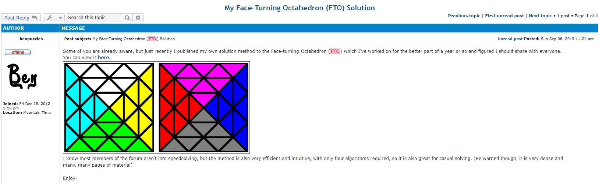
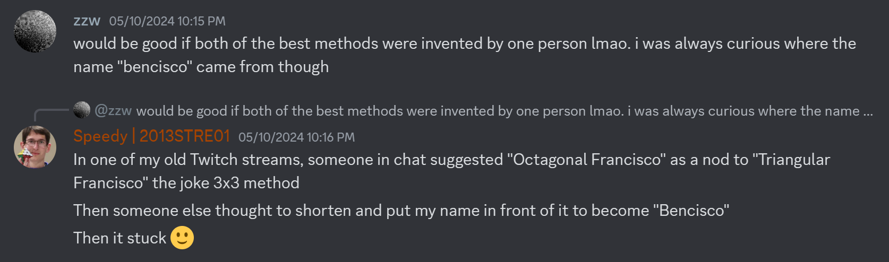
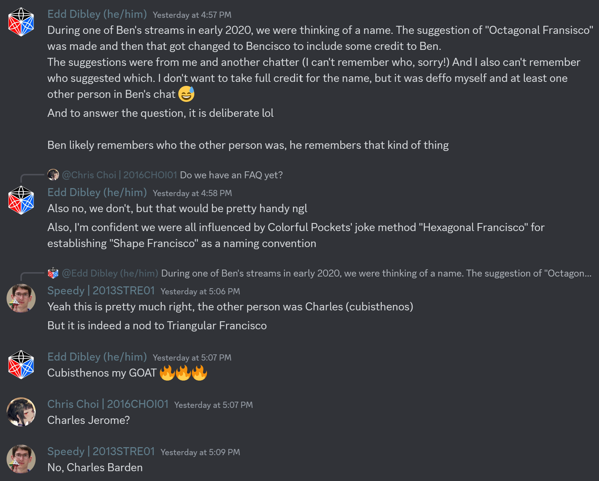

import TwistyPlayer from "@site/src/components/TwistyPlayer";

# Bencisco

<TwistyPlayer
 puzzle="fto"
 experimentalStickeringMaskOrbits="C4RNER:-I-I-I,CENTERS:I-I----------------II-II,EDGES:------------"
 controlPanel="none"
/>

## Description

**Proposer:** [Ben Streeter](CubingContributors/MethodDevelopers.md#streeter-ben)

**Proposed:** 2018

**Steps:**

1. Build a block on the left side at dBL.
2. Solve the remaining three large centers.
3. Solve the corner and two centers at UBL.
4. Solve the remaining three sets of corners and centers.

## Development

Development on the Bencisco method started on April 1, 2018 [1] and the method was first shown in video form on YouTube on April 23, 2018 [2]. This video demonstrated the potential of the method with a solve time under one minute.

  <iframe loading="lazy" width="100%" height="100%"
    src="https://www.youtube.com/embed/HKKhHqHw8ps"
    frameborder="0" allowfullscreen
    style={{position: 'absolute', top: 0, left: 0}}>
  </iframe>

## Release

In September of 2019, Streeter officially revealed the steps of the method to the puzzle community. Initially the steps were presented through an example solve video [3] and, later on the same day, a video announcing the release of a document detailing the steps of the method [4]. A couple of days after the YouTube reveal, Streeter presented the complete method to the rest of the community through a post to TwistyPuzzles.com [5]. A few months later, Streeter released an in-depth tutorial for the method [6].

  <iframe loading="lazy" width="100%" height="100%"
    src="https://www.youtube.com/embed/XdgZcz5Pt9g"
    frameborder="0" allowfullscreen
    style={{position: 'absolute', top: 0, left: 0}}>
  </iframe>

  <iframe loading="lazy" width="100%" height="100%"
    src="https://www.youtube.com/embed/dOx2mqe6cTw"
    frameborder="0" allowfullscreen
    style={{position: 'absolute', top: 0, left: 0}}>
  </iframe>

  <iframe loading="lazy" width="100%" height="100%"
    src="https://www.youtube.com/embed/tYeV8LvqVDY"
    frameborder="0" allowfullscreen
    style={{position: 'absolute', top: 0, left: 0}}>
  </iframe>

## Name Origin

The Bencisco method name is a portmanteau of Streeter’s first name, Ben, and the second half of the name of the 3x3 method Triangular Francisco. The Triangular Francisco name has sort of become a name that people enjoy modifying for naming their own new methods. Examples include Quadrangular Francisco and Hexagonal Francisco. In May 2024, Streeter stated that while streaming solves on Twitch, chat members Edd Dibley and Charles Barden suggested to name the method Octagonal Francisco, combining the FTO’s shape with the Francisco name. Dibley and Barden then took the idea further to create the portmanteau Bencisco [7].

## References

[1] B. Streeter, "Ben’s Face-Turning Octahedron (FTO) Speed Solution (Bencisco Method)," Google Docs, 6 September 2019. [Online]. Available: https://docs.google.com/document/d/e/2PACX-1vTDL7-XvpNrhIc2Q_1nHfeJyG7tIazgBCq88PE8ahqIbvPb3LPQsM3_vsdqX6y8sxte1n5jGk2J3c5V/pub.

[2] B. Streeter, "FTO in 59.07 seconds," YouTube, 23 April 2018. [Online]. Available: https://www.youtube.com/watch?v=HKKhHqHw8ps.

[3] B. Streeter, "Face-Turning Octahedron: Example Solve 1," YouTube, 6 September 2019. [Online]. Available: https://www.youtube.com/watch?v=XdgZcz5Pt9g.

[4] B. Streeter, "FTO Solution Released + Special Announcement!," YouTube, 6 September 2019. [Online]. Available: https://www.youtube.com/watch?v=dOx2mqe6cTw.

[5] B. Streeter, "My Face-Turning Octahedron (FTO) Solution," TwistyPuzzles.com, 8 September 2019. [Online]. Available: https://twistypuzzles.com/forum/viewtopic.php?p=392974.

[6] B. Streeter, "How to Solve an FTO (Bencisco Method)," YouTube, 2 February 2020. [Online]. Available: https://www.youtube.com/watch?v=tYeV8LvqVDY.

[7] B. Streeter, Discord, 10 May 2024. [Online]. Available: https://discord.com/channels/737435949381976147/737442120683618345/1238676079053504543.
