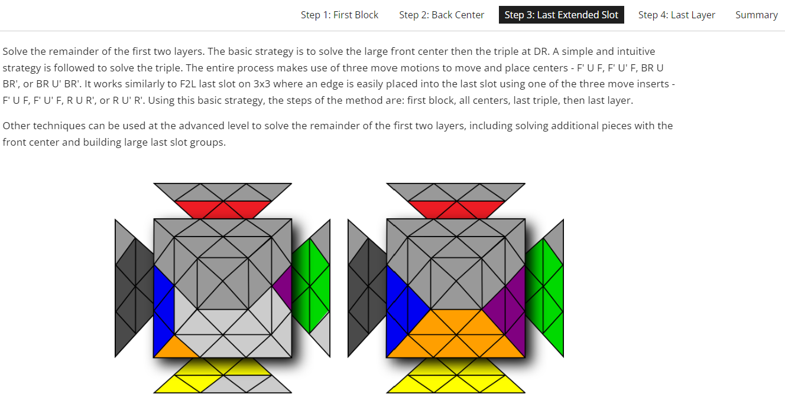
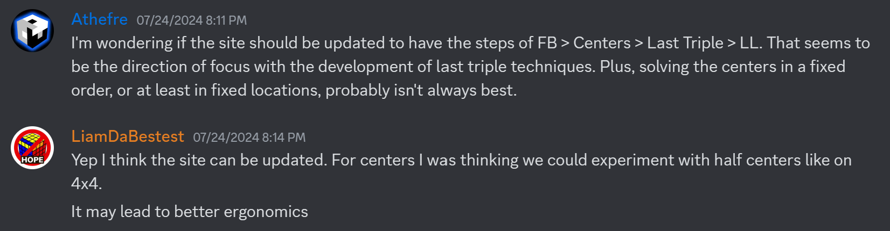
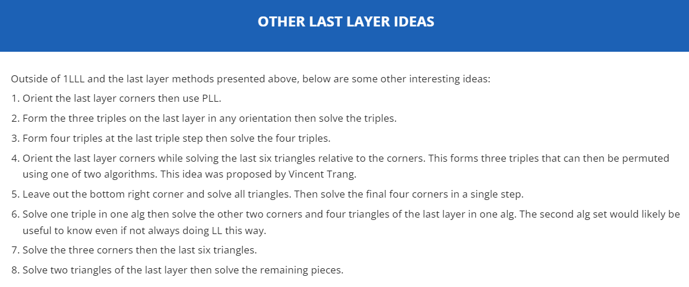
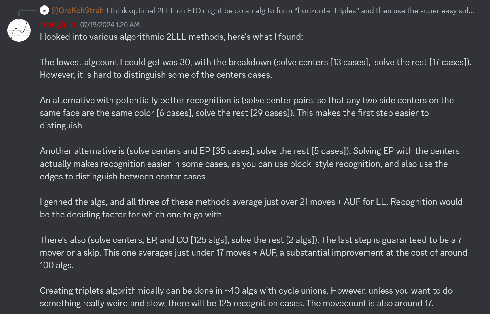
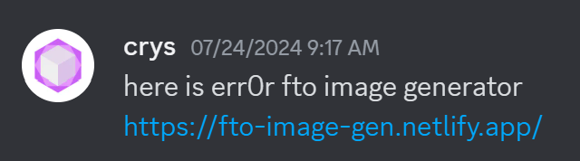
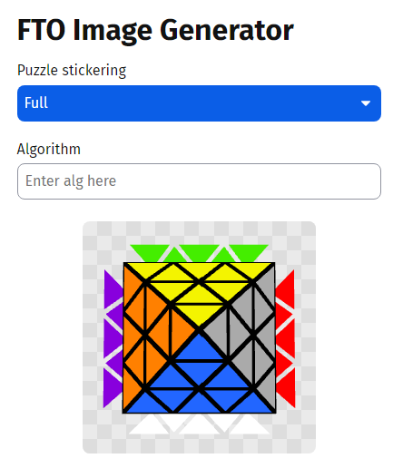

import TwistyPlayer from "@site/src/components/TwistyPlayer";

# Nautilus

<TwistyPlayer
 puzzle="fto"
 experimentalStickeringMaskOrbits="C4RNER:-III-I,CENTERS:-----III--III-----I--I--,EDGES:------------"
 controlPanel="none"
/>

## Description

**Proposer:** [Michael James Straughan](CubingContributors/MethodDevelopers.md#straughan-michael-james-athefre), [Liam Highducheck](CubingContributors/MethodDevelopers.md#highducheck-liam), [Vincent Trang](CubingContributors/MethodDevelopers.md#trang-vincent-trangium)

**Proposed:** 2024

**Steps:**

1. Build a block on the left side at dBL.
2. Solve the remaining three large centers.
3. Solve the three remaining pieces of the first two layers.
4. Solve the last layer.

[Nautilus Website](https://sites.google.com/view/nautilusfto)

## Development

### Steps

Development of Nautilus began in June 2024 when Michael James Straughan showed interest in adapting the 3x3 Nautilus method to the FTO [1].

After considering the best way to adapt Nautilus to the FTO, the initial steps became to solve a block on the left, finish the back two large centers, fill in the remainder of the first two layers, then solve the last layer [2].

After discussion and further development of the method, it was decided to narrow down the steps to their current form [3].

### Last Layer

Various last layer strategies were proposed upon the initial release of the method [2]. Vincent Trang later suggested a few other last layer method ideas along with predicted move counts [4]. It was ultimately decided to have center permutation then corner solving the two step process due to the low algorithm count and potentially better ergonomics.

### Software

There weren’t many FTO image generators available at the time of the development of Nautilus. Eric Xu stepped in to assist the development team by created an image generator that is based on cubing.js [5]. View the image generator [here](https://fto-image-gen.netlify.app/).

## References

[1] M. J. Straughan, 17 June 2024. [Online]. Available: https://discord.com/channels/885722463521103892/885722523013103667/1252286440289599551.

[2] M. J. Straughan, "Introduction," July 2024. [Online]. Available: https://sites.google.com/view/nautilusfto.

[3] M. J. Straughan and L. Highducheck, 24 July 2024. [Online]. Available: https://discord.com/channels/885722463521103892/1259323911892504662/1265823831201808504.

[4] V. Trang, 19 July 2024. [Online]. Available: https://discord.com/channels/885722463521103892/1259323911892504662/1263727261153235099.

[5] E. Xu, "FTO Image Generator," 14 July 2024. [Online]. Available: https://discord.com/channels/885722463521103892/1259323911892504662/1265659206120509570.
