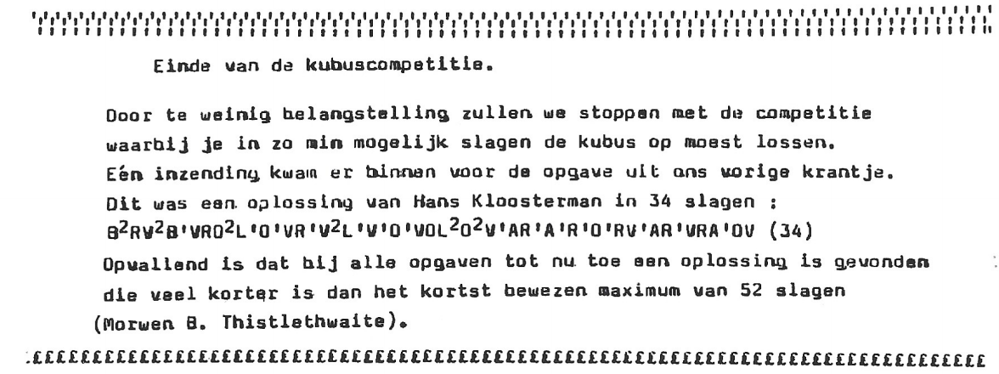
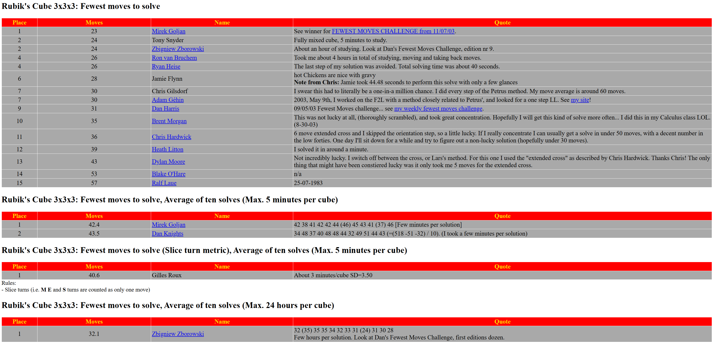

import TwistyPlayer from "@site/src/components/TwistyPlayer";
import Exhibit from "@site/src/components/Exhibit";
import ReconViewer from "@site/src/components/ReconViewer";
import ReconCarousel from "@site/src/components/ReconCarousel";
import ReactPlayer from 'react-player'
import ImageCollage from '@site/src/components/ImageCollage';
import YouTube from "@site/src/components/YouTube";

# Fewest Moves Solving Origins

After the cube craze came to an end in the early 1980s, many enthusiasts continued exploring the puzzle's potential. One new way to competitively solve the cube was to attempt to solve it in fewer moves than other competitors. This type of competition proved to be popular, leading to it becoming an official event of the World Cube Association.

## Cubism For Fun

### 9th Issue

In February 1985, the 9th issue of Cubism For Fun introduced a new kind of solving competition to its members [^steenhuis-1985-1]. Instead of solving Rubik's Cube as quickly as possible, the idea was for the members to solve given scrambles in as few moves as possible and send in their solutions. The submission with the fewest moves was declared the winner. This competition was accompanied by a few rules:

1. Every turn must be included. Simply referencing a sequence of moves, or an algorithm, from a previous Cubism For Fun issue without writing the sequence wasn't allowed. There was one exception to this rule, which was that members were allowed to send in reference numbers from the one look last layer table that was in development and peridically published in Cubism For Fun.
2. The moves were counted in the half turn metric.
3. The notation must be understandable and rotations must be indicated.

For the first competition the thought process was that if a simple scramble was provided anyone could submit the inverse. So it was decided to provide a 72 move scramble, from which a shorter solution would likely be found.

Original scramble translated into modern standard notation: `L' D U B2 D F' R B R B R' U2 F2 L2 D F U' D B U F2 U' F' D2 R B L D' B2 R F2 B2 L D B U' F L' U2 R F L U2 B' R U' B2 U L D L2 D' F2 R2 F2 R' L U' R D B' U2 L' F' R2 D B' U2 L2 U B R`

Optimal scramble:

<ReconViewer
scramble="B U' L' U B2 R U' L D' L D' B F R' F R2 B' U"
solution={`U' B R2 F' R F' B' D L' D L' U R' B2 U' L U B'`}
/>
 
<ImageCollage
images={[
{ src: require("@site/docs/FewestMoves/img/Origin/CFF1.png").default},
{ src: require("@site/docs/FewestMoves/img/Origin/CFF2.png").default}
]}
/>
 

### 10th Issue

In the 10th issue it was noted that several people had worked on a solution, but ultimately only one person submitted [^steenhuis-1985-2]. The suspicion was that the scramble was too long and that it led everyone to doubt whether they correctly applied each move. The competition was restarted with a new, shorter solution accompanied by images to help readers ensure that they correctly applied the scramble.

Original scramble translated: `R B L F (D' R)*6 (L B)*6 (U' F')*6`

Optimal scramble:

<ReconViewer
scramble="R' B' D2 U L' B D' B2 R' U' B2 R2 D B R D F' U'"
solution={`U F D' R' B' D' R2 B2 U R B2 D B' L U' D2 B R`}
/>

### 11th Issue

#### Solutions

In the 11th issue, four people submitted solutions to the scramble [^steenhuis-1985-3]. Analyzing the solutions and the Cubism For Fun leadership discussing among themselves, it was realized that attempting to strictly follow the steps of the CFOP style method promoted by Cubism For Fun often led to long solutions. This is because existing blocks that may be advantageous to preserve, can be broken during steps. Those who submitted attempted to preserve any grouped pieces by trying several solutions around those blocks. The four submissions are as follows:

**Hans van der Zijden (45 moves)**
<ReconViewer
scramble="R' B' D2 U L' B D' B2 R' U' B2 R2 D B R D F' U'"
solution={`R' B' D F2 D L2 // Cross
R' D' R F L' D F' L // Two pairs
D' R D2 R2 D' R2 D R' D' R D2 R' // Last two pairs
F D F' D F D' L D' L' // CLL + ending cancel
D L D2 L' F' D' R' D2 R D2 // Cancel into ELL`}
/>

**Anneke Treep (34 moves)**
<ReconViewer
scramble="R' B' D2 U L' B D' B2 R' U' B2 R2 D B R D F' U'"
solution={`L' U' L F D // Cross on F
F R' U B R U' F D' B' D B2 // F2L minus one corner
R B R' B2 R B R' // Last pair
U B U2 L' B' L B U2 B2 U' B2 // 1LLL`}
/>

**Klaas Steenhuis (30 moves)**
<ReconViewer
scramble="R' B' D2 U L' B D' B2 R' U' B2 R2 D B R D F' U'"
solution={`U2 F2 R2 B' L2 D2 L2 B D' B' L2 // Form F2L blocks
R F' R' U' R' U R2 // Finish F2L minus two moves
F D F L D B D' R D' R' B' D' // Cancel into 1LLL`}
/>

**Guus Razoux Schultz (27 moves)**
<ReconViewer
scramble="R' B' D2 U L' B D' B2 R' U' B2 R2 D B R D F' U'"
solution={`U F2 U' D R' B' L' F2 // XCross plus two corners
D2 R F D2 F' U D' R F R' U' R' // F2L
B D2 B' D' B D' B' // 1LLL`}
/>

#### New Scramble

A new scramble was provided in the 11th issue.

Original final scramble translated: `U R2 D L2 (U R F')*6 (B L2 U')*5 L' D2 R' U2`

Optimal final scramble:
<ReconViewer
scramble="B F' L2 B D2 L F' U' R2 U' F' D U L2 F' D2 U"
solution={`U' D2 F L2 U' D' F U R2 U F L' D2 B' L2 F B'`}
/>

<ImageCollage
images={[
{ src: require("@site/docs/FewestMoves/img/Origin/CFF4.png").default},
{ src: require("@site/docs/FewestMoves/img/Origin/CFF5.png").default}
]}
/>

### 12th Issue

Although a new scramble was provided in the 11th issue, the competition was canceled in the 12th issue due to a lack of participants [^steenhuis-1986].

## Fewest Moves Challenge

### Early Discussions

In the early years of the Speed Solving Rubik's Cube Yahoo! group, some had shown an interest in solving a particular scramble in as few moves as possible. One standout example came in December 2002 when Lucas Winter suggested the idea of solving the same scramble multiple times to try to each time solve more quickly than the last, a solving style now called downsolving [^winter-2002]. Lars Petrus replied with his experience, stating that, in addition to the initial challenge, he spent time trying to find the shortest solution to memorize before downsolving [^petrus-2002]. Petrus found a 32 move solution, stating the possibility of using optimal last layer solutions to reduce the overall solution to 26 moves. Impressed by the low move count, Jessica Fridrich replied to the message by Petrus [^fridrich-2002]. Fridrich sent the scramble to Mirek Goljan who found a 29 move solution.

<ImageCollage
images={[
{ src: require("@site/docs/FewestMoves/img/Origin/Winter.png").default},
{ src: require("@site/docs/FewestMoves/img/Origin/Petrus.png").default},
{ src: require("@site/docs/FewestMoves/img/Origin/Fridrich.png").default}
]}
/>

In addition to the discussions, an unofficial world records page was maintained by Chris Hardwick on speedcubing.com starting in the early 2000s. Among the categories were various types of fewest moves events [^speedcubing.com-2003].

### Challenge Creation

In April 2003, Dan Harris started a weekly competition called the Fewest Moves Challenge [^harris-2003-1] [^harris-2003-2]. The competition was moved to a new domain the next month [^harris-2003-3].

<ImageCollage
images={[
{ src: require("@site/docs/FewestMoves/img/Origin/HarrisAnnouncement1.png").default},
{ src: require("@site/docs/FewestMoves/img/Origin/HarrisAnnouncement2.png").default}
]}
/>
 

In March 2008 it was announced that the Fewest Moves Challenge as held by Harris would be coming to an end [^harris-2008]. Per Kristen Fredlund took over control of the challenge, hosting it on a new domain [^fredlund-2008].

<ImageCollage
images={[
{ src: require("@site/docs/FewestMoves/img/Origin/HarrisFMCEnd.png").default},
{ src: require("@site/docs/FewestMoves/img/Origin/Fredlund.png").default}
]}
/>
 

During an email exchange with Cubing History, Harris described the origin of the Fewest Moves Challenge as well as restored the website containing the results.

> The idea of solving in the fewest moves wasn't mine originally - but it was a pretty niche "category" in cube solving with only a handful of people specialising in it before 2003. And probably people like Mirek Goljan had been doing it since the cube originally came out in the 1980s. There was the unofficial world records page, administered by Chris Hardwick, who had a "space" on Ron van Bruchem's pages at www.speedcubing.com.
>
> However, there was no online competition as such, compared with speedcubing where people were already using various online means of competing against one another to solve in the fastest time. The first iteration of my website came along I guess in early 2003, or maybe end of 2002, although I only took up cubing in I think April or May 2002, so it would not have been any earlier than end of 2002 I think. It was already quite popular by April 2003, and Ron van Bruchem challenged me to set up an online fewest moves competition (I'm pretty sure he said if I didn't do it, he would :-) ), which I duly did. It was probably during the time I went to visit him at his house in Almere, which was Easter weekend 2003. It was a lot of manual effort in the early days but gradually I made the submission and checking/verification process more automatic, and at some point I added a rating system.

Harris' website with the results can be viewed <a href="https://www.cubestation.co.uk/index.php?page=fmc/fmcnewsystem">here</a>.

The popularity of the Fewest Moves Challenge was likely a major reason for the event's inclusion in the World Championship 2003 and subsequently becoming a standard official competition event. On this possibility, Harris stated to Cubing History:

> I cannot prove that it was the reason for Fewest moves being included in WC 2003, but I suspect it was a contributing factor as you mention, since it served to popularise it between April 2003 and August 2003.

### Examples

Competitors in the Fewest Moves Challenge used a variety of methods, including speed methods such as CFOP, Petrus, Roux, and ZZ, as well as general blockbuilding and domino reduction. Below is a sample of some solutions.

**Frederick Badie (Line > F2L > LL, 27 moves)**
<ReconViewer
scramble="F2 R' F2 U2 B2 R F2 D2 U2 L U2 R2 U' L' D' B L2 U R' D2 B2"
solution={`F' R' D F' // Line
U R2 L U2 // Two 1x2x2 blocks
L2 R' U R U' R' U' R U L' B' U2 B L // F2L
F' U2 F U F' U // OLL
B' U2 F B L R U2 L' R' U' // PLL`}
/>

**Gilles Roux (CEOR, 41 moves)**
<ReconViewer
scramble="B2 L2 F2 L B2 R2 F2 U' L2 R2 B' U2 B L2 U' D2 F' R2 F L2 R' B' L D2 U2"
solution={`U B R' B2 D2 // CPLine
R u2 R' u' r2 // DM
u R' u R2 u' R2 u U2 R' U R u // 2x2x3 + EO
U R U2 R2 U' R' U' R U2 R' // Right block
U' R U2 R' U' R U' R' U // 2GLL`}
/>

Mirek inverse scramble solve:
D B2 U2 R2 U' F2 L2 R2 U B2 F' R2 D B2 U2 F D' F' U2
https://web.archive.org/web/20030802215137/http://www.cubestation.co.uk:80/

## Added to WCA

## Block Building

## Domino Reduction

History and transition.

## General Techniques

Insertions

Pre-moves

NISS

[^steenhuis-1985-1]: K. Steenhuis, "NIEUWE WEDSTRIJD MET KUBUS: WIE GEEFT OPLOOSING IN KLEINSTE AANTAL SLAGEN?," Cubism For Fun, no. 9, pp. 5-8, February 1985.
[^steenhuis-1985-2]: K. Steenhuis, "WEDSTRIJD/COMPETITIE," Cubism For Fun, no. 10, pp. 7, June 1985.
[^steenhuis-1985-3]: K. Steenhuis, "DE KUBUSCOMPETITIE," Cubism For Fun, no. 11, pp. 4-7, November 1985.
[^steenhuis-1986]: K. Steenhuis, "Einde van de kubuscompetitie.," Cubism For Fun, no. 12, pp. 6, April 1986.
[^winter-2002]: L. Winter, "Theoretical fastest average," Speed Solving Rubik's Cube Yahoo! Group, 11 December 2002. [Online].
[^petrus-2002]: L. Petrus, "Theoretical fastest average," Speed Solving Rubik's Cube Yahoo! Group, 11 December 2002. [Online].
[^fridrich-2002]: L. Petrus, "Theoretical fastest average," Speed Solving Rubik's Cube Yahoo! Group, 11 December 2002. [Online].
[^harris-2003-1]: D. Harris, "Saturday Contest," Speed Solving Rubik's Cube Yahoo! Group, 25 April 2003. [Online].
[^harris-2003-2]: D. Harris, "\*\*Fewest Moves Challenge (aka Saturday Contest)\*\*," Speed Solving Rubik's Cube Yahoo! Group, 25 April 2003. [Online].
[^harris-2003-3]: D. Harris, "cubestation.co.uk has been launched!," Speed Solving Rubik's Cube Yahoo! Group, 17 May 2003. [Online].
[^speedcubing.com-2003]: C. Hardwick, "Rubik's Cube Statistical Records", 28 October 2003. [Online] https://web.archive.org/web/20031028193325/http://www.speedcubing.com/records/recs_stats.html.
[^harris-2008]: D. Harris, "Per's New FMC," Dan's Cube Station!, 16 March 2008. [Online]. https://web.archive.org/web/20080913221748/http://www.cubestation.co.uk/.
[^fredlund-2008]: P. K. Fredlund, "FMC is reopening!!," SpeedSolving.com, 10 March 2008. [Online]. Available: https://www.speedsolving.com/threads/fmc-is-reopening.3176/.
