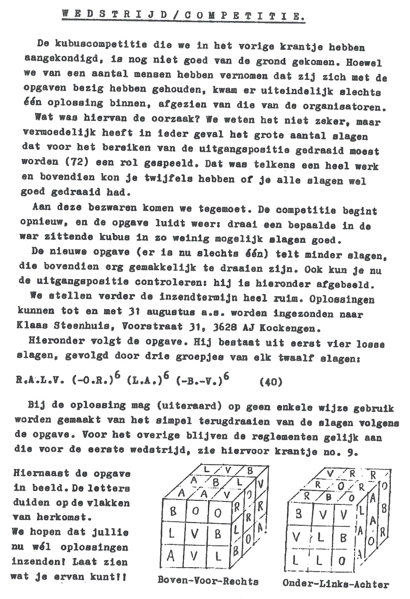
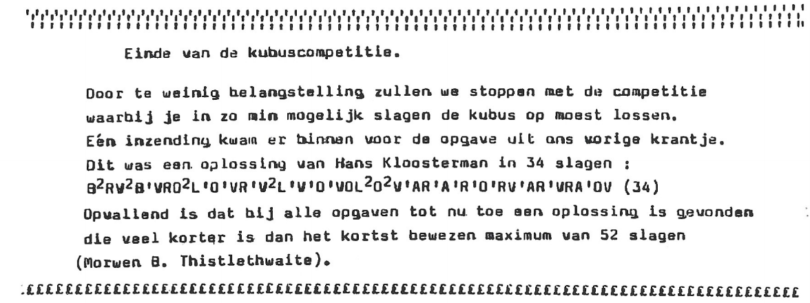

import TwistyPlayer from "@site/src/components/TwistyPlayer";
import Exhibit from "@site/src/components/Exhibit";
import ReconViewer from "@site/src/components/ReconViewer";
import ReconCarousel from "@site/src/components/ReconCarousel";
import ReactPlayer from 'react-player'
import ImageCollage from '@site/src/components/ImageCollage';
import YouTube from "@site/src/components/YouTube";

# Fewest Moves Solving Origin

## Cubism For Fun

### 9th Issue

In February 1985, the 9th issue of Cubism For Fun introduced a new kind of solving competition to its members [^steenhuis-1985-1]. Instead of solving Rubik's Cube as quickly as possible, the idea was for the members to solve given scrambles in as few moves as possible and send in their solutions. The submission with the fewest moves was declared the winner. This competition was accompanied by a few rules:

1. Every turn must be included. Simply referencing a sequence of moves, or an algorithm, from a previous Cubism For Fun issue without writing the sequence wasn't allowed. There was one exception to this rule, which was that members were allowed to send in reference numbers from the one look last layer table that was in development and peridically published in Cubism For Fun.
2. The moves were counted in the half turn metric.
3. The notation must be understandable and rotations must be indicated.

For the first competition the thought process was that if a simple scramble was provided anyone could submit the inverse. So it was decided to provide a 72 move scramble, from which a shorter solution would likely be found.

Original scramble translated into modern standard notation: `L' D U B2 D F' R B R B R' U2 F2 L2 D F U' D B U F2 U' F' D2 R B L D' B2 R F2 B2 L D B U' F L' U2 R F L U2 B' R U' B2 U L D L2 D' F2 R2 F2 R' L U' R D B' U2 L' F' R2 D B' U2 L2 U B R`

Optimal scramble:

<ReconViewer
scramble="B U' L' U B2 R U' L D' L D' B F R' F R2 B' U"
solution={`U' B R2 F' R F' B' D L' D L' U R' B2 U' L U B'`}
/>
 
<ImageCollage
images={[
{ src: require("@site/docs/FewestMoves/img/Origin/CFF1.png").default},
{ src: require("@site/docs/FewestMoves/img/Origin/CFF2.png").default}
]}
/>
 

### 10th Issue

In the 10th issue it was noted that several people had worked on a solution, but ultimately only one person submitted [^steenhuis-1985-2]. The suspicion was that the scramble was too long and that it led everyone to doubt whether they correctly applied each move. The competition was restarted with a new, shorter solution accompanied by images to help readers ensure that they correctly applied the scramble.

Original scramble translated: `R B L F (D' R)*6 (L B)*6 (U' F')*6`

Optimal scramble:

<ReconViewer
scramble="R' B' D2 U L' B D' B2 R' U' B2 R2 D B R D F' U'"
solution={`U F D' R' B' D' R2 B2 U R B2 D B' L U' D2 B R`}
/>

### 11th Issue

#### Solutions

In the 11th issue, four people submitted solutions to the scramble. Analyzing the solutions and the Cubism For Fun leadership discussing among themselves, it was realized that attempting to strictly follow the steps of the CFOP style method promoted by Cubism For Fun often led to long solutions. This is because existing blocks that may be advantageous to preserve, can be broken during steps. Those who submitted attempted to preserve any grouped pieces by trying several solutions around those blocks. The four submissions are as follows:

Hans van der Zijden (45 moves)
<ReconViewer
scramble="R' B' D2 U L' B D' B2 R' U' B2 R2 D B R D F' U'"
solution={`R' B' D F2 D L2 // Cross
R' D' R F L' D F' L // Two pairs
D' R D2 R2 D' R2 D R' D' R D2 R' // Last two pairs
F D F' D F D' L D' L' // CLL + ending cancel
D L D2 L' F' D' R' D2 R D2 // Cancel into ELL`}
/>

Anneke Treep (34 moves)
<ReconViewer
scramble="R' B' D2 U L' B D' B2 R' U' B2 R2 D B R D F' U'"
solution={`L' U' L F D // Cross on F
F R' U B R U' F D' B' D B2 // F2L minus one corner
R B R' B2 R B R' // Last pair
U B U2 L' B' L B U2 B2 U' B2 // 1LLL`}
/>

Klaas Steenhuis (30 moves)
<ReconViewer
scramble="R' B' D2 U L' B D' B2 R' U' B2 R2 D B R D F' U'"
solution={`U2 F2 R2 B' L2 D2 L2 B D' B' L2 // Form F2L blocks
R F' R' U' R' U R2 // Finish F2L minus two moves
F D F L D B D' R D' R' B' D' // Cancel into 1LLL`}
/>

Guus Razoux Schultz (27 moves)
<ReconViewer
scramble="R' B' D2 U L' B D' B2 R' U' B2 R2 D B R D F' U'"
solution={`U F2 U' D R' B' L' F2 // XCross plus two corners
D2 R F D2 F' U D' R F R' U' R' // F2L
B D2 B' D' B D' B' // 1LLL`}
/>

#### New Scramble

A new scramble was provided in the 11th issue.

Original final scramble translated: `U R2 D L2 (U R F')*6 (B L2 U')*5 L' D2 R' U2`

Optimal final scramble:
<ReconViewer
scramble="B F' L2 B D2 L F' U' R2 U' F' D U L2 F' D2 U"
solution={`U' D2 F L2 U' D' F U R2 U F L' D2 B' L2 F B'`}
/>

<ImageCollage
images={[
{ src: require("@site/docs/FewestMoves/img/Origin/CFF4.png").default},
{ src: require("@site/docs/FewestMoves/img/Origin/CFF5.png").default}
]}
/>
 

### 12th Issue

Although a new scramble was provided in the 11th issue, the competition was canceled in the 12th issue due to a lack of participants.

## Dan's FMC

Yahoo group FMC. They used a varity of methods such as blockbuilding, or general speed methods like Petrus, ZZ, Roux, and even the one CEOR solve by Gilles

## Added to WCA

## Block Building

## Domino Reduction

History and transition.

## General Techniques

9 pg 5, February 1985, NIEUWE WEDSTRIJD MET KUBUS: WIE GEEFT OPLOOSING IN KLEINSTE AANTAL SLAGEN?, Klaas Steenhuis
10 pg 7, June 1985, WEDSTRIJD/COMPETITIE
11 pg 4, November 1985, DE KUBUSCOMPETITIE
12 pg 6, April 1986, Einde van de kubuscompetitie.

[^steenhuis-1985-1]: K. Steenhuis, "NIEUWE WEDSTRIJD MET KUBUS: WIE GEEFT OPLOOSING IN KLEINSTE AANTAL SLAGEN?," Cubism For Fun, February 1985
[^steenhuis-1985-2]: K. Steenhuis, "WEDSTRIJD/COMPETITIE," Cubism For Fun, June 1985
