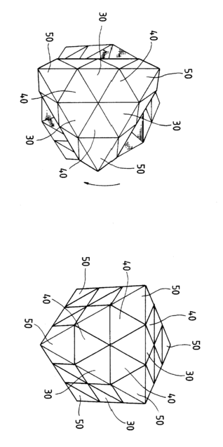
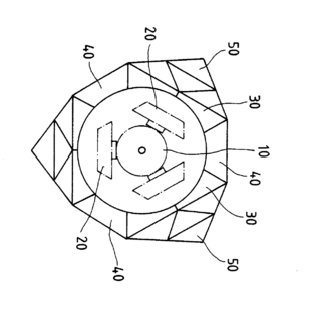
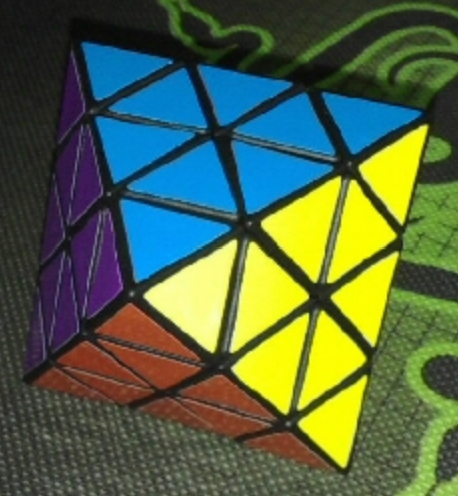

# FTO History

## Early Patents

### Clarence W. Hewlett Jr.

On February 9 1982, Clarence W. Hewlett Jr. filed the first patent for the face turning octahedron [1]. However, the product was never brought to market.

### Karl Rohrbach

Just two weeks after Hewlett's patent application, on February 24, 1982, Karl Rohrbach filed a patent for the same puzzle idea [2]. Like Hewlett's patent, the puzzle wasn't produced and sold.

### Ernő Rubik's Development Intent

In Rubik's Cubic Compendium, Rubik expressed interest in developing a face turning octahedron puzzle [3]. It appears that the smaller version, consisting of just corners and edges, was the planned starting point.

Rubik stated that readers may soon see the puzzle on shelves. In fact, a patent was filed on February 9, 1981 [4].

## First Prototype and Production

### Xie Zongliang

In September 15, 1997, Xie Zongliang (謝宗良) from Taiwan applied for a patent for the face turning octahedron [5].

According to a post on ptt.cc, 1000 units of the puzzle were produced in Taiwan in 2008 [5]. The post also states that the puzzle was made as early as 10 years before then. It is unclear whether this refers to the puzzle being physically created or whether it refers to the patent. News of the 1000 produced puzzles soon reached the Twisty Puzzles forum [7, 8], leading to many wanting to buy one of their own.

<iframe width="640" height="360" src="https://www.youtube.com/embed/BFSorFjezO8" frameborder="0" allow="accelerometer; autoplay; encrypted-media; gyroscope; picture-in-picture" allowfullscreen></iframe>

### David Pitcher

On July 9, 2003 David Pitcher filed an application for the puzzle [9]. According to the Twisty Puzzles Twistypedia, Pitcher developed a working version of the puzzle between 2001 and 2003 [10]. Pitcher himself stated the same in a message to the Twisty Puzzles forum, saying that he created “the first working design for a face-turning octahedron” [11]. However, the puzzle wasn't mass produced by Pitcher. Pitcher’s prototype may or may not have been the first physical face turning octahedron, depending on when Xie first created a prototype.

## References

[1]	C. W. Hewlett Jr., "Magic Octahedron," February 9 1982. [Online]. Available: https://patentimages.storage.googleapis.com/9a/8e/c9/6a57bb011d8fb2/US4451039.pdf.

[2]	K. Rohrbach, "Logisches Stereosspielzeug," 24 February 1982. [Online]. Available: https://worldwide.espacenet.com/publicationDetails/originalDocument?CC=DE&NR=3206560A1&KC=A1&FT=D&ND=&date=19830901&DB=&locale=en_EP.

[3]	E. Rubik, T. Varga, G. Keri, G. Marx and T. Vekerdy, Rubik's Cubic Compendium (Recreations in Mathematics), New York: Oxford University Press, 1987. 

[4]	E. Rubik, "Logic puzzle," 9 February 1981. [Online]. Available: https://worldwide.espacenet.com/publicationDetails/originalDocument?CC=GB&NR=2084471A&KC=A&FT=D&ND=&date=19820415&DB=&locale=en_EP.

[5]	X. Zongliang, "鑽石型魔術方塊 Diamond-like magic block," 15 September 1997. [Online]. Available: https://gpss2.tipo.gov.tw/gpsskmc/gpssbkm?.44c465B0000000200000210^0000000100000D06000000000011010017A004ba0.

[6]	cmkin, "Re: [方塊] 八面體方塊," 14 November 2008. [Online]. Available: https://www.ptt.cc/bbs/Rubiks/M.1226659344.A.311.html.

[7]	T. v. d. Zanden, "Chinese Octahedron?," 13 November 2008. [Online]. Available: https://twistypuzzles.com/forum/viewtopic.php?f=1&t=11541.

[8]	D. Guo, "(面轉)八面體魔方組裝," 2008. [Online]. Available: https://www.davidguo.idv.tw/Cube/oct.htm.

[9] D. Pitcher, "Octahedral puzzle apparatus," 9 July 2003. [Online]. Available: https://patents.google.com/patent/US20050006842.

[10] "Face Turning Octahedron," [Online]. Available: https://twistypuzzles.com/cgi-bin/puzzle.cgi?pkey=1663.

[11] D. Pitcher, "Re: Twisted-8," 16 May 2011. [Online]. Available: https://twistypuzzles.com/forum/viewtopic.php?p=256860&hilit=octahedron#p256860.