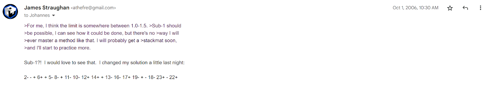

# Ball Shape

When speed solving the Rubik's Snake, the common end state is to from the ball shape. In 2006, Michael James Straughan and Johannes Laire shared their own speed-oriented solutions for the ball shape [^1].

## Michael James Straughan

Another way to read the solution, with more numbers included:

2- 3- 4+ 6+ 7+ 5- 8- 9+ 11- 10- 12+ 14+ 15+ 13- 16- 17+ 19- 20+ 21- 18- 23+ 24- 22+

## Johannes Laire

[^1]: M. J. Straughan and J. Laire, "Snake," Personal communication, October 2006. [Online].