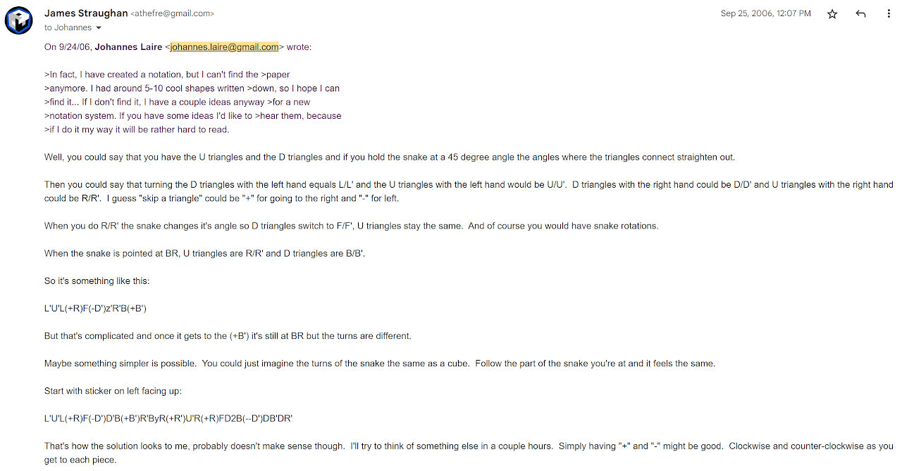
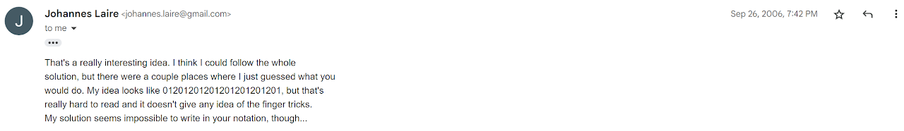
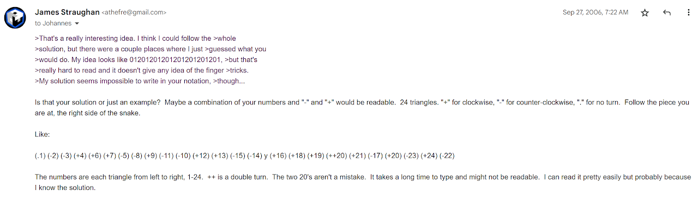
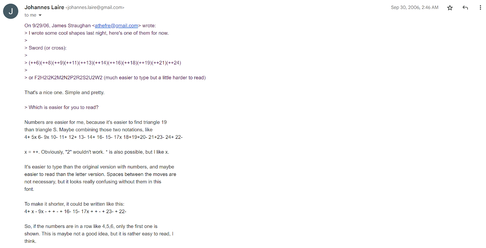

# Notation

## Origin and Development

In September, 2006, Michael James Straughan and Johannes Laire began discussing Rubik's Snake and racing each other. During this time, Straughan and Laire developed a notation to easily describe movements and shape creation [^straughan-laire-nd].

The notation assigns numbers to each piece starting from the left. +, -, and x are attched to each number to notate the direction that a piece is to be turned. + = clockwise, - = counter-clockwise, and x = turn a piece twice.

[^straughan-laire-nd]: M. J. Straughan and J. Laire, "Snake," Personal communication, September 2006. [Online].