# CxLL Recognition

Various methods have been developed for recognizing the corner state in CLL, CMLL, and related steps. Each has its own advantages, disadvantages, and intended uses.

## Waterman (U Orientation + Pattern)

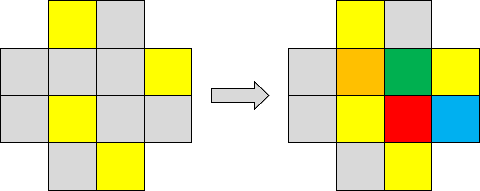

In this recognition style, the orientation of the corners is determined by checking the four stickers that should be facing the upper layer. Next, three or four additional stickers are checked in specific locations relative to the upper layer sticker orientation case. The pattern indicates the permutation state of the corners. This recognition method was developed by Marc Watermann and Daan Krammar in 1981 for use in the Waterman method [^1]. The recognition cases can be viewed in the original Waterman method booklet <a href="/archive/Documents/WatermanBooklet.pdf">here</a>.

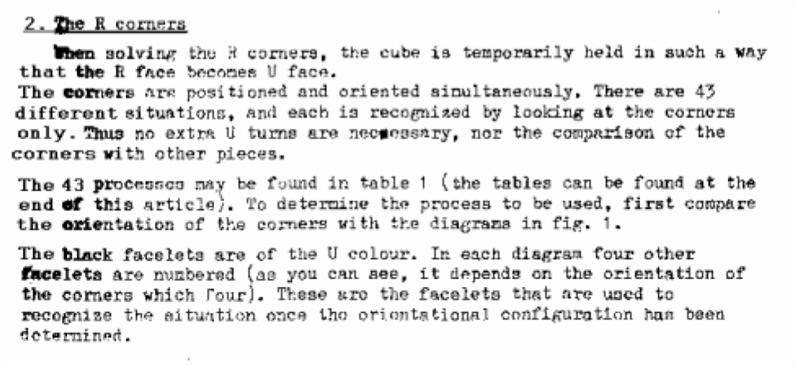
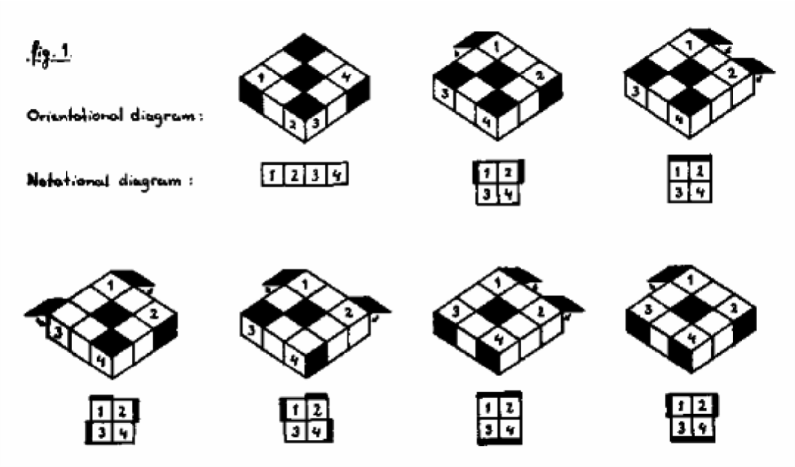
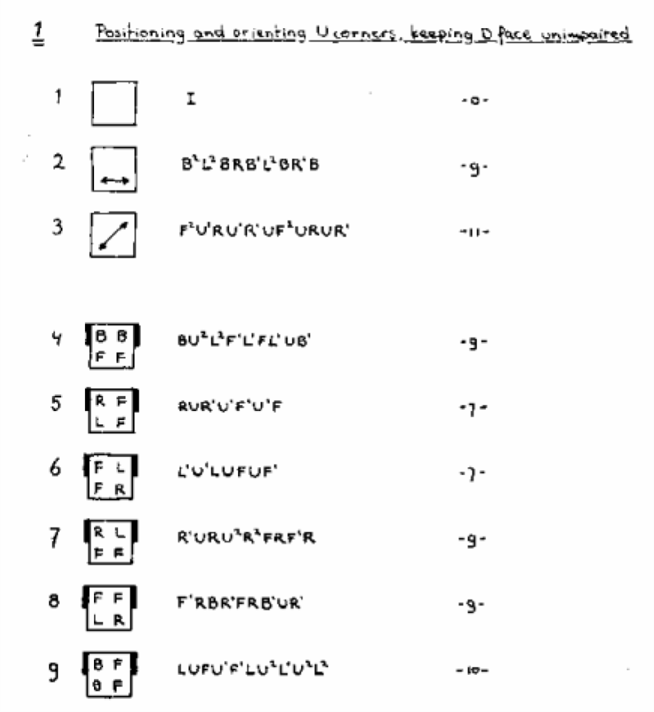

## NMCLL 1

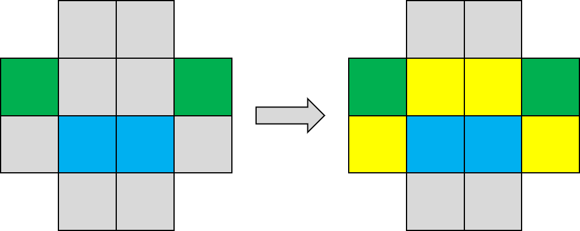

In the NMCLL recognition method, the orientation of the four stickers that should be facing the left and right side, or front and back side, is checked. Then the position of the stickers that should be facing the upper layer are checked to determine the complete case. This style of recognition was originally proposed and partially developed by Gilles Roux in 2004 [^2] [^3]. Roux had been experimenting with non-matching bocks in the Roux method and found that corner recognition was difficult when the left and right side blocks don’t match. Roux decided to first check the left and right side corner stickers since those don’t change on a solved cube when L or R turns are performed. The recognition method was completed by Michael James Straughan in 2006 [^4] [^5].

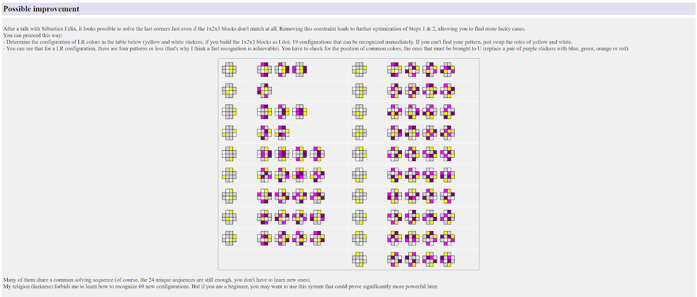

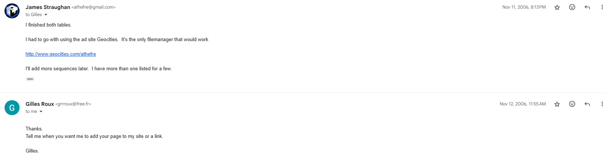
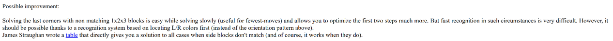

## Hyperorientations

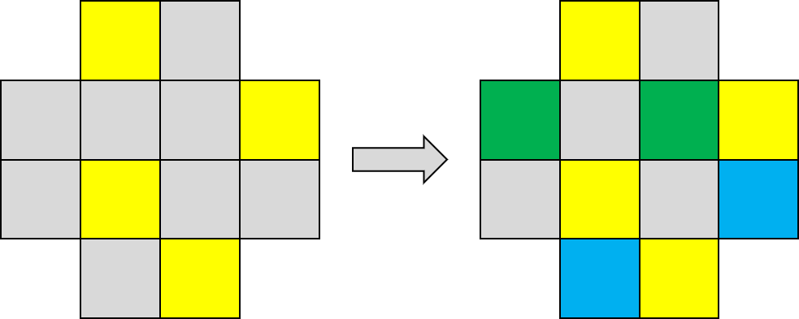

The first step of the Hyperorientations recognition method is to check the orientations of the stickers that should be facing the upper layer, just as in Waterman. Then, check the orientation of the left and right side stickers or front and back stickers based on the type that is currently in a pre-determined location for the current upper layer sticker orientation. Hyperorientations can be used to recognize normal CLL and CLL when the right side layer is a non-matching stye of R2 away. Recognition becomes more difficult when the non-matching style is that the right side is R or R’ away. This is because the upper layer stickers of the right side corners change and are not easily distinguished from the similar stickers on the left side corners. This recognition method was developed by Robert Smith in 2007 [^6].

## NMCLL 2

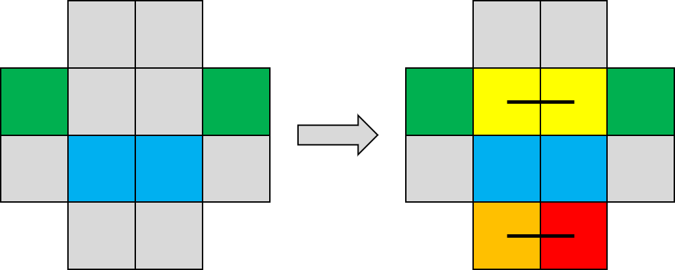

In NMCLL 2, the orientation of the left and right side stickers is checked, just as in NMCLL 1. In the second step, four specific sticker locations are checked relative to each orientation, just as in Waterman. When experimenting with NMCLL 1 recognition, Straughan found that the second step of locating the upper layer stickers was still difficult with non-matching blocks. This is because the upper layer stickers are different depending on the type of non-matching blocks. So it was decided to combine the left and right side sticker orientation first step of NMCLL 1 with the pre-determined location, pattern based second step of Waterman. This recognition method was developed in 2010 [^7] [^8].

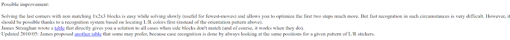

## ATCRM

In ATCRM, the orientation of the left and right side stickers is checked, just as in NMCLL 1 and NMCLL 2. Then, two pre-determined sticker locations are checked. ATCRM is a simplification of the NMCLL 2 recognition method, requiring just two stickers in the second step versus the original four. ATCRM originally started development as an adaption of NMCLL 2, retaining the second step four sticker method, for recognizing conjugated CMLL as used in the 42 method. During development, it was realized that only two stickers are necessary in the second step to completely identify corner cases. ATCRM was developed in 2021 [^9] [^10], with the recognition method created by Straughan and the document by Tim Mosher.

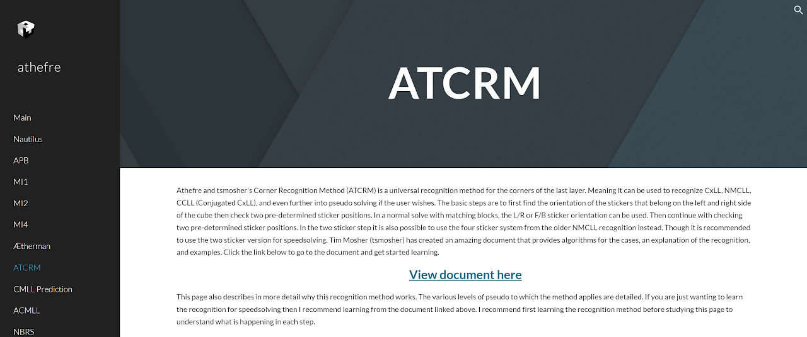

## Straughan

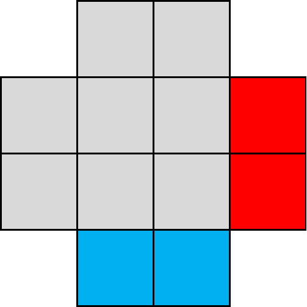

The Straughan recognition method contains one step and is based on finding the minimum amount of information. The locations of the two F stickers and the two R stickers are found. The configuration of the four stickers is enough to determine the complete CxLL case. Four stickers other than the two F and two R can also be checked, such as the two F stickers and two L stickers, the two R stickers with one F sticker and one U sticker, and other possibilities. This recognition method was developed by Straughan in 2024 [^11] [^12]. The idea originated from an intuitive CMLL recognition method that Straughan used in 2006 [^13]. In 2024 he was attempting to develop a pattern based early corner permutation recognition method. This process reminded him of his original CMLL recognition method and in examining the method again realized that the corners can be recognized using four stickers.

[^1]: M. Waterman and D. Krammer, The Algorithm of Marc Waterman and Daan Krammer, 1981.

[^2]: G. Roux, ""LL" corners," Yahoo! Groups - Speed Solving Rubik's Cube, 6 December 2004. [Online].

[^3]: G. Roux, "Step 3," Roux's website, 2004. [Online]. Available: https://web.archive.org/web/20041214140729/http://grrroux.free.fr:80/method/Step_3.html.

[^4]: M. J. Straughan, "NMCMLL," Personal communication, 3 October 2006. [Online].

[^5]: G. Roux, "Step 3," Roux Method Website, 2006. [Online]. Available: http://grrroux.free.fr/method/Step_3.html.

[^6]: R. Smith, "Hyperorientation Recognition," 2007. [Online]. Available: https://web.archive.org/web/20140527061214/http://home.comcast.net/~quadricode/hyperorientations/.

[^7]: M. J. Straughan, "I found a new way to recognize NMCMLL," Personal communication, 26 April 2010. [Online].

[^8]: G. Roux, "Step 3," Roux Method Website, 2011. [Online]. Available: https://web.archive.org/web/20111204185452/http://grrroux.free.fr/method/Step_3.html.

[^9]: JMark, Discord, 19 December 2021. [Online]. Available: https://discord.com/channels/913104731814105088/913129515541233734/922200195092066355.

[^10]: M. J. Straughan and T. Mosher, "ATCRM," Straughan's Website, 2021. [Online]. Available: https://sites.google.com/site/athefre/recognition/atcrm.

[^11]: M. J. Straughan, Discord, 17 May 2024. [Online]. Available: https://discord.com/channels/885722463521103892/885722523013103667/1240932644334866442.

[^12]: M. J. Straughan, "Straughan Recognition," 2024. [Online]. Available: https://sites.google.com/site/athefre/recognition/straughan-recognition?authuser=0.

[^13]: M. J. Straughan, "Straughan Recognition," 17 May 2025. [Online]. Available: https://sites.google.com/site/athefre/recognition/straughan-recognition.