import AnimCube from "@site/src/components/AnimCube";

# Pseudo

## Non-Matching

<AnimCube params="buttonbar=0&position=lluuu&scale=6&hint=10&hintborder=1&facelets=ddddyddddwwwdwdgggdbbdbddwwdyydgddggdddoooooodrrdrrdrr" width="400px" height="400px" />

### Description

Non-Matching is a sub-technique within the overall pseudo technique. It is the intentional building of blocks, that belong in one position of a layer, into a different position in the layer. Non-Matching is the most basic level of the use of pseudo. It is used to reduce the move count of a method.

### Origin and Development

In 2002, Ryan Heise used the Petrus method as an example to suggest a new technique that can be applied to various methods [1]. Heise’s idea was that, instead of solving the correct block into the area that is to be solved, a block from another area of the layer can be solved into the position.

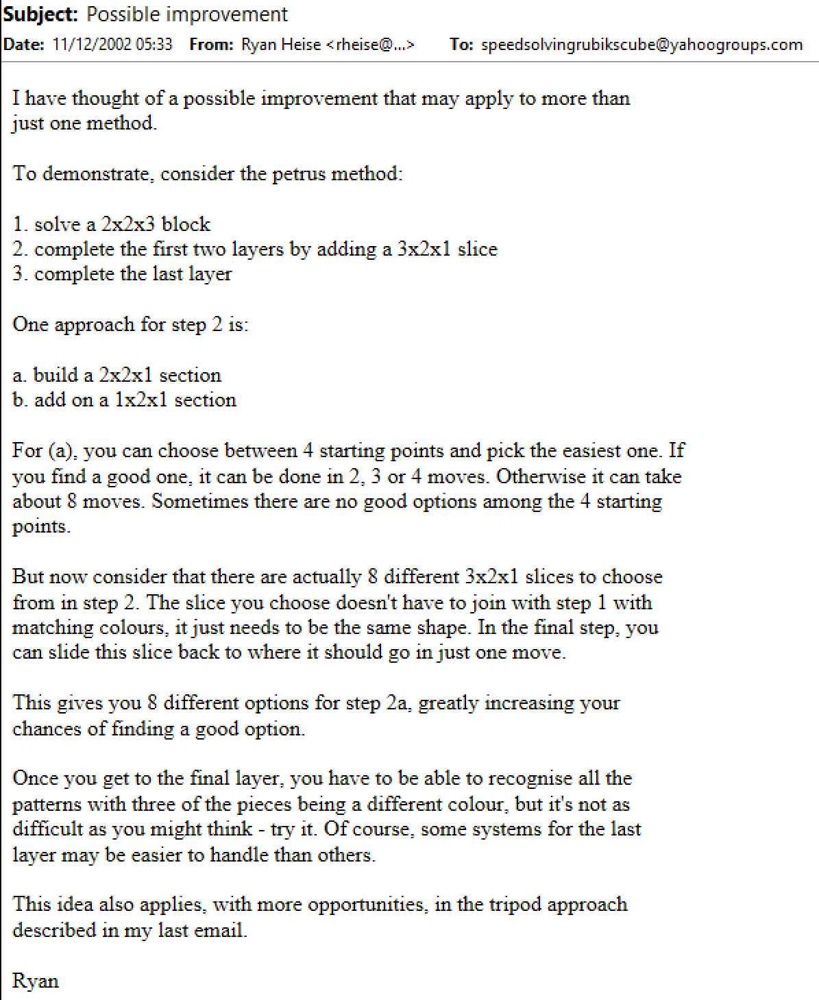

In 2004, Gilles Roux applied the technique to the Roux method [2]. The right side 1x2x3 block can be any of the four 1x2x3 blocks from the right side layer.

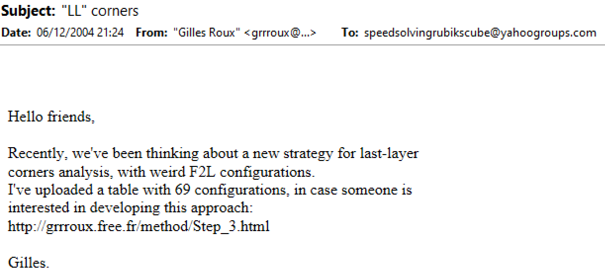

### Recognition Methods

#### NMCLL 1

Along with the application of the technique to the Roux method, Roux started development on a recognition system for the CMLL step. The recognition system consisted of two steps. First, orientation of the stickers that belong on the left and right sides of the corners are checked. Then the stickers that belong on the upper layer are checked. A table of cases was partially developed.

In 2006, Michael James Straughan completed the table of cases [3].

#### NMCLL 2

In 2010, Straughan developed a new recognition system [4, 5]. The first step is the same as the original recognition method. In the second step, instead of searching for U layer stickers, pre-determined positions are checked for a pattern.

#### ATCRM

In 2021, Straughan devised yet another recognition method that was then developed into a table of algorithms and guide by Tim Mosher [6]. The first step is the same as the previous two systems. In the second step, just two pre-determined sticker locations are checked. The recognition method is named Athefre and Tsmosher’s Corner Recognition Method (ATCRM), using Straughan and Mosher’s online usernames.

#### Straughan

In 2024, Straughan created a recognition concept that is based on checking the minimum number of required stickers [7]. This recognition also works for recognizing NMCLL.

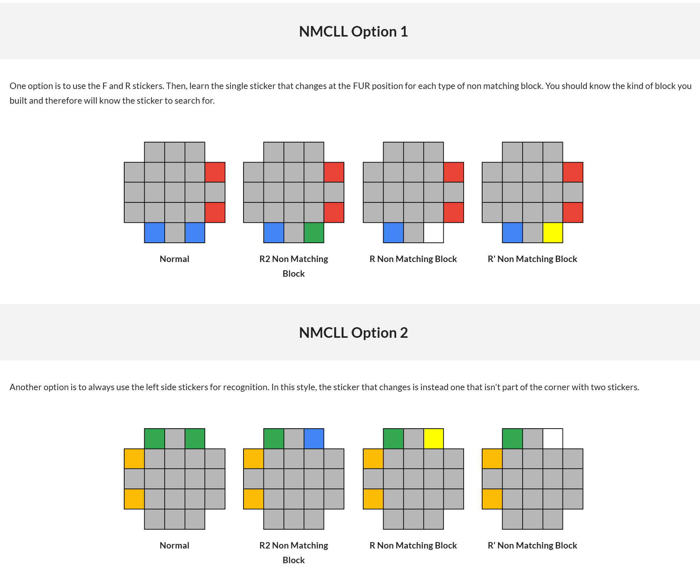

### Last Layer

In 2023, Straughan presented a recognition method called Polar for solving a pseudo last layer [8]. The recognition method uses ATCRM for recognizing the corners then two left and right side edges and the edge orientation is checked.

## Transformation / Conjugation

<AnimCube params="buttonbar=0&position=lluuu&scale=6&hint=10&hintborder=1&facelets=ydbdydydrwwwdwdggorbbdbdwwwydydgdoggbdboooooorrrdrrgdg" width="400px" height="400px" />

### Description

Transformation, a specific application of conjugation, is another sub-technique within the pseudo concept. It goes a level deeper than non-matching, involving adjacent layers interconnected and involved in the pseudo concept application. Pieces from one layer are moved to an adjacent layer then temporarily placed outside of the original layer. Transformation is often used to reduce the number of cases within large algorithm sets.

### Origin, Discovery, and Development

#### Michael James Straughan

In 2010, Straughan developed a last layer method called NMLL [9, 10]. Straughan realized that the left or right side layer could be turned in some cases to transform one case into another. This sets up to better algorithms and reduces the number of cases.

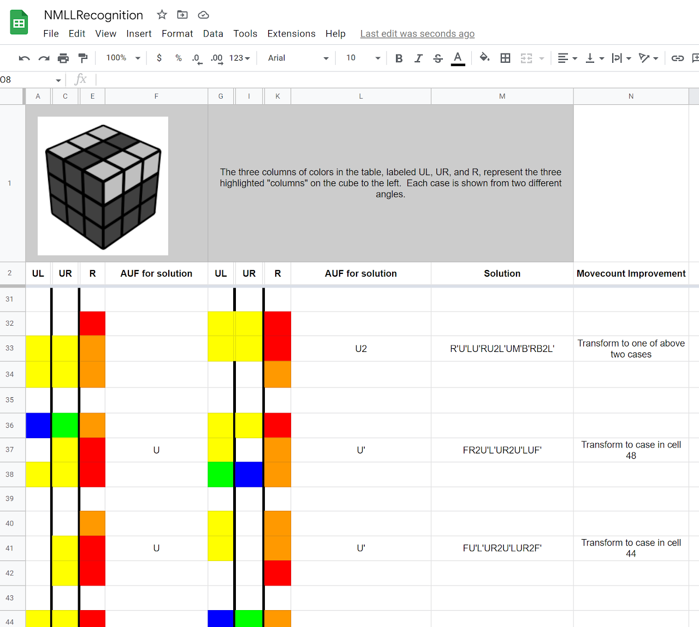

In 2012, Straughan applied and developed the concept for the 2x2 puzzle [11, 12]. CLL cases can be transformed into a different case by moving a U layer corner to the left or right side then turning that layer, or by a simple rotation.

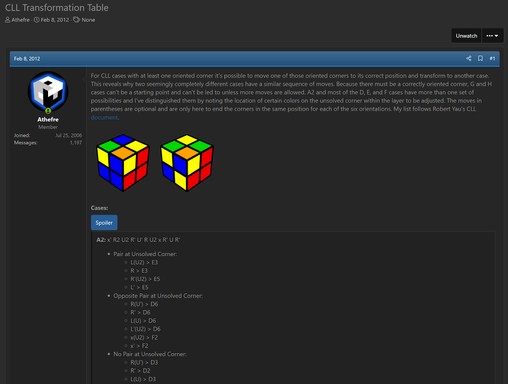
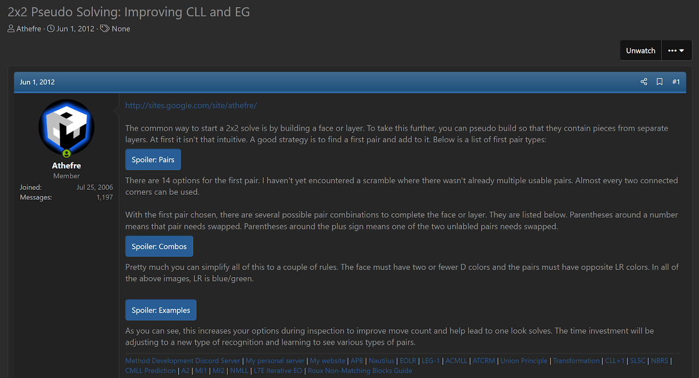

Also in 2012, Straughan applied the technique to OLLCP, ELL, and CLL+1 [13]. Cases of the last layer can be reduced by introducing setup turns similar to those used in the NMLL or CLL application of the technique.

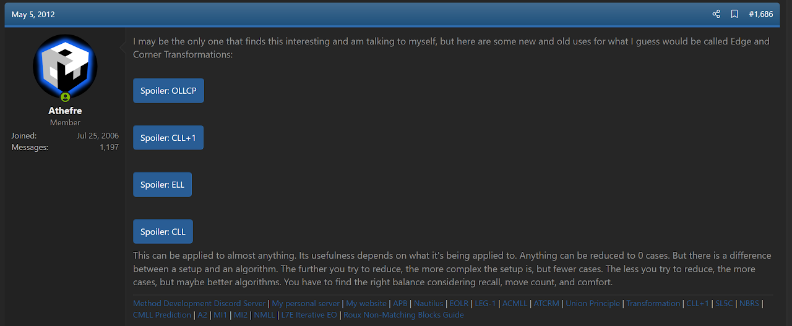

#### Joseph Briggs

In 2017, Joseph Briggs independently discovered the technique and incorporated it into a method called 42 [14]. First, a 1x2x3 block is built on the left. Then a 1x2x2 block on the right is built. After this step, five unsolved corners remain. A U layer corner can be moved above the 1x2x2 block, then the right side layer turned. This leaves a pseudo situation on the upper layer where the five corners are transformed to four unsolved corners. A normal CxLL algorithm can be used to solve the upper layer corners relative to the corner that was placed on the bottom layer with the 1x2x2 block. Joseph Briggs gave the step the name Conjugated CxLL, or CCxLL.

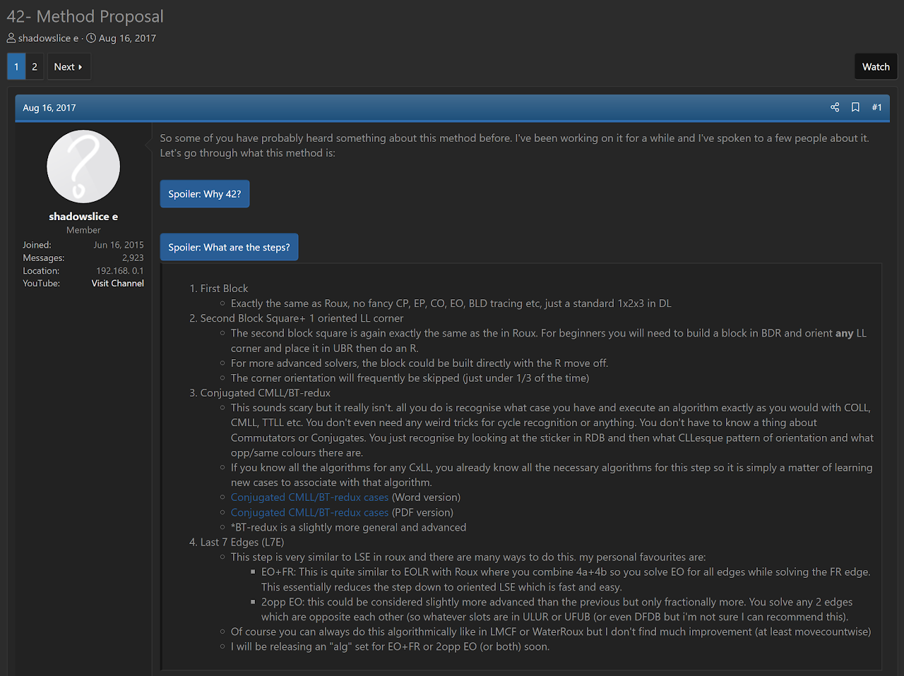

### CCxLL Recognition Methods

#### Joseph Briggs

Upon proposal of the 42 method, Briggs provided a recognition method and algorithm document [15, 16]. The recognition method involves first checking the orientation of the U/D corner stickers. Then a pattern of additional stickers is compared with the right side sticker of the unsolved corner that is currently on the bottom layer.

  <iframe loading="lazy" width="100%" height="100%"
    src="https://www.youtube.com/embed/DZZZ2WvFiZs"
    frameborder="0" allowfullscreen
    style={{position: 'absolute', top: 0, left: 0}}>
  </iframe>

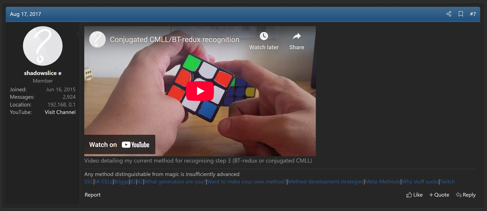
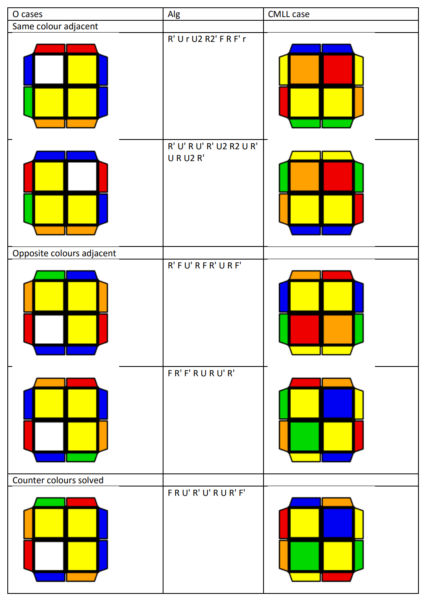

- https://1drv.ms/w/s!ApfSlXDznkdsm1Pk2iGoAOPLoppR
- https://1drv.ms/b/s!ApfSlXDznkdsm1Va9rzIbUXWHJgy

#### Jason Wong

Since the proposal of the 42 method, Jason Wong has developed three different recognition methods for solving the upper layer corners while in the pseudo state.

- https://drive.google.com/file/d/16vyV2Ph2gnIYrkO3sARIHk7kMmfuta1e/view?usp=sharing
- https://docs.google.com/spreadsheets/d/1OSLPkBhnxfozuSPbEL8_oP9FFBrFAv0v9kjN73Z0Ycs/edit?usp=sharing
- https://drive.google.com/file/d/1PiiS8KDuJaRp8PD7t46Yc2-CwkI4vJfB/view?usp=sharing

#### ATCRM

ATCRM as developed in 2021 was not only developed for use with NMCLL, but also was designed for recognizing CCxLL [6].

#### Straughan

The Straughan recognition method previously described in the Non-Matching section has also been adapted for use with CCxLL [17].

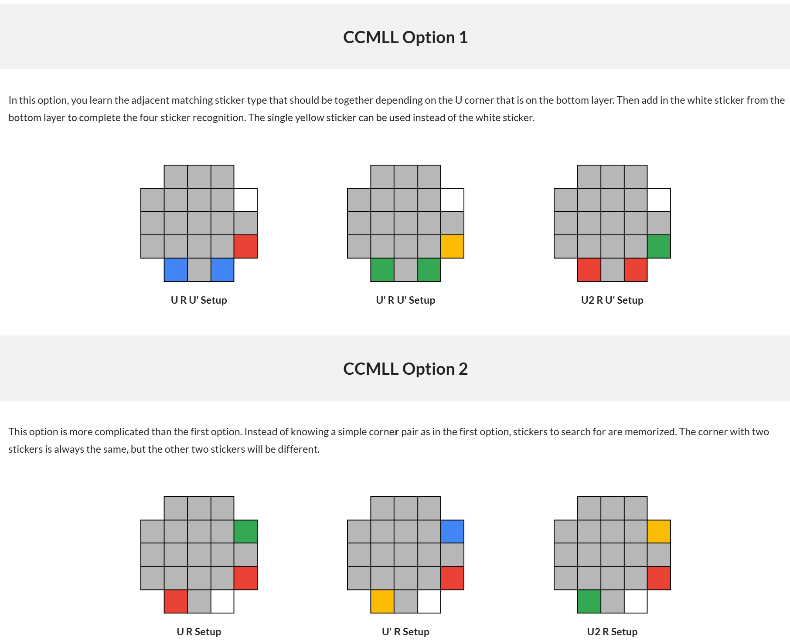

### Extra

An earlier mention of the idea can be found in 2003. This comes from a short discussion between Jacob Enget [18] and Ron van Bruchem [19]. Enget proposed reducing the number of LSLL cases, if the last slot is at dFR, by performing the moves R d’. Bruchem then expanded upon the idea by suggesting that an oriented last layer corner can be placed at UBR then moved to the bottom layer with an R turn. This leaves four unsolved corners on the upper layer. Bruchem suggested that this could be applied to the edges as well. However, no follow up messages nor developments followed the two messages.

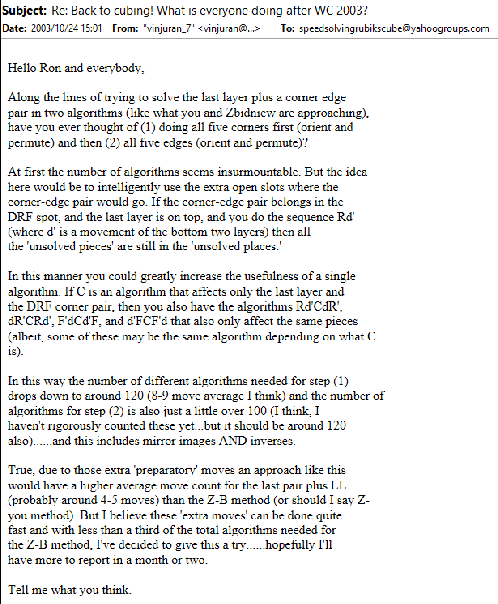
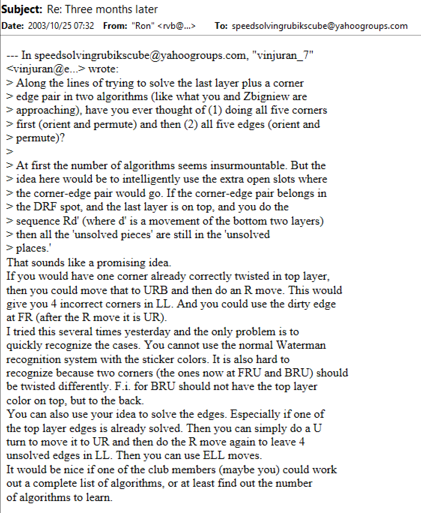

## Retroactive Solving

<AnimCube params="buttonbar=1&position=lluuu&scale=6&hint=10&hintborder=1&movetext=3&initrevmove=U'R'FRU'R'FRURUR'F'&facelets=ydydydydywwwdwdwwwbbbdbdbbbgggdgdgggodooooooorrrdrrrrr" width="400px" height="400px" />

### Description

Retroactive Solving is the intentional placement of pieces into an imperfectly solved position then correcting the pieces along with another set of pieces in a later step.

#### EG

The first application of the technique was in the EG method for the 2x2 puzzle [20]. The bottom layer corners are placed oriented, but are free to be in any permutation. The next step solves the upper layer corners while correcting the permutation of the bottom layer corners.

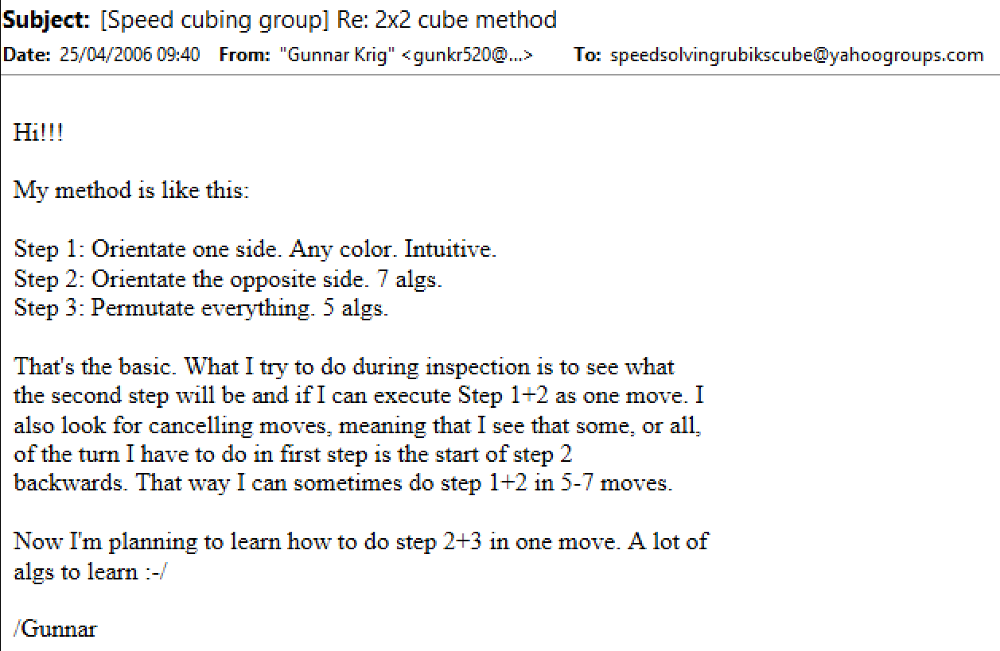

#### ACMLL

An example of a complete development of the technique for the 3x3 puzzle is ACMLL. In April, 2020, Straughan proposed solving the blocks of the Roux method with pieces in any orientation or permutation [21]. Then the CMLL algorithm simultaneously corrects the blocks.

## References

[1] R. Heise, "Possible improvement," Yahoo! Groups - Speed Solving Rubik's Cube, 11 December 2002. [Online].

[2] G. Roux, ""LL" corners," Yahoo! Groups - Speed Solving Rubik's Cube, 6 December 2004. [Online].

[3] M. J. Straughan, "NMCMLL," Personal communication, 3 October 2006. [Online].

[4] M. J. Straughan, "I found a new way to recognize NMCMLL," Personal communication, 26 April 2010. [Online].

[5] G. Roux, "Step 3," Roux Method Website, 2009. [Online]. Available: https://web.archive.org/web/20090123084804/http://grrroux.free.fr/method/Step_3.html.

[6] M. J. Straughan and T. Mosher, "ATCRM," Straughan's Website, 2021. [Online]. Available: https://sites.google.com/site/athefre/recognition/atcrm.

[7] M. J. Straughan, "Straughan Recognition," 2024. [Online]. Available: https://sites.google.com/site/athefre/recognition/straughan-recognition?authuser=0.

[8] M. J. Straughan, "Polar ZBLL Recognition," Straughan's Website, 2023. [Online]. Available: https://sites.google.com/site/athefre/recognition/polar-recognition.

[9] M. J. Straughan, "Random Cubing Discussion," SpeedSolving.com, 31 December 2010. [Online]. Available: https://www.speedsolving.com/threads/random-cubing-discussion.22862/post-509957.

[10] M. J. Straughan, "NMLL Recognition," Google Docs, 2010. [Online]. Available: https://docs.google.com/spreadsheets/d/1Z-rJzroZ7QrGcqd2RvZ5P3OW7DyX7H-GpT-dK-xWZgA/edit?hl=en_US&hl=en_US#gid=0.

[11] M. J. Straughan, "CLL Transformation Table," SpeedSolving.com, 8 February 2012. [Online]. Available: https://www.speedsolving.com/threads/cll-transformation-table.35293/.

[12] M. J. Straughan, "2x2 Pseudo Solving: Improving CLL and EG," SpeedSolving.com, 1 June 2012. [Online]. Available: https://www.speedsolving.com/threads/2x2-pseudo-solving-improving-cll-and-eg.37073/.

[13] M. J. Straughan, "Random Cubing Discussion," SpeedSolving.com, 5 May 2012. [Online]. Available: https://www.speedsolving.com/threads/random-cubing-discussion.22862/page-85#post-741058.

[14] J. Briggs, "42 - Method Proposal," SpeedSolving.com, 16 August 2017. [Online]. Available: https://www.speedsolving.com/threads/42-method-proposal.66052/.

[15] J. Briggs, "42- Method Proposal," SpeedSolving.com, 17 August 2017. [Online]. Available: https://www.speedsolving.com/threads/42-method-proposal.66052/post-1250449.

[16] J. Briggs, "Conjugated CMLL/BT-redux recognition," YouTube.com, 17 August 2017. [Online]. Available: https://www.youtube.com/watch?v=DZZZ2WvFiZs.

[17] M. J. Straughan, "Straughan Recognition," May 2024. [Online]. Available: https://sites.google.com/site/athefre/recognition/straughan-recognition?authuser=0#h.e5b7xqhqvojm.

[18] J. Enget, "Re: Back to cubing! What is everyone doing after WC 2003?," Yahoo! Groups - Speed Solving Rubik's Cube, 24 October 2003. [Online].

[19] R. v. Bruchem, "Re: Three months later," Yahoo! Groups - Speed Solving Rubik's Cube, 25 October 2003. [Online].

[20] G. Krig, "[Speed cubing group] Re: 2x2 cube method," Yahoo! Groups - Speed Solving Rubik's Cube, 25 April 2006. [Online].

[21] M. J. Straughan, "The New Method / Substep / Concept Idea Thread," SpeedSolving.com, 17 April 2020. [Online]. Available: https://www.speedsolving.com/threads/the-new-method-substep-concept-idea-thread.40975/post-1363270.
