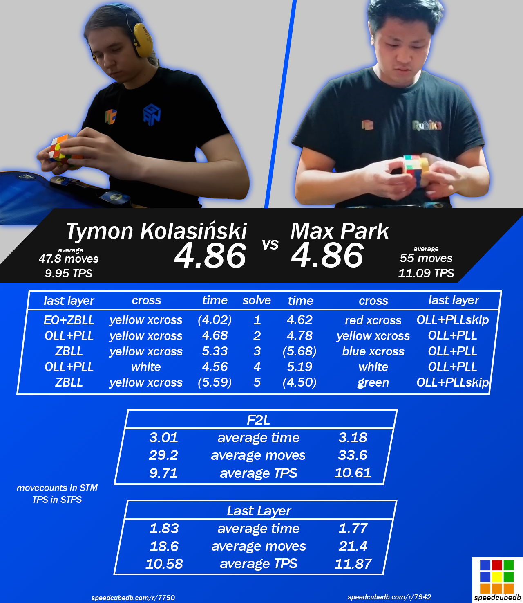

import AnimCube from "@site/src/components/AnimCube";

# World Record Averages (2H)

## 20.00 (Dan Knights) - World Rubik's Games Championship 2003

The first official world record average in the 3x3 two hand category was achieved on August 23, 2003 by Dan Knights. This average occurred during the final round of the World Rubik's Games Championship 2003, the first official competition since the 1982 Rubik's Cube World Championship.

| Average | Solves                            | Date            |
| ------- | --------------------------------- | --------------- |
| 20.00   | 21.13 19.93 18.95 (22.07) (18.76) | August 23, 2003 |

## 16.53 to 14.52 (Shotaro Makisumi)

Throughout 2004, Shotaro Makisumi reduced the world record average to 14.52. Starting it off, Makisumi achieved a 16.53 second average on January 24, 2004, then a 15.38 average on April 3, 2004, and finally a 14.52 average on October 16, 2004.

| Average | Solves                            | Date             |
| ------- | --------------------------------- | ---------------- |
| 16.53   | 15.29 16.64 17.65 (18.05) (14.76) | January 24, 2004 |
| 15.38   | 15.29 16.64 17.65 (18.05) (14.76) | April 3, 2004    |
| 14.52   | (13.16) 13.77 15.49 14.29 (15.60) | October 16, 2004 |

  <iframe loading="lazy" width="100%" height="100%"
    src="https://www.youtube.com/embed/aOmgT6GjZIg"
    frameborder="0" allowfullscreen
    style={{position: 'absolute', top: 0, left: 0}}>
  </iframe>

## 14.40 and 13.22 (Anssi Vanhala)

On March 18, 2006, a year and a half after the 14.52 second average was set, the world record average was broken. During the second round of the SveKub Annual Meeting competition, Vanhala set a record of 14.40 seconds. Then in the final round, further reduced the record to 13.22 seconds.

| Average | Solves                            | Date           |
| ------- | --------------------------------- | -------------- |
| 14.40   | (16.59) 14.18 15.29 (13.08) 13.74 | March 18, 2006 |
| 13.22   | 14.08 12.81 12.77 (12.47) (14.09) | March 18, 2006 |

  <iframe loading="lazy" width="100%" height="100%"
    src="https://www.youtube.com/embed/eX-LRl6JA1Y"
    frameborder="0" allowfullscreen
    style={{position: 'absolute', top: 0, left: 0}}>
  </iframe>

## 11.76 to 10.07

From January 2007 to September 2009, the record was reduced to 10.07 seconds. The first of these was a large jump compared to the previous record. On January 7 2007, JeongMin Yu set a record average of 11.76 seconds – a 1.46 second reduction from the previous record of 13.22. This was followed a year later by an 11.48 second average by Edouard Chambon. Soon after in the same year, Yu Nakajima broke the world record average twice. First with an 11.33, then an 11.28.

2009 saw the world record average broken four times. First in February by Erik Akkersdijk with an 11.11 second average. Then throughout the year the record reached and remained in the 10 second mark. The first of these was a 10.83 second average from Yumu Tabuchi. The final two averages were a 10.63 and a 10.07, both set by Tomasz Żołnowski.

| Name             | Average | Solves                            | Date               |
| ---------------- | ------- | --------------------------------- | ------------------ |
| JeongMin Yu      | 11.76   | 11.66 12.02 (13.09) (11.09) 11.59 | January 7, 2007    |
| Edouard Chambon  | 11.48   | (13.03) (9.18) 12.44 12.33 9.66   | February 23, 2008  |
| Yu Nakajima      | 11.33   | (16.69) 12.56 (10.46) 10.72 10.71 | March 29, 2008     |
| Yu Nakajima      | 11.28   | 11.36 (10.16) 10.65 (13.13) 11.83 | May 5, 2008        |
| Erik Akkersdijk  | 11.11   | (9.71) 10.25 12.71 (14.58) 10.38  | February 21, 2009  |
| Yumu Tabuchi     | 10.83   | 9.30 (9.19) 11.03 (13.11) 12.16)  | March 28, 2009     |
| Tomasz Żołnowski | 10.63   | 10.88 10.19 10.81 (9.43) (DNF)    | April 4, 2009      |
| Tomasz Żołnowski | 10.07   | 10.80 (12.08) 9.77 (8.68) 9.65    | September 26, 2009 |

  <iframe loading="lazy" width="100%" height="100%"
    src="https://www.youtube.com/embed/bZv_YtXwKzo"
    frameborder="0" allowfullscreen
    style={{position: 'absolute', top: 0, left: 0}}>
  </iframe>

  <iframe loading="lazy" width="100%" height="100%"
    src="https://www.youtube.com/embed/MUP0T_bH7Vc"
    frameborder="0" allowfullscreen
    style={{position: 'absolute', top: 0, left: 0}}>
  </iframe>

  <iframe loading="lazy" width="100%" height="100%"
    src="https://www.youtube.com/embed/id2xtbfVbn8"
    frameborder="0" allowfullscreen
    style={{position: 'absolute', top: 0, left: 0}}>
  </iframe>

  <iframe loading="lazy" width="100%" height="100%"
    src="https://www.youtube.com/embed/WYL2Gmpn0sA"
    frameborder="0" allowfullscreen
    style={{position: 'absolute', top: 0, left: 0}}>
  </iframe>

  <iframe loading="lazy" width="100%" height="100%"
    src="https://www.youtube.com/embed/YJdGN0Opuvc"
    frameborder="0" allowfullscreen
    style={{position: 'absolute', top: 0, left: 0}}>
  </iframe>

  <iframe loading="lazy" width="100%" height="100%"
    src="https://www.youtube.com/embed/Kfvz0EU7_-Y"
    frameborder="0" allowfullscreen
    style={{position: 'absolute', top: 0, left: 0}}>
  </iframe>

## 9.21 to 6.45 (Feliks Zemdegs)

<AnimCube params="config=../../ReconstructionConfig.txt&initmove=D2 B R2 B' F2 D2 L2 F' L B' R' D R B' D F2 D' L F;B2 R2 D2 F2 U2 R2 U2 L F2 D B D U' F R U' B' U2 R';R' F2 L2 F2 R F' D' B L' D R' B' R2 U2 B R2 D';D2 U L2 B' R B U' F2 R F' U' B2 F' U L2 B D U2;B' L2 B L2 F L U F' L' D F2 L2 R' D2 F L R' B'&move={Scramble: D2 B R2 B' F2 D2 L2 F' L B' R' D R B' D F2 D' L F}{Inspection: z}z.{Xcross: R' F R u' R U' R D U' L2'}R' F R u' R U' R D U' L2'.{2nd pair: y2' R U' R' U R U2' R' U R U' R2'}y2' R U' R' U R U2' R' U R U' R2'.{3rd pair: U R L' U L}U R L' U L.{4th pair: U' U R' U2' R}U' U R' U2' R.{OLL(CP): U' R' U' F' U F R U' R U2' R' U' R U' R'}U' R' U' F' U F R U' R U2' R' U' R U' R'.{EPLL: U' R2 U R U R' U' R' U' R' U R' U'}U' R2 U R U R' U' R' U' R' U R' U';{Scramble: B2 R2 D2 F2 U2 R2 U2 L F2 D B D U' F R U' B' U2 R'}{Inspection: x' y'}x' y'.{Cross: R2' D2 R r U' r' D}R2' D2 R r U' r' D.{1st pair: R' F U' F' R}R' F U' F' R.{2nd pair: U L' U U R U' R'}U L' U U R U' R'.{3rd pair: U L U' L' U L}U L U' L' U L.{4th pair: U2' L U' L' U L U' L'}U2' L U' L' U L U' L'.{OLL: U' U' R U R' U' R' F R2 U R' U' F'}U' U' R U R' U' R' F R2 U R' U' F'.{PLL: x R2' D2 R U R' D2 R U' R}x R2' D2 R U R' D2 R U' R;{Scramble: R' F2 L2 F2 R F' D' B L' D R' B' R2 U2 B R2 D'}{Inspection: y x'}y x'.{Cross: R D R D2 R2'}R D R D2 R2'.{1st pair: U' L U2 L'}U' L U2 L'.{2nd pair: y L U L2'}y L U L2'.{3rd pair: U L U R U R'}U L U R U R'.{4th pair: y' U' R U R' U R U R'}y' U' R U R' U R U R'.{EO: U' F R U R' U' F'}U' F R U R' U' F'.{ZBLL: U' U' R' U' R U' R' D D' U' R2 D r' U2 r D' R2' U' R U2}U' U' R' U' R U' R' D D' U' R2 D r' U2 r D' R2' U' R U2;{Scramble: D2 U L2 B' R B U' F2 R F' U' B2 F' U L2 B D U2}{Inspection: x}x.{Xcross: (r' L') D' R' y R' U' R D2}(r' L') D' R' y R' U' R D2.{2nd pair: R U' U' R' L U' L'}R U' U' R' L U' L'.{3rd pair: y' R U R' U R U R' U' R U' R'}y' R U R' U R U R' U' R U' R'.{4th pair / EOLS: y R' F R F'}y R' F R F'.{ZBLL: U R U2' R2' U' R2 U' R' U R' U' R U R' U R U2'}U R U2' R2' U' R2 U' R' U R' U' R U R' U R U2';{Scramble: B' L2 B L2 F L U F' L' D F2 L2 R' D2 F L R' B'}{Inspection: z y2}z y2.{XXcross: U' l' U2 L' x' y L U L' U R' U' R D2 U' l' U l}U' l' U2 L' x' y L U L' U R' U' R D2 U' l' U l.{3rd pair: y' R' U' R U' R' U R}y' R' U' R U' R' U R.{4th pair: U R U2' R' d R' U' R}U R U2' R' d R' U' R.{OLL: U' R U2' R2' F R F' R U2' R'}U' R U2' R2' F R F' R U2' R'.{PLL: U' R' U2 R U' U' R' F R U R' U' R' F' R2 U'}U' R' U2 R U' U' R' F R U R' U' R' F' R2 U'" width="600px" height="400px" />

**6.45 second average by Feliks Zemdegs**
| **Solve** | **Method** | **Cube** | **Time** | **STM** | **STPS** | **ETM** | **ETPS** |
|------|------|------|----|-----|------|-----|------|
| 1 | CFOP | GAN 356S | (7.16) | 59 | 8.24 | 60 | 8.38 |
| 2 | CFOP | GAN 356S | 6.58 | 55 | 8.36 | 56 | 8.51 |
| 3 | CFOP | GAN 356S | 6.79 | 53 | 7.81 | 55 | 8.10 |
| 4 | CFOP | GAN 356S | (5.88) | 47 | 7.99 | 50 | 8.50 |
| 5 | CFOP | GAN 356S | 5.99 | 57 | 9.52 | 60 | 10.02 |

In 2010, the sub-10 second barrier for the world record average was broken for the first time. On January 30 of that year, Feliks Zemdegs achieved a 9.21 second average. This was to become the start of a six and a half year dominance by Zemdegs and numerous barriers being broken. From January 2010 to July 2016, Zemdegs achieved the first sub-10, sub-9, sub-8, and sub-7 second averages. This was accomplished over a total of nine world record averages.

| Average | Solves                        | Date              |
| ------- | ----------------------------- | ----------------- |
| 9.21    | 8.91 8.83 (10.91) 9.90 (8.69) | January 30, 2010  |
| 8.52    | 9.36 (14.11) 8.02 8.19 (7.94) | July 10, 2010     |
| 7.91    | (11.78) 7.40 7.63 8.69 (7.09) | November 13, 2010 |
| 7.87    | (8.56) (7.31) 8.22 7.31 8.09  | January 29, 2011  |
| 7.64    | 7.03 8.11 (8.36) (5.66) 7.78  | June 25, 2011     |
| 7.53    | 7.56 (6.78) 7.16 (11.44) 7.86 | September 1, 2012 |
| 7.49    | 7.59 (7.71) 7.68 7.21 (6.18)  | September 7, 2013 |
| 6.54    | 6.91 6.41 (6.25) (7.30) 6.31  | November 16, 2013 |
| 6.45    | (7.16) 6.58 6.79 (5.88) 5.99  | July 9, 2016      |

  <iframe loading="lazy" width="100%" height="100%"
    src="https://www.youtube.com/embed/Lv54OeFQZOk"
    frameborder="0" allowfullscreen
    style={{position: 'absolute', top: 0, left: 0}}>
  </iframe>

  <iframe loading="lazy" width="100%" height="100%"
    src="https://www.youtube.com/embed/93KEXSfKp4c"
    frameborder="0" allowfullscreen
    style={{position: 'absolute', top: 0, left: 0}}>
  </iframe>

## 6.39 (Max Park)

<AnimCube params="config=../../ReconstructionConfig.txt&initmove=U2 F2 B2 D' F2 L B D' F D R' L2 B2 U2 D2 L' U2 D2 F2;D F2 R2 U F' B2 U2 R' U2 L B' R2 U' F2 L2 F2 R2 D' R2 L2;D U R2 U' B2 D' F2 D2 R' U B' U' F2 D2 R F2 L' F' U;D F2 U2 R2 U2 L2 B2 L2 U2 B R' U2 F' R2 D' F2 U' L F' U;R2 B' R2 D2 B' R2 F L2 B L' U' B2 U F D' F' D' U' L2 D'&move={Scramble: U2 F2 B2 D' F2 L B D' F D R' L2 B2 U2 D2 L' U2 D2 F2}{Inspection: z2}z2.{Cross: r D R D D F}r D R D D F.{1st pair: L U L'}L U L'.{2nd pair: U R' U R2 U' R'}U R' U R2 U' R'.{3rd pair: U U L' U L R' U R}U U L' U L R' U R.{4th pair: U' U' L' U U L U' L' U L}U' U' L' U U L U' L' U L.{OLL: U U' F U R U' R' F'}U U' F U R U' R' F'.{PLL: U' U' U' R2 U R' U R' U' R U' R2' (U' D) R' U R D'}U' U' U' R2 U R' U R' U' R U' R2' (U' D) R' U R D';{Scramble: D F2 R2 U F' B2 U2 R' U2 L B' R2 U' F2 L2 F2 R2 D' R2 L2}{Inspection: z2}z2.{Xcross: (r' L') U x R r U' r' y U R U' R' u'}(r' L') U x R r U' r' y U R U' R' u'.{2nd pair: U L' U U L U L' U' L}U L' U U L U L' U' L.{3rd pair: R U' R' d R' U' R U' R' U' R}R U' R' d R' U' R U' R' U' R.{4th pair: U L' U' L U L' U' L}U L' U' L U L' U' L.{OLL: R' U' R' F R F' U R}R' U' R' F R F' U R.{PLL: U' U L U' R U' U' L' U L R' U' R U' U' L' U l'}U' U L U' R U' U' L' U L R' U' R U' U' L' U l';{Scramble: D U R2 U' B2 D' F2 D2 R' U B' U' F2 D2 R F2 L' F' U}{Inspection: y2 x'}y2 x'.{Cross: D' L2' U' R' F R D'}D' L2' U' R' F R D'.{1st pair: R' U R}R' U R.{2nd pair: U' U' R U R' U R U' R'}U' U' R U R' U R U' R'.{3rd pair: y' U' R U R'}y' U' R U R'.{4th pair: y' R U' R' U R U' U' R' U R U' R'}y' R U' R' U R U' U' R' U R U' R'.{OLL: U U r U' r2' U r2 U r2' U' r}U U r U' r2' U r2 U r2' U' r.{PLL: U U' R' U L' U U R U' R' L U L' U U R U' L U U}U U' R' U L' U U R U' R' L U L' U U R U' L U U;{Scramble: D F2 U2 R2 U2 L2 B2 L2 U2 B R' U2 F' R2 D' F2 U' L F' U}{Inspection: y'}y'.{Xcross: R' U' B' R U' R' F R2 U' R'}R' U' B' R U' R' F R2 U' R'.{2nd pair: y U R U' R' U U R U' R2'}y U R U' R' U U R U' R2'.{3rd pair: U R y U R' U R}U R y U R' U R.{4th pair: U U R U' U' R' U R U' R'}U U R U' U' R' U R U' R'.{OLL: U U r' U' R U' R' U R U' R' U' U' r}U U r' U' R U' R' U R U' R' U' U' r.{PLL: U' R' U U R U' U' R' F R U R' U' R' F' R2 U'}U' R' U U R U' U' R' F R U R' U' R' F' R2 U';{Scramble: R2 B' R2 D2 B' R2 F L2 B L' U' B2 U F D' F' D' U' L2 D'}{Cross: R U r U' r' D' R' u}R U r U' r' D' R' u.{1st pair: U R' U' R}U R' U' R.{2nd pair: U' R U' R' U' L U' L'}U' R U' R' U' L U' L'.{3rd pair: R U' U' R' U U R U' R'}R U' U' R' U U R U' R'.{4th pair: U L' U L d R U R'}U L' U L d R U R'.{OLL: U R U R' U' M' U R U' r'}U R U R' U' M' U R U' r'.{PLL: U' R2 U R' U R' U' R U' R2' (U' D) R' U R (U D')}U' R2 U R' U R' U' R U' R2' (U' D) R' U R (U D')" width="600px" height="400px" />

**6.39 second average by Max Park**
| **Solve** | **Method** | **Cube** | **Time** | **STM** | **STPS** | **ETM** | **ETPS** |
|------|------|------|----|-----|------|-----|------|
| 1 | CFOP | GAN 356 Air UM | 6.41 | 59 | 9.20 | 59 | 9.20 |
| 2 | CFOP | GAN 356 Air UM | (7.26) | 66 | 9.09 | 68 | 9.37 |
| 3 | CFOP | GAN 356 Air UM | 6.63 | 66 | 9.95 | 68 | 10.26 |
| 4 | CFOP | GAN 356 Air UM | 6.12 | 66 | 10.78 | 68 | 11.11 |
| 5 | CFOP | GAN 356 Air UM | (5.60) | 64 | 11.43 | 64 | 11.43 |

In 2017, for the first time in over seven years, Zemdegs’ streak was broken. On April 23, 2017, broke the world record with an average of 6.39 seconds. What people began to notice about Max Park’s solving style was his turns per second. This contrasted with Zemdegs’ solves which had lower turns per second, but were more move efficient.

  <iframe loading="lazy" width="100%" height="100%"
    src="https://www.youtube.com/embed/7hEVhvpcFZI"
    frameborder="0" allowfullscreen
    style={{position: 'absolute', top: 0, left: 0}}>
  </iframe>

## 5.97 to 5.53 (Feliks Zemdegs)

<AnimCube params="config=../../ReconstructionConfig.txt&initmove=R2 F' U2 L D' L' D' R D2 U2 F2 L' D2 L' D' B' U';D' L D' U2 R2 U' B L U2 B2 R U R2 F2 D' U2 B';U' R2 B U' L' F' R D2 U L' F2 D2 R' F' D B' D' U';L B2 U2 B' R' D2 R' B L B F' U2 L D R2 B R;U' R F U2 F' U2 F2 D' R D' L2 R' F D B2 L' B R' U2&move={Scramble: R2 F' U2 L D' L' D' R D2 U2 F2 L' D2 L' D' B' U'}{Inspection: y}y.{Cross: R2' F D F D2}R2' F D F D2.{1st pair: R U' R' y R U' R' U R' U' R}R U' R' y R U' R' U R' U' R.{2nd pair: y' U' L' U L R' U R}y' U' L' U L R' U R.{3rd pair: R U' R' F U F'}R U' R' F U F'.{4th pair: U' R U R'}U' R U R'.{OLL: U' U' F U R U2 R' U' R U2 R' U' F'}U' U' F U R U2 R' U' R U2 R' U' F'.{PLL: U R U R' F' R U2' R' U2' R' F R U R U2' R' U}U R U R' F' R U2' R' U2' R' F R U R U2' R' U;{Scramble: D' L D' U2 R2 U' B L U2 B2 R U R2 F2 D' U2 B'}{Inspection: x y2}x y2.{Cross: U' R2 D R' D2}U' R2 D R' D2.{1st pair: R U' U' R' U L U L'}R U' U' R' U L U L'.{2nd pair: U' R' U2 R d' R U R'}U' R' U2 R d' R U R'.{3rd pair: U' L U2 L'}U' L U2 L'.{4th pair: y' U R U' R' y' R' U' R}y' U R U' R' y' R' U' R.{OLL(CP): F R U' R' U' R U R' F'}F R U' R' U' R U R' F'.{EPLL: R U' R U R U R U' R' U' R2 U'}R U' R U R U R U' R' U' R2 U';{Scramble: U' R2 B U' L' F' R D2 U L' F2 D2 R' F' D B' D' U'}{Inspection: z' x'}z' x'.{Xcross: L' U' r' l U' l' R' U' R D}L' U' r' l U' l' R' U' R D.{2nd pair: y' U' U L F' L' F}y' U' U L F' L' F.{3rd pair: U' R' U R}U' R' U R.{4th pair+OLS: U R' F R F' U' R' F R F'}U R' F R F' U' R' F R F'.{EPLL: R U' R U R U R U' R' U' R2}R U' R U R U R U' R' U' R2;{Scramble: L B2 U2 B' R' D2 R' B L B F' U2 L D R2 B R}{Inspection: x z'}x z'.{Cross: U' R' F D2 R' U R' D'}U' R' F D2 R' U R' D'.{1st pair: L U L'}L U L'.{2nd pair: U' R U' R' U' R' U' R}U' R U' R' U' R' U' R.{3rd pair: U' R U' R' U L' U' L}U' R U' R' U L' U' L.{4th pair: U R U R' U' R U R'}U R U R' U' R U R'.{OLL: U' l' U' L U' L' U L U' L' U U l}U' l' U' L U' L' U L U' L' U U l.{PLL: R2 U R' U R' U' R U' R2 (D U') R' U R D'}R2 U R' U R' U' R U' R2 (D U') R' U R D';{Scramble: U' R F U2 F' U2 F2 D' R D' L2 R' F D B2 L' B R' U2}{Inspection: x}x.{Cross: U' R U2 R (U' D)}U' R U2 R (U' D).{1st+2nd pairs: R' U R2 U' R'}R' U R2 U' R'.{3rd pair: y' R U' R' U' R U R' U2 R U' R'}y' R U' R' U' R U R' U2 R U' R'.{4th pair: y' U R' F R F' U R U' R' R U' R'}y' U R' F R F' U R U' R' R U' R'.{OLL: F R U R' U' F'}F R U R' U' F'.{PLL: y' x' R U' R D2 R' U R D2 R2'}y' x' R U' R D2 R' U R D2 R2'" width="600px" height="400px" />

**5.53 second average by Feliks Zemdegs**
| **Solve** | **Method** | **Cube** | **Time** | **STM** | **STPS** | **ETM** | **ETPS** |
|------|------|------|----|-----|------|-----|------|
| 1 | CFOP | GAN 356 XS | (7.16) | 62 | 8.66 | 64 | 8.94 |
| 2 | CFOP | GAN 356 XS | 5.04 | 53 | 10.52 | 55 | 10.91 |
| 3 | CFOP | GAN 356 XS | (4.67) | 41 | 8.78 | 42 | 8.99 |
| 4 | CFOP | GAN 356 XS | 6.55 | 63 | 9.62 | 63 | 9.62 |
| 5 | CFOP | GAN 356 XS | 4.99 | 49 | 9.82 | 53 | 10.62 |

2017 saw Zemdegs reclaim the world record average and another streak of holding the title. On June 28, 2017, Zemdegs attained a 5.97 average. This continued Zemdegs’ series of broken barriers, making him the first to set sub-10, 9, 8, 7, and sub-6 world record averages. After the 5.97 second average, Zemdegs achieved averages of 5.80, 5.69, and 5.53.

| Average | Solves                       | Date              |
| ------- | ---------------------------- | ----------------- |
| 5.97    | (5.55) 5.64 6.58 (6.67) 5.70 | June 28, 2017     |
| 5.80    | 5.99 5.28 (5.25) 6.13 (9.19) | October 14, 2017  |
| 5.69    | (6.90) 5.64 (5.57) 5.79 5.63 | April 6, 2019     |
| 5.53    | (7.16) 5.04 (4.67) 6.55 4.99 | November 10, 2019 |

  <iframe loading="lazy" width="100%" height="100%"
    src="https://www.youtube.com/embed/kWUQbhbqvqo"
    frameborder="0" allowfullscreen
    style={{position: 'absolute', top: 0, left: 0}}>
  </iframe>

  <iframe loading="lazy" width="100%" height="100%"
    src="https://www.youtube.com/embed/Pj796Dd95-w"
    frameborder="0" allowfullscreen
    style={{position: 'absolute', top: 0, left: 0}}>
  </iframe>

## 5.48 to 5.08

<AnimCube params="config=../../ReconstructionConfig.txt&initmove=L2 B2 L2 D B2 F2 D2 R' F2 D2 L U2 B U' R' F' L2 U2 L';U F2 U' L2 D' F2 D' R2 B' L' F D R U2 B' L' F' R' F2;D2 L2 B2 F2 D' F2 U L2 D' B2 L' U' F' D B2 R' U' B D2 L2 R2 U';L2 B2 D' U' L2 F2 U F2 D' U2 B' U' B L' U2 L F D L' F' U2;R B2 L2 B2 R B2 R D2 U' L2 B' F2 D2 B' U R B' U2 L F2&move={Scramble: L2 B2 L2 D B2 F2 D2 R' F2 D2 L U2 B U' R' F' L2 U2 L'}{Inspection: x' z2}x' z2.{Cross: R' F R' F R L D}R' F R' F R L D.{1st pair: R U' R' U R U R'}R U' R' U R U R'.{2nd pair: y' d R' U' R}y' d R' U' R.{3rd and 4th pairs: U L' U L U' y' R U R2' U' R2 U' R'}U L' U L U' y' R U R2' U' R2 U' R'.{OLL: U R' U' R U' R' U U R}U R' U' R U' R' U U R.{PLL: U l' U R' D D R U' R' D D R2}U l' U R' D D R U' R' D D R2;{Scramble: U F2 U' L2 D' F2 D' R2 B' L' F D R U2 B' L' F' R' F2}{Inspection: z y2}z y2.{Cross: R' r D' R' F R D}R' r D' R' F R D.{1st pair: R' U R U' R' U' R2 R'}R' U R U' R' U' R2 R'.{2nd pair: L' U L U R U' R' F U F'}L' U L U R U' R' F U F'.{3rd pair: U' R U' U' R' d' R' U' R}U' R U' U' R' d' R' U' R.{4th pair: y' U' U' R U R' U U R U' R'}y' U' U' R U R' U U R U' R'.{OLL: U U R' U' R' F R F' U R}U U R' U' R' F R F' U R.{PLL: U x R2' D D R U R' D D R U' R x' U'}U x R2' D D R U R' D D R U' R x' U';{Scramble: D2 L2 B2 F2 D' F2 U L2 D' B2 L' U' F' D B2 R' U' B D2 L2 R2 U'}{Inspection: x y2}x y2.{Xxcross: U r' R2 D L2' R U R' d' R' U' R u'}U r' R2 D L2' R U R' d' R' U' R u'.{3rd pair: U' F U F' U' L' U L}U' F U F' U' L' U L.{4th pair: U R U R' U U R U R'}U R U R' U U R U R'.{OLL: U' U' R U R' U R U' U' R' F R U R' U' F'}U' U' R U R' U R U' U' R' F R U R' U' F'.{PLL: U F R U' R' U' R U R' R R' F' R U R' U' R' F R F' U}U F R U' R' U' R U R' R R' F' R U R' U' R' F R F' U;{Scramble: L2 B2 D' U' L2 F2 U F2 D' U2 B' U' B L' U2 L F D L' F' U2}{Inspection: z}z.{Xcross: r' F R U R2 D' L}r' F R U R2 D' L.{2nd pair: U R U' R' U R U R'}U R U' R' U R U R'.{3rd pair: y' U L' U U L U L' U' L}y' U L' U U L U L' U' L.{4th pair: d U R' U' R U U R' U R}d U R' U' R U U R' U R.{OLL: U' U' R U R' U' R' F R F'}U' U' R U R' U' R' F R F'.{PLL: L' U R' U' U' z U R' U' R2 D U}L' U R' U' U' z U R' U' R2 D U;{Scramble: R B2 L2 B2 R B2 R D2 U' L2 B' F2 D2 B' U R B' U2 L F2}{Inspection: z2}z2.{Cross: D D x' U' R' F}D D x' U' R' F.{1st pair: U' L' U L U R' U R2}U' L' U L U R' U R2.{2nd pair: U' U' R' d' R' U' R}U' U' R' d' R' U' R.{3rd pair: U D d R U R' D'}U D d R U R' D'.{4th pair: U' R U' U' R' U U R U' R'}U' R U' U' R' U U R U' R'.{OLL: r U R' U R U' U' r'}r U R' U R U' U' r'.{PLL: R U R' F' R U R' U' R' F R2 U' R'}R U R' F' R U R' U' R' F R2 U' R'" width="600px" height="400px" />

**5.08 second average by Max Park**
| **Solve** | **Method** | **Cube** | **Time** | **STM** | **STPS** | **ETM** | **ETPS** |
|------|------|------|----|-----|------|-----|------|
| 1 | CFOP | Unknown | 4.88 | 51 | 10.45 | 53 | 10.86 |
| 2 | CFOP | Unknown | (5.70) | 67 | 11.75 | 70 | 12.28 |
| 3 | CFOP | Unknown | 5.56 | 67 | 12.05 | 67 | 12.05 |
| 4 | CFOP | Unknown | (4.53) | 55 | 12.14 | 57 | 12.58 |
| 5 | CFOP | Unknown | 4.80 | 49 | 10.21 | 53 | 11.04 |

From June 2021 to April 2022, the world record average was brought down to 5.08 seconds over four different records. The first of these was set by Ruihang Xu on June 5, 2021, with an average of 5.48 seconds. Following this was a 5.32 by Max Park, a 5.09 by Tymon Kolasiński, and a 5.08 by Max Park.

| Name             | Average | Solves                       | Date              |
| ---------------- | ------- | ---------------------------- | ----------------- |
| Ruihang Xu       | 5.48    | 5.48 5.52 5.45 (4.06) (7.51) | June 5, 2021      |
| Max Park         | 5.32    | 5.34 5.50 5.12 (4.54) (5.96) | November 6, 2021  |
| Tymon Kolasiński | 5.09    | (4.73) 4.83 5.24 (6.57) 5.20 | December 18, 2021 |
| Max Park         | 5.08    | 4.88 (5.70) 5.56 (4.53) 4.80 | April 3, 2022     |

  <iframe loading="lazy" width="100%" height="100%"
    src="https://www.youtube.com/embed/UDbTMnGBuEQ"
    frameborder="0" allowfullscreen
    style={{position: 'absolute', top: 0, left: 0}}>
  </iframe>

  <iframe loading="lazy" width="100%" height="100%"
    src="https://www.youtube.com/embed/QMRDcx0iTBc"
    frameborder="0" allowfullscreen
    style={{position: 'absolute', top: 0, left: 0}}>
  </iframe>

  <iframe loading="lazy" width="100%" height="100%"
    src="https://www.youtube.com/embed/BxWbYB4kI8M"
    frameborder="0" allowfullscreen
    style={{position: 'absolute', top: 0, left: 0}}>
  </iframe>

  <iframe loading="lazy" width="100%" height="100%"
    src="https://www.youtube.com/embed/X3UFiUnWIqc"
    frameborder="0" allowfullscreen
    style={{position: 'absolute', top: 0, left: 0}}>
  </iframe>

## 4.86 (Tymon Kolasiński and Max Park)

<AnimCube params="config=../../ReconstructionConfig.txt&initmove=U' L2 D' B2 L2 R2 D2 U B2 F' D F2 U B' F' L R F L R2;B2 L2 F2 U2 L2 D' F2 U2 R2 U2 F' D' L' F' U2 R B2 F2 L U' R';L2 U L2 U B2 U B2 U' R2 B2 L' F R F2 R2 F U L U2 B';U R2 D B2 R2 D F2 U' L2 U L' R D2 U' B R' D2 U B' L' R2 U;L2 D2 U' L2 D2 R2 F2 R2 U L2 R' U2 F' U2 L D2 B' F2 U' B' U&move={Scramble: U' L2 D' B2 L2 R2 D2 U B2 F' D F2 U B' F' L R F L R2}{Inspection: x y}x y.{Xcross: D' F' r U' r'}D' F' r U' r'.{2nd pair: U2' L U L'}U2' L U L'.{3rd pair: d' U' R U R' U' R U R'}d' U' R U R' U' R U R'.{4th pair: U' L' U' L U' L' U L}U' L' U' L U' L' U L.{EO: U r U R' U' r' R U R2}U r U R' U' r' R U R2.{ZBLL: D R' U' R D' R2' U2'}D R' U' R D' R2' U2';{Scramble: B2 L2 F2 U2 L2 D' F2 U2 R2 U2 F' D' L' F' U2 R B2 F2 L U' R'}{Inspection: z2 y}z2 y.{Xcross: R u' U2 R L2'}R u' U2 R L2'.{2nd 3rd pairs: y' U' R U2' R' D R U' R' D'}y' U' R U2' R' D R U' R' D'.{4th pair: U' R' U R y U R U R'}U' R' U R y U R U R'.{OLL: U L' U' L U' L' U2 L}U L' U' L U' L' U2 L.{PLL: R' U L' U2 R U' R' U U L R U'}R' U L' U2 R U' R' U U L R U';{Scramble: L2 U L2 U B2 U B2 U' R2 B2 L' F R F2 R2 F U L U2 B'}{Inspection: z2 y}z2 y.{Xcross: U' R2 D L U2 F' L' u}U' R2 D L U2 F' L' u.{2nd pair: L' U L2 U' L'}L' U L2 U' L'.{3rd pair: U2 y' R U R'}U2 y' R U R'.{4th pair: y U U' r U' r' U r R' U2' R U r'}y U U' r U' r' U r R' U2' R U r'.{ZBLL: U2 U R U2' R' U' R U' R' U' R U R' U R U2' R' U'}U2 U R U2' R' U' R U' R' U' R U R' U R U2' R' U';{Scramble: U R2 D B2 R2 D F2 U' L2 U L' R D2 U' B R' D2 U B' L' R2 U}{Inspection: x2 y}x2 y.{Cross: D' R' F U' D U' R2' F R2}D' R' F U' D U' R2' F R2.{1st pair: U L U L'}U L U L'.{2nd pair: y L U L' U L U L'}y L U L' U L U L'.{3rd pair: R U' R'}R U' R'.{4th pair: y' U2 R U R' U R' F R F'}y' U2 R U R' U R' F R F'.{OLL: R U R' U R U2' R'}R U R' U R U2' R'.{PLL: U2 R U R' U' R' F R2 U' R' U' R U R' F'}U2 R U R' U' R' F R2 U' R' U' R U R' F';{Scramble: L2 D2 U' L2 D2 R2 F2 R2 U L2 R' U2 F' U2 L D2 B' F2 U' B' U}{Inspection: x2}x2.{Xcross: U R D L F' U R U' R U R' D}U R D L F' U R U' R U R' D.{2nd pair: y' U' L' U2 L U' L' U L}y' U' L' U2 L U' L' U L.{3rd pair: R U' R' y L' U' L}R U' R' y L' U' L.{4th pair: U r U' r' U2 r U r' R U R'}U r U' r' U2 r U r' R U R'.{ZBLL: U U2' R R' R U R' U F2 R U2' R' U2' R' F2 R U}U U2' R R' R U R' U F2 R U2' R' U2' R' F2 R U" width="600px" height="400px" />

<AnimCube params="config=../../ReconstructionConfig.txt&initmove=R2 B2 F2 U L2 F2 U2 B2 D U2 L' D2 B L2 D' B' U' R2 D' F D';U2 B2 D R2 B2 U' R2 B2 L2 U B' U2 B' U' B' R' B' D L2 D2;U' F2 U' B2 F2 U R2 B2 R2 F2 L' U B2 U2 B2 R2 F D U L' F';B2 L2 D2 L2 U F2 L2 D' L2 U2 F L B F' D' U2 B' D' L2 R2;U' F2 U' L2 R2 U' B2 U B2 D2 R' U B U' R2 F D B R2&move={Scramble: R2 B2 F2 U L2 F2 U2 B2 D U2 L' D2 B L2 D' B' U' R2 D' F D'}{Inspection: z}z.{Xcross: F' U' U' R' F D' R U R' U' D'}F' U' U' R' F D' R U R' U' D'.{2nd pair: d' R U' R'}d' R U' R'.{3rd pair: U' y' R U' R' L U U L'}U' y' R U' R' L U U L'.{4th pair: U R U' R' F' U' F}U R U' R' F' U' F.{OLL(CP): U r U' r2' U r2 U r2' U' r U}U r U' r2' U r2 U r2' U' r U;{Scramble: U2 B2 D R2 B2 U' R2 B2 L2 U B' U2 B' U' B' R' B' D L2 D2}{Inspection: y'}y'.{Xcross: R D R D' R' U R U' R' D'}R D R D' R' U R U' R' D'.{2nd pair: U' y U' R' U' R2 U R'}U' y U' R' U' R2 U R'.{3rd pair: d' R U' U' R' L U' L'}d' R U' U' R' L U' L'.{4th pair: R U R' d R' U' R}R U R' d R' U' R.{OLL: U' F R U R' U' F'}U' F R U R' U' F'.{PLL: U R' U' F' R U R' U' R' F R2 U' R' U' R U R' U R U2'}U R' U' F' R U R' U' R' F R2 U' R' U' R U R' U R U2';{Scramble: U' F2 U' B2 F2 U R2 B2 R2 F2 L' U B2 U2 B2 R2 F D U L' F'}{Inspection: y z}y z.{Xcross: D' L F' U' R U' R U' D'}D' L F' U' R U' R U' D'.{2nd pair: U' L' U' L}U' L' U' L.{3rd pair: U' y U' L' U L U' y U' L U L'}U' y U' L' U L U' y U' L U L'.{4th pair: U' R U' R' d R' U' R}U' R U' R' d R' U' R.{OLL(CP): F R U R' U' F' U U' r U R' U' r' F R F'}F R U R' U' F' U U' r U R' U' r' F R F'.{EPLL: R U' R U R U R U' R' U' R2 U'}R U' R U R U R U' R' U' R2 U';{Scramble: B2 L2 D2 L2 U F2 L2 D' L2 U2 F L B F' D' U2 B' D' L2 R2}{Inspection: z2}z2.{Cross: R' D D R' U D' R D'}R' D D R' U D' R D'.{1st pair: L U' L'}L U' L'.{2nd pair: U R' U' R U L' U L}U R' U' R U L' U L.{3rd pair: U R' U' R U' R U' R'}U R' U' R U' R U' R'.{4th pair: d' R U' R' U R U R'}d' R U' R' U R U R'.{OLL: U' U' F R U R' U' R U R' U' F'}U' U' F R U R' U' R U R' U' F'.{PLL: U' F R U' R' U' R U R' F' R U R' U' R' F R F'}U' F R U' R' U' R U R' F' R U R' U' R' F R F';{Scramble: U' F2 U' L2 R2 U' B2 U B2 D2 R' U B U' R2 F D B R2}{Inspection: z'}z'.{Cross: U' r' U R' D R D R D'}U' r' U R' D R D R D'.{1st pair: d' U' R' U R}d' U' R' U R.{2nd pair: d R U' R' U R' U' R}d R U' R' U R' U' R.{3rd pair: U' U' R U R' U' F U' F'}U' U' R U R' U' F U' F'.{4th pair: U U R U' R' U R U R'}U U R U' R' U R U R'.{OLL(CP): U' U' r U R' U R U' U' r' U}U' U' r U R' U R U' U' r' U" width="600px" height="400px" />

**4.86 second average by Tymon Kolasiński (left) and Max Park (right)**

**Tymon Kolasiński**
| **Solve** | **Method** | **Cube** | **Time** | **STM** | **STPS** | **ETM** | **ETPS** |
|------|------|------|----|-----|------|-----|------|
| 1 | CFOP | Gan 12 Maglev | (4.02) | 42 | 10.45 | 42 | 10.45 |
| 2 | CFOP | Gan 12 Maglev | 4.68 | 42 | 8.97 | 44 | 9.40 |
| 3 | CFOP | Gan 12 Maglev | 5.33 | 47 | 8.82 | 49 | 9.19 |
| 4 | CFOP | Gan 12 Maglev | 4.56 | 54 | 11.84 | 56 | 12.28 |
| 5 | CFOP | Gan 12 Maglev | (5.59) | 54 | 9.66 | 56 | 10.02 |

**Max Park**
| **Solve** | **Method** | **Cube** | **Time** | **STM** | **STPS** | **ETM** | **ETPS** |
|------|------|------|----|-----|------|-----|------|
| 1 | CFOP | X-Man Tornado V3 | 4.62 | 41 | 8.87 | 42 | 9.09 |
| 2 | CFOP | X-Man Tornado V3 | 4.78 | 59 | 12.34 | 60 | 12.55 |
| 3 | CFOP | X-Man Tornado V3 | (5.68) | 59 | 10.39 | 61 | 10.74 |
| 4 | CFOP | X-Man Tornado V3 | 5.19 | 65 | 12.52 | 65 | 12.52 |
| 5 | CFOP | X-Man Tornado V3 | (4.50) | 51 | 11.33 | 51 | 11.33 |

On July 30, 2022, Kolasiński broke the sub-5 barrier with a 4.86 second average. Just two months later on September 24, 2022, Max Park achieved the same world record average of 4.86 seconds. Similar to the comparison between the solving styles of Feliks Zemdegs and Max Park, the puzzle community focused on the contrast between the solves of Kolasiński and Park in the matching averages. A table published on speedcubedb.com highlighted Kolasiński’s efficiency as a contributor to the 4.86 world record. On the other side, Park solved using more moves but turned faster to achieve the average time of 4.86 seconds.

  <iframe loading="lazy" width="100%" height="100%"
    src="https://www.youtube.com/embed/yZywq-ROTbg"
    frameborder="0" allowfullscreen
    style={{position: 'absolute', top: 0, left: 0}}>
  </iframe>

  <iframe loading="lazy" width="100%" height="100%"
    src="https://www.youtube.com/embed/s3ypNkatnwg"
    frameborder="0" allowfullscreen
    style={{position: 'absolute', top: 0, left: 0}}>
  </iframe>

## 4.69 to 4.09 (Yiheng Wang)

<AnimCube params="config=../../ReconstructionConfig.txt&initmove=U' B2 L2 R2 U' L2 U' F2 D2 U' R' D' U' F U' R' B' U F L2 R' U2;F2 R2 D' L2 B2 L2 U' F2 U2 L2 F L' R' U2 F2 L2 U' L' U2 B L';L2 D R2 D B2 L2 U2 B2 L2 D L' D2 F D2 R2 U2 L' R' F D' R;L2 R2 D' U2 B2 D2 U' F2 L2 B2 L' B' F R F R B R B' F';B2 D' L2 D L2 D' L2 U2 F2 R2 F L2 B R D' R2 F U L2 F D U'&move={Scramble: U' B2 L2 R2 U' L2 U' F2 D2 U' R' D' U' F U' R' B' U F L2 R' U2}{Inspection: x2 y}x2 y.{Xcross: D L F' D' U L F' L' F R}D L F' D' U L F' L' F R.{2nd pair: U L U' L'}U L U' L'.{3rd pair: R' F R F' R U' R2'}R' F R F' R U' R2'.{4th pair: U R}U R.{OLL: U2' r U R' U R U2' r'}U2' r U R' U R U2' r'.{PLL: R U' R' U' R U R D R' U' R D' R' U2 R'}R U' R' U' R U R D R' U' R D' R' U2 R';{Scramble: F2 R2 D' L2 B2 L2 U' F2 U2 L2 F L' R' U2 F2 L2 U' L' U2 B L'}{Inspection: y2}y2.{Cross: U' L' F' D' R' F R2}U' L' F' D' R' F R2.{1st pair: U' y U' L' U' L}U' y U' L' U' L.{2nd pair: U D' R' U' R U u}U D' R' U' R U u.{3rd pair: L' U L R U' R'}L' U L R U' R'.{4th pair: U' L F' L' F U' L' U L}U' L F' L' F U' L' U L.{OLL(CP): l' U' L U' L' U2 l}l' U' L U' L' U2 l.{EPLL: U' R2' U R U R' U' R3 U' R' U R' U'}U' R2' U R U R' U' R3 U' R' U R' U';{Scramble: L2 D R2 D B2 L2 U2 B2 L2 D L' D2 F D2 R2 U2 L' R' F D' R}{Cross: D L' D' L l' U' l}D L' D' L l' U' l.{1st pair: d L' U2 L}d L' U2 L.{2nd pair: U' R U R2' U' R}U' R U R2' U' R.{3rd pair: U R U' R' y' L' U' L}U R U' R' y' L' U' L.{4th pair: R' U' R U R' U2' R}R' U' R U R' U2' R.{OLL: U r' U2' R U R' U r}U r' U2' R U R' U r.{PLL: U2' U L' U' L F L' U' L U L F' L2' U L}U2' U L' U' L F L' U' L U L F' L2' U L;{Scramble: L2 R2 D' U2 B2 D2 U' F2 L2 B2 L' B' F R F R B R B' F'}{Inspection: x' z2}x' z2.{Xcross: F' U' D r' R F' U R U R' D2}F' U' D r' R F' U R U R' D2.{2nd pair: U' y U' R U R' U' L U L2'}U' y U' R U R' U' L U L2'.{3rd pair: U L}U L.{4th pair: U R U R' U R U' R'}U R U R' U R U' R'.{OLL(CP): R U2' R' U' R U' R'}R U2' R' U' R U' R';{Scramble: B2 D' L2 D L2 D' L2 U2 F2 R2 F L2 B R D' R2 F U L2 F D U'}{Inspection: z2 y}z2 y.{Xcross: R' U' R2 F' D U L U' L' U' r U' r'}R' U' R2 F' D U L U' L' U' r U' r'.{2nd pair: R U' R' U R' U2' R}R U' R' U R' U2' R.{3rd pair: F U F' U' L' U L}F U F' U' L' U L.{4th pair: U R U' R' U' R U R'}U R U' R' U' R U R'.{OLL: U' R' F R U R' F' R F U' F'}U' R' F R U R' F' R F U' F'.{PLL: R U R' U' R' F R2 U' R' U' R U R' F' U}R U R' U' R' F R2 U' R' U' R U R' F' U" width="600px" height="400px" />

**4.09 second average by Yiheng Wang**
| **Solve** | **Method** | **Cube** | **Time** | **STM** | **STPS** | **ETM** | **ETPS** |
|------|------|------|----|-----|------|-----|------|
| 1 | CFOP | GAN 12 Maglev UV | 3.83 | 46 | 12.01 | 46 | 12.01 |
| 2 | CFOP | GAN 12 Maglev UV | (5.16) | 54 | 10.47 | 55 | 10.66 |
| 3 | CFOP | GAN 12 Maglev UV | 4.55 | 54 | 11.87 | 55 | 12.09 |
| 4 | CFOP | GAN 12 Maglev UV | (3.71) | 37 | 9.97 | 38 | 10.24 |
| 5 | CFOP | GAN 12 Maglev UV | 3.88 | 61 | 15.72 | 61 | 15.72 |

Six months after the world record of 4.86 seconds was tied, a new world record was achieved. On March 1, 2023, Yiheng Wang set a new world record average of 4.69 seconds. This record really brought to everyone’s attention the high turns per second within Yiheng Wang’s solves. Similar to Max Park, the focus was less on move efficiency and more on turning as fast as possible.

The 4.69 second average was the first of several world records. From June 2023 to September 2024, Yiheng Wang achieved 4.48, 4.36, 4.25, and 4.09 second averages.

| Average | Solves                       | Date               |
| ------- | ---------------------------- | ------------------ |
| 4.69    | 4.35 (3.90) 4.41 5.31 (6.16) | March 10, 2023     |
| 4.48    | 4.72 4.72 3.99 (3.95) (5.99) | June 19, 2023      |
| 4.36    | (6.11) (3.97) 4.48 4.59 4.02 | July 5, 2024       |
| 4.25    | 4.76 3.98 (4.81) 4.00 (3.96) | August 25, 2024    |
| 4.09    | 3.83 (5.16) 4.55 (3.71) 3.88 | September 21, 2024 |

  <iframe loading="lazy" width="100%" height="100%"
    src="https://www.youtube.com/embed/RcIFY4_PO3E"
    frameborder="0" allowfullscreen
    style={{position: 'absolute', top: 0, left: 0}}>
  </iframe>

## Sources

https://www.worldcubeassociation.org/

http://cubesolv.es/

http://www.reco.nz

https://www.speedsolving.com/threads/feliks-zemdegs-6-45-3x3-average.61649/post-1181576

https://www.speedsolving.com/threads/max-park-6-39-3x3-average.64753/post-1231153

https://www.speedsolving.com/threads/feliks-zemdegs-5-53-3x3-average.75679/post-1337325
