import AnimCube from "@site/src/components/AnimCube";

# World Record Singles (2H)

## 22.95 (Minh Thai) - Rubik's Cube World Championship (1982)

<AnimCube params="config=../../ReconstructionConfig.txt&move={Scramble: U L2 D' B2 U' R2 B2 F2 D' F2 L2 R2 F R2 D L2 R2 B' L' D' R F'}{Inspection: x2 y}x2 y.{First layer corners and one edge: D' R u D R' y' D' R D R'}D' R u D R' y' D' R D R'.{First layer center and second edge: y D r' E' L}y D r' E' L.{CLL: z2 U y l D R' z' R' x z' r' R2 U2 z D R2 D2}z2 U y l D R' z' R' x z' r' R2 U2 z D R2 D2.{First layer third edge: R' l' z M D2 M'}R' l' z M D2 M'.{Last layer first edge: z2 y R z' M z R'}z2 y R z' M z R'.{Last layer second edge: z' r' L' z D R' E R}z' r' L' z D R' E R.{Last layer third edge: U' u' R E' R'}U' u' R E' R'.{Last six edges: u R' E' R E2 R E R'}u R' E' R E2 R E R'.{Last four centers: R2 E E' r2 E M2 E'}R2 E E' r2 E M2 E'&initmove=U L2 D' B2 U' R2 B2 F2 D' F2 L2 R2 F R2 D L2 R2 B' L' D' R F'" width="600px" height="400px" />

**22.95 second solve by Minh Thai**
| **Method** | **Cube** | **Time** | **STM** | **STPS** | **ETM** | **ETPS** |
|------|------|----|-----|------|-----|------|
| Corners First | Provided by competition | 22.95 | 58 | 2.53 | 75 | 3.27 |

The first officially recognized competition is the Rubik's Cube World Championship held in 1982. Although there were many small and large competitions held before this one, the 1982 championship was likely chosen as the first official one due to the involvement and presence of many high profile names and organizers, such as Ernő Rubik and David Singmaster, the competition being highly organized and filmed, and its bringing together of competitors from around the world.

The competition was held on June 5, 1982 in Budapest, Hungary. Competitors from various countries were chosen to participate. In order to qualify, a competitor must have been able to solve the cube in under one minute [1].

The competition featured three rounds with each competitor solving the cube once each round. The best time of the competition was 22.95, achieved by Minh Thai in the second round. This resulted in Minh Thai winning the competition and setting the first ever official world record. The competitors all used varying solving methods, with Minh Thai using Corners First to win the competition [2]. A couple of months before the championship, in April of 1982, Minh Thai published the method that he uses in a book called _The Winning Solution_. The book was titled such due to Minh Thai having won the U.S. National Rubik's Cube-A-Thon.

Today, Minh Thai’s 22.95 solve time is considered the first ever official world record because it was performed in the first competition to be officially recognized by the WCA. Lower record solve times were achieved in the early 1980s, such as a 17.04 second solve by Robert Pergl in the 1983 Czechoslovakian Championship [3]. However, these other solves aren’t considered by the WCA to be official.

  <iframe loading="lazy" width="100%" height="100%"
    src="https://www.youtube.com/embed/kRs3u54kMbI"
    frameborder="0" allowfullscreen
    style={{position: 'absolute', top: 0, left: 0}}>
  </iframe>

## 16.71 (Dan Knights) and 16.53 (Jess Bonde) - World Rubik's Games Championship (2003)

In 2003, an official competition was organized in Toronto, Canada. This would be the first official competition to be held in over 20 years.

Due to the SARS outbreak of 2002, and a travel advisory issued for Toronto, many questioned whether the competition would be held. The travel advisory was eventually lifted, which allowed all competitors to enter Toronto and participate in the competition.

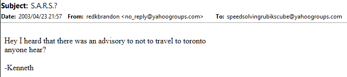
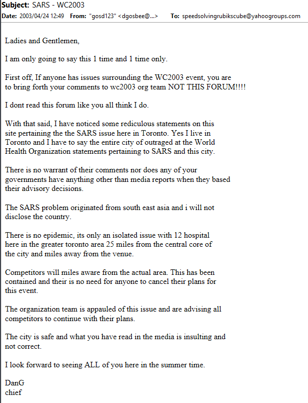
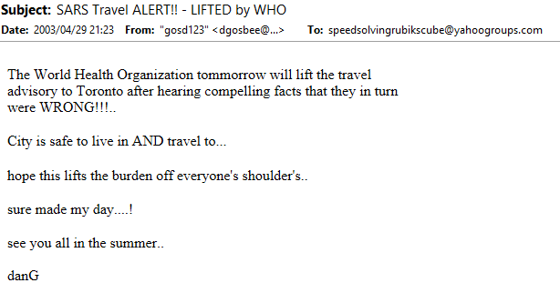

On the first day of the competition, Dan Knights achieved the fastest solving time of 16.71. This was also the first official world record since Minh Thai’s 22.95 set in 1982. On the second day of the competition, Jess Bonde achieved a time of 16.53, making it the fastest time of the competition and the new world record.

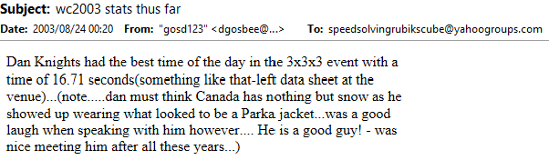
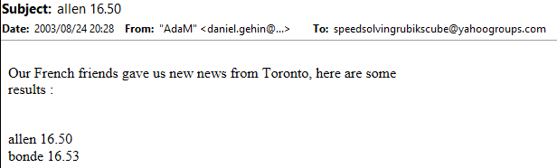

Also on the second day of the competition, David Allen set a time of 16.50. This would have been the world record, making it the second world record using Corners First, since Allen is a Corners First solver. However, it was deemed that the timer malfunctioned and Allen was assigned a time of 16.99 based on a video review.

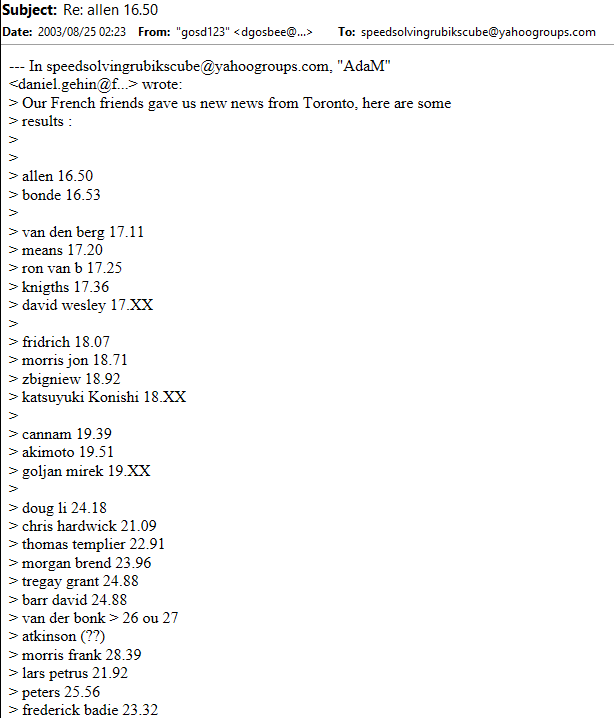
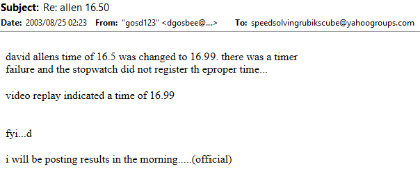

The regulations of the competition can be viewed on the <a href="https://web.archive.org/web/20030215105407/http://www.rubikswc2003.com/pages/812665/index.htm">website</a> that was set up just for the event.

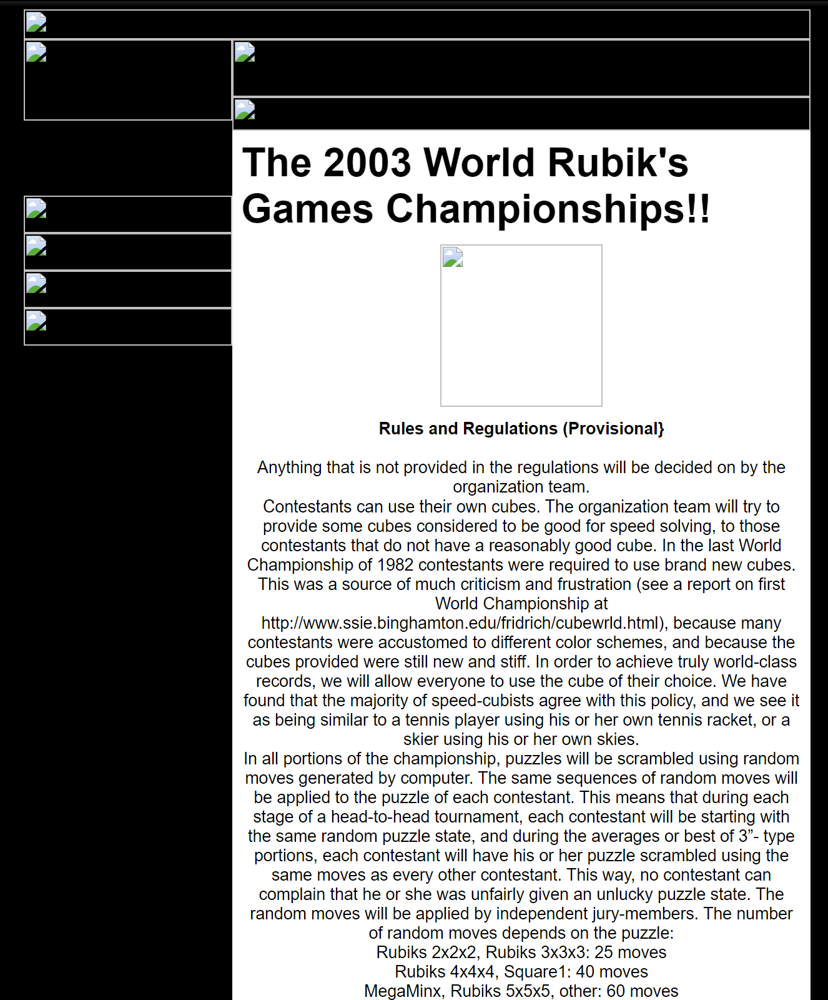

## 15.07 and 14.76 (Shotaro Makisumi)

At Caltech Winter 2004, Shotaro Makisumi started off the competition with a first solve of 15.07 seconds, a new world record. In the third round of 3x3 and in Makisumi’s final solve, another world record was set at 14.76 seconds.

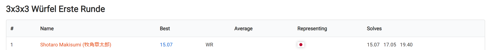
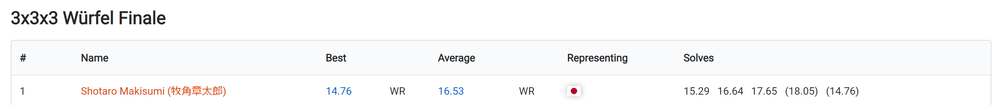

https://www.worldcubeassociation.org/competitions/CaltechWinter2004/results/all?event=333

## 13.93 and 12.11 (Shotaro Makisumi)

<AnimCube params="config=../../ReconstructionConfig.txt&move={Scramble: B R D2 F2 R F2 U D F2 R2 L2 D' U' R2 U2 F' L' B2 F R U2 R' B F U2}{Inspection: z2 y'}z2 y'.{Cross: R F R U' R}R F R U' R.{First Pair: R' U2 R2 U R'}R' U2 R2 U R'.{Second Pair: d R U' R' U2 F' U' F}d R U' R' U2 F' U' F.{Third Pair: L' U' L2 U L'}L' U' L2 U L'.{Fourth Pair: U L' U L}U L' U L.{OLL: y2 F R U R' U' F'}y2 F R U R' U' F'.{PLL: U y R B' R F2 R' B R F2 R2}U y R B' R F2 R' B R F2 R2&initmove=B R D2 F2 R F2 U D F2 R2 L2 D' U' R2 U2 F' L' B2 F R U2 R' B F U2" width="600px" height="400px" />

**12.11 second solve by Shotaro Makisumi**
| **Method** | **Cube** | **Time** | **STM** | **STPS** | **ETM** | **ETPS** |
|------|------|----|-----|------|-----|------|
| CFOP | Unknown | 12.11 | 43 | 3.55 | 47 | 3.88 |

At Caltech Spring 2004, Makisumi set a record of 13.93 seconds during the first round. In the third round, Makisumi set yet another world record of 12.11 seconds.

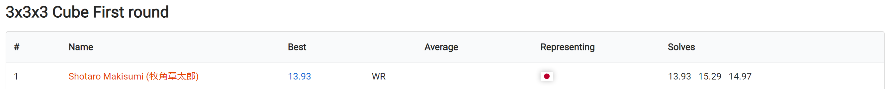
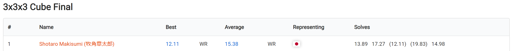

## 11.75 to 10.36

<AnimCube params="config=../../ReconstructionConfig.txt&initmove=D2 L D2 U2 F' U R2 B L R' B2 L F' L R D' U2&move={Scramble: D2 L D2 U2 F' U R2 B L R' B2 L F' L R D' U2}{Inspection: y2}y2.{Cross: r U x' U R' U R' z2 y' D2'}r U x' U R' U R' z2 y' D2'.{1st pair: U R' U' R2 U R'}U R' U' R2 U R'.{2nd pair: U' y' U' R U' R' U2 R U' R'}U' y' U' R U' R' U2 R U' R'.{3rd pair: U y R' U2 R U R' U' R}U y R' U2 R U R' U' R.{4th pair: U' y U' R' U R U' R' U' R}U' y U' R' U R U' R' U' R.{OLL: U' R' U' R' F R F' U R}U' R' U' R' F R F' U R.{PLL: R U R' U' R' F R2 U' R' U' R U R' F'}R U R' U' R' F R2 U' R' U' R U R' F'" width="600px" height="400px" />

**11.75 second solve by Jean Pons**
| **Method** | **Cube** | **Time** | **STM** | **STPS** | **ETM** | **ETPS** |
|------|------|----|-----|------|-----|------|
| CFOP | Unknown | 11.75 | 62 | 5.28 | 69 | 5.87 |

From October 2005 to February 2007, the world record single was reduced to 10.36. The starting point was the first sub-12 single at 11.75 accomplished by Jean Pons. This was followed by an 11.13 by Leyan Lo, a 10.48 by Toby Mao, and a 10.36 by Edouard Chambon.

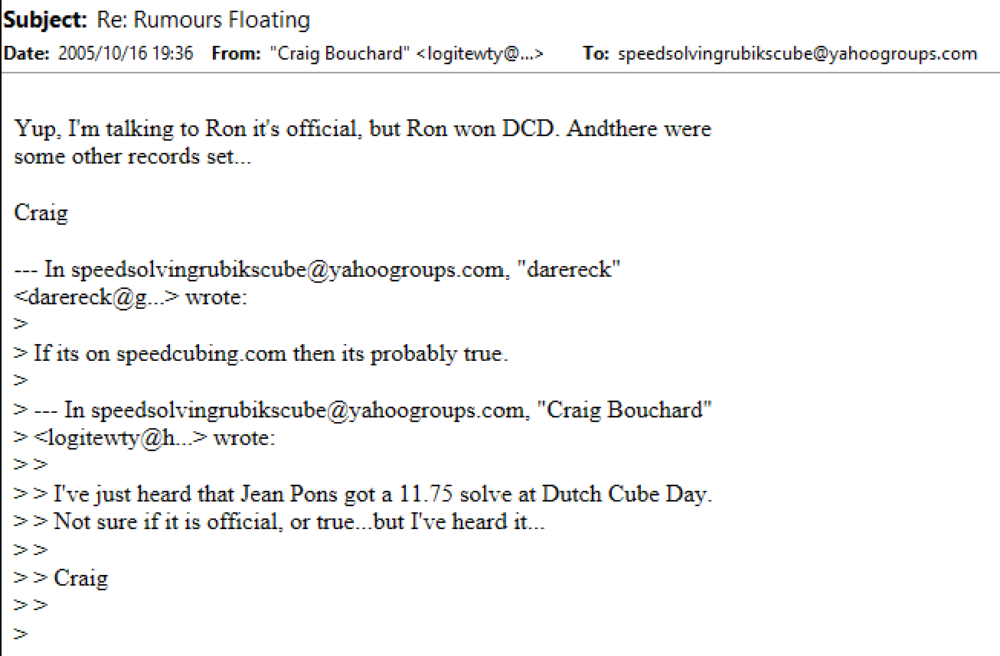

  <iframe loading="lazy" width="100%" height="100%"
    src="https://www.youtube.com/embed/2BcxVZvIxTI"
    frameborder="0" allowfullscreen
    style={{position: 'absolute', top: 0, left: 0}}>
  </iframe>

  <iframe loading="lazy" width="100%" height="100%"
    src="https://www.youtube.com/embed/uNBFGl7ErJE"
    frameborder="0" allowfullscreen
    style={{position: 'absolute', top: 0, left: 0}}>
  </iframe>

  <iframe loading="lazy" width="100%" height="100%"
    src="https://www.youtube.com/embed/zHTuvB9Vm9s"
    frameborder="0" allowfullscreen
    style={{position: 'absolute', top: 0, left: 0}}>
  </iframe>

  <iframe loading="lazy" width="100%" height="100%"
    src="https://www.youtube.com/embed/WpqYc_P51N4"
    frameborder="0" allowfullscreen
    style={{position: 'absolute', top: 0, left: 0}}>
  </iframe>

## 9.86 (Thibaut Jacquinot)

On May 5 2007, the first ever sub-10 world record single solve was set by Thibaut Jacquinot with a time of 9.86 seconds. This record was set at the Spanish Open 2007. At a separate competition that occurred on the same day, the Caltech Discovery Spring Competition 2007, Dan Dzoan set a time of 10.08 seconds. This would have been a world record. The two record times spawned a long discussion on the Speed Solving Rubik’s Cube Yahoo! group about how the situation should be handled. After considering the time zones, it was eventually determined that the 9.86 second solve was set prior to the 10.08 second solve. This settled the debate as to whether the 10.08 should be recorded as a separate world record occurring before the 9.86.

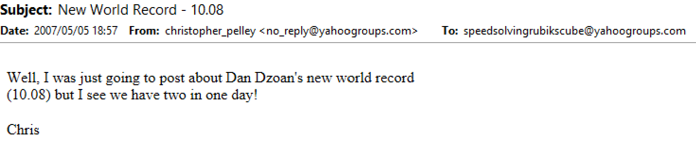
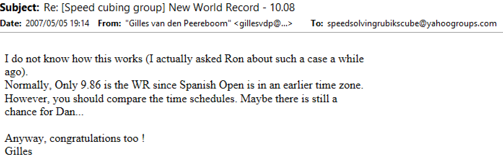
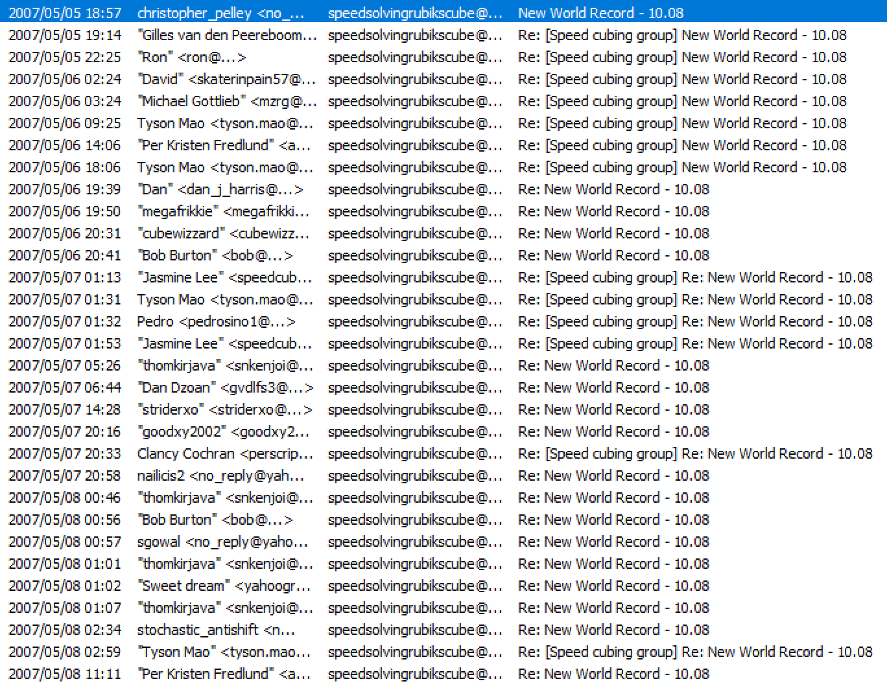
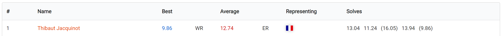
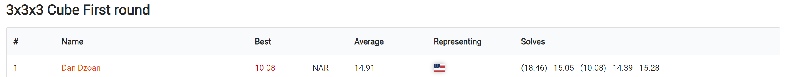

## 9.77 to 8.72

<AnimCube params="config=../../ReconstructionConfig.txt&initmove=R' F' L' F U' D2 R D' L' U2 B2 D' F2 L' U' F' B2 L2&move={Scramble: R' F' L' F U' D2 R D' L' U2 B2 D' F2 L' U' F' B2 L2}{Cross: u' R' F l' L D2 x' u'}u' R' F l' L D2 x' u'.{1st pair: y U' R U R' d' R' U' R}y U' R U R' d' R' U' R.{2nd pair: y U' R' U' R U' R' U R}y U' R' U' R U' R' U R.{3rd pair: y' U R U' R' U' L' U' L}y' U R U' R' U' L' U' L.{4th pair: U' d' L' U L}U' d' L' U L.{PLL: U y R2 U R U R' U' R' U' R' U R'}U y R2 U R U R' U' R' U' R' U R'" width="600px" height="400px" />

**8.72 second solve by Yu Nakajima**
| **Method** | **Cube** | **Time** | **STM** | **STPS** | **ETM** | **ETPS** |
|------|------|----|-----|------|-----|------|
| CFOP | Rubik's DIY | 8.72 | 48 | 5.50 | 53 | 6.08 |

The world record was further reduced to 8.87 seconds from October 2007 to May 2008. This started with a 9.77 from Erik Akkersdijk and was followed by a 9.55 by Ron van Bruchem, a 9.18 by Edouard Chambon, and two 8.72 solves by Yu Nakajima at a single competition in the final two rounds.

  <iframe loading="lazy" width="100%" height="100%"
    src="https://www.youtube.com/embed/JqFFXs0RAnI"
    frameborder="0" allowfullscreen
    style={{position: 'absolute', top: 0, left: 0}}>
  </iframe>

  <iframe loading="lazy" width="100%" height="100%"
    src="https://www.youtube.com/embed/PLOT1Z_c1Dc"
    frameborder="0" allowfullscreen
    style={{position: 'absolute', top: 0, left: 0}}>
  </iframe>

  <iframe loading="lazy" width="100%" height="100%"
    src="https://www.youtube.com/embed/J25n7OOdnMI"
    frameborder="0" allowfullscreen
    style={{position: 'absolute', top: 0, left: 0}}>
  </iframe>

## 7.08 (Erik Akkersdijk)

<AnimCube params="config=../../ReconstructionConfig.txt&initmove=D' R2 D L2 B2 L2 D' R2 F' L2 R' F D F' D' L' U2 F' R&move={Scramble: D' R2 D L2 B2 L2 D' R2 F' L2 R' F D F' D' L' U2 F' R}{Cross: y' x U' R2 x' U R' u}y' x U' R2 x' U R' u.{1st pair: U' R U' R'}U' R U' R'.{2nd pair: U' y' R U2 R' U' R U R'}U' y' R U2 R' U' R U R'.{3rd pair: L' U L2 U' L'}L' U L2 U' L'.{4th pair: U L' U2 L U' L' U L U'}U L' U2 L U' L' U L U'.{OLL: U' F R U R' U' R U R' U' F' U2}U' F R U R' U' R U R' U' F' U2" width="600px" height="400px" />

**7.08 second solve by Erik Akkersdijk**
| **Method** | **Cube** | **Time** | **STM** | **STPS** | **ETM** | **ETPS** |
|------|------|----|-----|------|-----|------|
| CFOP | Rubik's DIY Core, Type B Cubies | 7.08 | 43 | 6.07 | 47 | 6.64 |

On July 12, 2008, Erik Akkersdijk set a world record of 7.08 seconds. This is one of the most famous world records due to the large solve time drop compared to the previous world record.

  <iframe loading="lazy" width="100%" height="100%"
    src="https://www.youtube.com/embed/VzGjbjUPVUo"
    frameborder="0" allowfullscreen
    style={{position: 'absolute', top: 0, left: 0}}>
  </iframe>

## 7.03 to 5.66 (Feliks Zemdegs)

<AnimCube params="config=../../ReconstructionConfig.txt&initmove=D2 L2 D2 R2 B' R2 F2 L2 U2 F' R2 U B D U' L' U F' U2 L2 F'&move={Scramble: D2 L2 D2 R2 B' R2 F2 L2 U2 F' R2 U B D U' L' U F' U2 L2 F'}{Inspection: y'}y'.{Xcross: R U' R U y' R' U R D}R U' R U y' R' U R D.{2nd pair: U' y' R' U R U' R' U' R}U' y' R' U R U' R' U' R.{3rd pair: R U R' U2 R U' R'}R U R' U2 R U' R'.{4th pair: L' U L U r' F' r}L' U L U r' F' r.{OLL: U' R' U' F U R U' R' F' R}U' R' U' F U R U' R' F' R.{PLL: R' U R' U' R' U' R' U R U R2 U}R' U R' U' R' U' R' U R U R2 U" width="600px" height="400px" />

**5.66 second solve by Feliks Zemdegs**
| **Method** | **Cube** | **Time** | **STM** | **STPS** | **ETM** | **ETPS** |
|------|------|----|-----|------|-----|------|
| CFOP | Dayan ZhanChi | 5.66 | 52 | 9.19 | 54 | 9.54 |

After standing for almost 2.5 years, the 7.08 world record was beaten on November 13, 2010. At Melbourne Cube Day 2010, Feliks Zemdegs set a single solve world record of 7.03 seconds. This marked the start of Zemdegs’ long run of dominance and barrier breaking.

The 7.03 was followed by a 6.77, two 6.65 second solves, a 6.24, a 6.18, and a 5.66. These records were set over a seven month period from November 2010 to June 2011.

Interestingly, when the 7.08 world record was set, Zemdegs commented that he didn’t think that a faster solve could be achieved in competition unless it was a very lucky solve [4]. Zemdegs then went on to break the record numerous times.

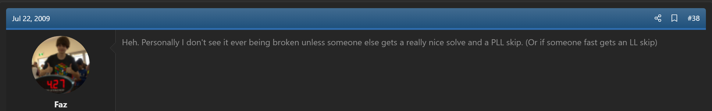

  <iframe loading="lazy" width="100%" height="100%"
    src="https://www.youtube.com/embed/TiFwEBUKcsY"
    frameborder="0" allowfullscreen
    style={{position: 'absolute', top: 0, left: 0}}>
  </iframe>

  <iframe loading="lazy" width="100%" height="100%"
    src="https://www.youtube.com/embed/t32VQ2HeELA"
    frameborder="0" allowfullscreen
    style={{position: 'absolute', top: 0, left: 0}}>
  </iframe>

  <iframe loading="lazy" width="100%" height="100%"
    src="https://www.youtube.com/embed/Vn_-253xO4s"
    frameborder="0" allowfullscreen
    style={{position: 'absolute', top: 0, left: 0}}>
  </iframe>

  <iframe loading="lazy" width="100%" height="100%"
    src="https://www.youtube.com/embed/X6zjv-PP24g"
    frameborder="0" allowfullscreen
    style={{position: 'absolute', top: 0, left: 0}}>
  </iframe>

  <iframe loading="lazy" width="100%" height="100%"
    src="https://www.youtube.com/embed/wIvHw17vuGU"
    frameborder="0" allowfullscreen
    style={{position: 'absolute', top: 0, left: 0}}>
  </iframe>

  <iframe loading="lazy" width="100%" height="100%"
    src="https://www.youtube.com/embed/uIcbAsoT8y0"
    frameborder="0" allowfullscreen
    style={{position: 'absolute', top: 0, left: 0}}>
  </iframe>

  <iframe loading="lazy" width="100%" height="100%"
    src="https://www.youtube.com/embed/3v_Km6cv6DU"
    frameborder="0" allowfullscreen
    style={{position: 'absolute', top: 0, left: 0}}>
  </iframe>

## 5.55 (Mats Valk) and 5.25 (Collin Burns)

<AnimCube params="config=../../ReconstructionConfig.txt&initmove=U2 R2 U B2 L2 R2 U2 F2 U' F R2 B2 R2 U' L' D2 U' R F2 L2&move={Scramble: U2 R2 U B2 L2 R2 U2 F2 U' F R2 B2 R2 U' L' D2 U' R F2 L2}{Inspection: x2}x2.{Cross: F' R D L' D2'}F' R D L' D2'.{1st pair: R U' R' U' L' U' L}R U' R' U' L' U' L.{2nd pair: U L U' L'}U L U' L'.{3rd pair: R' U' U' R U' U' R' U R}R' U' U' R U' U' R' U R.{4th pair: U' R U R'}U' R U R'.{OLL(CP): U' U R' F R U R U' R2 F' R2 U' R' U R U R'}U' U R' F R U R U' R2 F' R2 U' R' U R U R'" width="600px" height="400px" />

**5.25 second solve by Collin Burns**
| **Method** | **Cube** | **Time** | **STM** | **STPS** | **ETM** | **ETPS** |
|------|------|----|-----|------|-----|------|
| CFOP | Yuxin 3x3 | 5.25 | 46 | 8.76 | 46 | 8.76 |

The 5.66 world record from Zemdegs stood for almost two years before being broken. On March 2, 2013, Mats Valk achieved a new world record time of 5.55 seconds. This was followed by a 5.25 second solve from Collin Burns on April 25, 2015.

  <iframe loading="lazy" width="100%" height="100%"
    src="https://www.youtube.com/embed/nn7svkdrE7I"
    frameborder="0" allowfullscreen
    style={{position: 'absolute', top: 0, left: 0}}>
  </iframe>

  <iframe loading="lazy" width="100%" height="100%"
    src="https://www.youtube.com/embed/i8RBl7NmL8g"
    frameborder="0" allowfullscreen
    style={{position: 'absolute', top: 0, left: 0}}>
  </iframe>

## 4.90 (Lucas Etter)

<AnimCube params="config=../../ReconstructionConfig.txt&initmove=R2 B D2 F2 U2 R D2 L' B L' B D R' F' U B2 F L&move={Scramble: R2 B D2 F2 U2 R D2 L' B L' B D R' F' U B2 F L}{Inspection: z2}z2.{Cross: D' L' R' F R D2'}D' L' R' F R D2'.{1st pair: U2 L' U' L}U2 L' U' L.{2nd pair: U' U' U' F' U' F U R U' R'}U' U' U' F' U' F U R U' R'.{3rd pair: y R U R'}y R U R'.{4th pair: U' y U' U' R U R'}U' y U' U' R U R'.{OLL(CP): U r U r' R U R' U' r U' r'}U r U r' R U R' U' r U' r'" width="600px" height="400px" />

**4.90 second solve by Lucas Etter**
| **Method** | **Cube** | **Time** | **STM** | **STPS** | **ETM** | **ETPS** |
|------|------|----|-----|------|-----|------|
| CFOP | Moyu Aolong v2 | 4.90 | 40 | 8.16 | 42 | 8.57 |

On November 21, 2015, the first ever sub-5 second official solve was achieved. This world record was set by Lucas Etter.

  <iframe loading="lazy" width="100%" height="100%"
    src="https://www.youtube.com/embed/vh0W8E4cNkQ"
    frameborder="0" allowfullscreen
    style={{position: 'absolute', top: 0, left: 0}}>
  </iframe>

## 4.73 to 4.22

<AnimCube params="config=../../ReconstructionConfig.txt&initmove=R2 L' F2 D2 F' D L2 B' D L U B2 U B2 D2 L2 D' F2 D&move={Scramble: R2 L' F2 D2 F' D L2 B' D L U B2 U B2 D2 L2 D' F2 D}{Xcross: F' R' D' R y R U' R' u'}F' R' D' R y R U' R' u'.{2nd pair: U' R U R'}U' R U R'.{3rd pair: y' L' U2 L U' L' U L}y' L' U2 L U' L' U L.{4th pair: d U R' U' R U R' U' R}d U R' U' R U R' U' R.{OLL(CP): U' R U2' R' R' F R F' R U2' R'}U' R U2' R' R' F R F' R U2' R'" width="600px" height="400px" />

**4.22 second solve by Feliks Zemdegs**
| **Method** | **Cube** | **Time** | **STM** | **STPS** | **ETM** | **ETPS** |
|------|------|----|-----|------|-----|------|
| CFOP | Angstrom Gan Air SM | 4.22 | 35 | 8.29 | 37 | 8.77 |

From December 2016 to May 2018, the world record was dropped to 4.22 seconds. Starting it off was Zemdegs with a 4.73 second solve, just .01 seconds faster than the world record at the time. This was the return of Zemdegs to the single solve world records, having not set one in around five and a half years.

  <iframe loading="lazy" width="100%" height="100%"
    src="https://www.youtube.com/embed/R07JiT0PlcE"
    frameborder="0" allowfullscreen
    style={{position: 'absolute', top: 0, left: 0}}>
  </iframe>

Ten months later, on September 2, 2017, Patrick Ponce achieved a world record of 4.69 seconds. This was followed by SeungBeom Cho in October 2017 with a 4.59 second solve. In early 2018, Zemdegs returned yet again to the single solve world records, first matching the 4.59 second record in January then a 4.22 in May.

  <iframe loading="lazy" width="100%" height="100%"
    src="https://www.youtube.com/embed/np2G0yr5xI0"
    frameborder="0" allowfullscreen
    style={{position: 'absolute', top: 0, left: 0}}>
  </iframe>

  <iframe loading="lazy" width="100%" height="100%"
    src="https://www.youtube.com/embed/5x8jgGX3iNM"
    frameborder="0" allowfullscreen
    style={{position: 'absolute', top: 0, left: 0}}>
  </iframe>

  <iframe loading="lazy" width="100%" height="100%"
    src="https://www.youtube.com/embed/Sz67ipXnKNg"
    frameborder="0" allowfullscreen
    style={{position: 'absolute', top: 0, left: 0}}>
  </iframe>

  <iframe loading="lazy" width="100%" height="100%"
    src="https://www.youtube.com/embed/NevGDFBfQGw"
    frameborder="0" allowfullscreen
    style={{position: 'absolute', top: 0, left: 0}}>
  </iframe>

## 3.47 (Yusheng Du)

<AnimCube params="config=../../ReconstructionConfig.txt&initmove=F U2 L2 B2 F' U L2 U R2 D2 L' B L2 B' R2 U2&move={Scramble: F U2 L2 B2 F' U L2 U R2 D2 L' B L2 B' R2 U2}{Inspection: y x'}y x'.{Xcross: U R2 U' F' L F' L'}U R2 U' F' L F' L'.{2nd pair: L U' L'}L U' L'.{3rd pair: U' R U R'}U' R U R'.{4th pair: R' U R U' U' R' U R}R' U R U' U' R' U R.{OLL(CP): U R' U' R U' R' U2 R}U R' U' R U' R' U2 R U" width="600px" height="400px" />

**3.47 second solve by Yusheng Du**
| **Method** | **Cube** | **Time** | **STM** | **STPS** | **ETM** | **ETPS** |
|------|------|----|-----|------|-----|------|
| CFOP | MoYu Weilong GTS2M | 3.47 | 31 | 8.93 | 31 | 8.93 |

On November 24, 2018, Yusheng Du set a new world record of 3.47 seconds. This record is notable not only for its large solve time drop compared to the previous world record, but also for how long it stood. It took over five and a half years for it to be broken.

The length that the world record stood can potentially be attributed to the impact of COVID on the number of competitions held. Prior to the 3.47 world record and up through 2019, the number of competitions was on a large upward trajectory. The number of competitions for each year was: 2016 (679), 2017 (924), 2018 (1154), 2019 (1328). In 2020, the year when the world started taking measures against COVID, there were just 240 competitions held and 242 in 2021. 2022 marked a return to the normal volume of competitions with 1,082, and 2,135 in 2023.

The solve was also the subject of some controversy. Yusheng Du’s averages at the competition over three rounds were: [11.13 (3.47) 8.80 (DNF) 7.07], [(6.95) 7.72 8.20 (10.43) 9.62], and [(8.01) 8.84 8.42 (11.02) 9.44]. The 3.47 solve was viewed as extremely low compared to the remainder of the solves within the averages. The footage of the solve was also of low quality. These aspects led some to doubt the authenticity of the solve [5].

  <iframe loading="lazy" width="100%" height="100%"
    src="https://www.youtube.com/embed/SB3ut65SFUU"
    frameborder="0" allowfullscreen
    style={{position: 'absolute', top: 0, left: 0}}>
  </iframe>

## 3.13 (Max Park)

<AnimCube params="config=../../ReconstructionConfig.txt&initmove=D U F2' L2 U' B2 F2 D L2 U R' F' D R' F' U L D' F' D R2&move={Scramble: D U F2' L2 U' B2 F2 D L2 U R' F' D R' F' U L D' F' D R2}{Inspection: x2}x2.{Xxcross: R' D D R' D L' U L D R' U' R D}R' D D R' D L' U L D R' U' R D.{3rd pair: L U' L'}L U' L'.{4th pair: U' R U R' d R' U' R}U' R U R' d R' U' R.{OLL(CP): r' U' R U' R' U U r U}r' U' R U' R' U U r U" width="600px" height="400px" />

**3.13 second solve by Max Park**
| **Method** | **Cube** | **Time** | **STM** | **STPS** | **ETM** | **ETPS** |
|------|------|----|-----|------|-----|------|
| CFOP | Tornado V3 | 3.13 | 33 | 10.54 | 33 | 10.54 |

The world record was finally beaten again on June 11, 2023. After years of attaining world records in the 3x3 2H average category and in other events, Max Park set a world record single solve time of 3.13 seconds.

  <iframe loading="lazy" width="100%" height="100%"
    src="https://www.youtube.com/embed/gh8HX4itF_w"
    frameborder="0" allowfullscreen
    style={{position: 'absolute', top: 0, left: 0}}>
  </iframe>

## Sources

https://www.worldcubeassociation.org/

https://alg.garron.us/solves/

https://www.cubedb.net/

http://cubesolv.es/?query=Feliks+Zemdegs

https://www.reddit.com/r/Cubers/comments/i9gez/566_single_wr_feliks_zemdegs/

## References

[1] "Rubikmania: Lots of New Twists," Newsweek, vol. 19, p. April, 1982.

[2] M. Thai, "Issue 1," Cubic Circular, 1982. [Online]. Available: https://www.jaapsch.net/puzzles/cubic3.htm#p4.

[3] R. Laue, "Rubik's Cube World Records," recordholders.org, 2000. [Online]. Available: https://web.archive.org/web/20021211215840/http://www.recordholders.org/en/list/rubik.html.

[4] F. Zemdegs, "[WR] 7.08 3x3x3 single Erik Akkersdijk," speedsolving.com, 22 July 2009. [Online]. Available: https://www.speedsolving.com/threads/7-08-3x3x3-single-erik-akkersdijk.5179/post-211541.

[5] Various, "[WR] Yusheng Du - 3.47 3×3 single," speedsolving.com, November 2018. [Online]. Available: https://www.speedsolving.com/threads/yusheng-du-3-47-3%C3%973-single.71715/.
