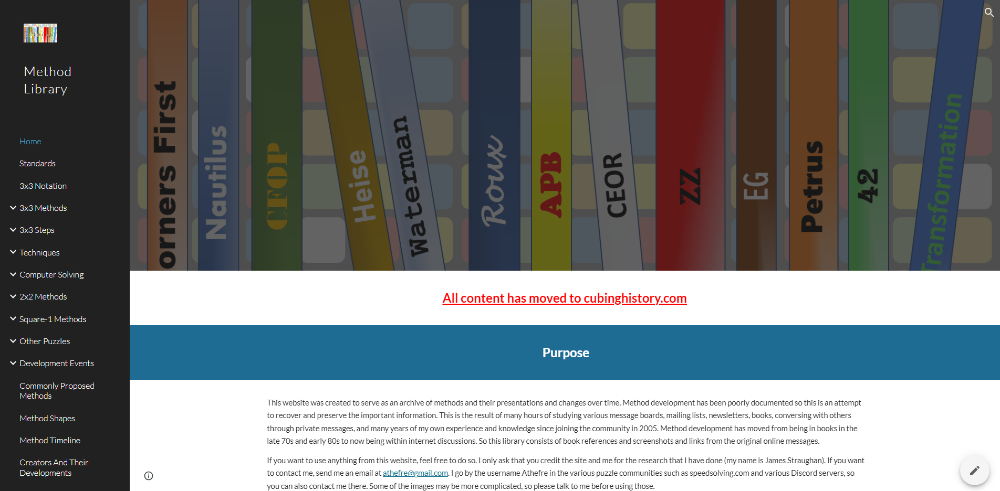

# Cubing History

## Purpose

This website was created to serve as an archive of Rubiks' Cube history - including world records, solving methods, hardware, and more - as well as the history of other puzzles such as Megaminx, Pyraminx, Skewb, Square-1, FTO, 2x2, and big cubes. The history of the community has been poorly documented so this is an attempt to recover and preserve everyone's contributions. Information has been compiled from various message boards, mailing lists, newsletters, books, conversing with others through private messages, and many years of my own experience and knowledge since joining the community in 2005. All content on the site is original research starting from the very beginning of each subject. Nothing is taken from any wiki pages or similar sources.

If you would like to support the hard work behind this project, a donation link is provided at the top of the page or click <a href="https://www.paypal.com/donate/?hosted_button_id=4TMHMJNVB62YY">here</a> if on mobile. This website is the result of hundreds of hours of research, writing, and website development.

If you want to use information from this website, I would love to work with you. Send me an email at athefre@gmail.com or contact me on one of the various puzzle communities such as speedsolving.com or Discord. My username everywhere is Athefre. My real name is Michael James Straughan.

[Visit my personal website to see my method developments](https://sites.google.com/site/athefre)

## Major Historical Discoveries

Below are some of the historical discoveries that have been uncovered while building Cubing History.

- The origin of the F2L pair technique. Many thought that it was from René Schoof because he was credited in the September 1981 issue of Cubism For Fun. But there are several publications of the technique before then. The earliest known publication is by John Conway, David Benson, and David Seal in 1979 that included a complete table of every possible case. It also did PLL then OLL as the last layer method.
- Cross and the Layer By Layer method is first known to be published by Donald Taylor, in 1978. The puzzle community believed that the method originated in David Singmaster's _Notes on Rubik's 'Magic Cube'_. However, _Notes_ was published starting in 1979 and Singmaster states in _Notes_ that he had heard of the cross and layer method from others and changed his method to his own version of that.
- The various parts of the standard 3x3 notation were created by several people. The U, D, L, R, F, B outer turn notation, the apostrophe for inverse, and the 2 for double turns are attributed to Singmaster. Rotations, wide turns, and other parts of the notation were created by other people.
- The earliest known published Corners First and Edges First methods. One of the early Edges First methods was published by Zoltán Perjés, a relative of Ernő Rubik.

## Cubing History Standards

### Attribution

When providing credit for a contribution, Cubing History follows a set of attribution standards:

- **Substantial Contribution:** Creation or proposal credit goes to the person or group who both had the idea and significantly contributed to its development. If the idea had already been proposed by others, but abandoned or not pursued, credit goes to the person or group who developed it.

- **Early Suggestion:** If a person or group simply mentioned an idea and didn't follow it up with development effort, credit isn't given as a creator or proposer. However, these early suggestions are still provided as an interesting part of history.

There are some grey areas. Someone may have suggested the idea first and partially developed it. Or someone may have independently fully developed an idea without knowledge that the idea already existed and was fully developed. In these cases, a community consensus is followed.

One example is the ZZ method. The method has a complicated history. Essentially, the idea goes back to Gilles Roux and Adam Géhin, made its way to Ryan Heise, then Ron van Bruchem, and, finally, Zbignew Zborowski. Even though four people prior to Zborowski had experimented with the idea, and Zborowski seemingly got the idea of EOLine from Bruchem, credit for the proposal and creation is given to Zborowski. This is because Zborowski is the first to show confidence in the idea and to develop it, going as far as creating a detailed website and promoting it.

### Classification

Method classification has been an evolving subject. When the cube was first introduced, the three primary methods were Corners First, Edges First, and Layer By Layer. Every small difference in the steps of each was cause for it to be a completely different method. Now the community consensus is that the various ways of solving the edges in Corners First or the last layer in Layer By Layer are minor variants of those methods.

Cubing History follows a classification standard based on the modern development community opinion. Minor changes to a method most often result in a variant of that method. A major example is last slot methods. MGLS, ZB, and others used to be considered full methods of their own. However, in recent years, the development community opinion has shifted toward classifying such systems as last slot and last layer variants or steps. Simplified, they are referred to as LSLL methods. It makes sense to consider them variants or steps not only because they are minor alterations, but also because they can be used in other methods that end with a final corner and edge pair slot.

## Cubing History Origin

Since I joined the community, I have always been interested in method development. From the very beginning I was trying out others' methods, developing my own methods, and updating the SpeedSolving.com wiki with the origins of methods. In May of 2020 I decided to start working on a timeline that covers the history of method development. That simple idea, and the subsequent research, turned into a 47 page Microsoft Word document full of notes, links, and ideas. I decided that all of that content would be great to have in book form. I started structuring and writing the book and created a website on Google Sites just as a way to organize my resources for the book. I then realized that the website would be exactly what the community needed as a way to view the history of methods. This resulted in a website called the [Method Library](https://sites.google.com/view/methodlibrary). Over time the site expanded to include more than just the history of methods. In 2024 I moved that website to a custom domain, cubinghistory.com, that covers the history of every aspect of cubing.

## Credit

- Thanks to crystalcuber for assisting with numerous things to get the site looking the way it does:

  - Recommended Docusaurus for the site.
  - Helped fix problems during the setup process.
  - Set up AnimCubeJS and Twisty Player on the site to allow cube applets to be used.
  - Got archive html links working. This allowed for linking to html pages of old websites that are now stored here.

- Georges Helm: Has been kind enough to look through the books that he owns and confirm my suspicions and provide me details. Helm sent me a lot of information and hand written descriptions of the steps within numerous books. Some of this information changed the history that was previously thought, especially as it relates to Layer By Layer and CFOP.

- Ron van Bruchem: Has been very helpful in providing information about early method development and locating information in the books that he owns.

- Michael Feather: Provided assistance ensuring proper functionality of AnimCubeJS.

- Tadeáš Miler: Gave ideas to take full advantage of AnimCubeJS features.

- James Macdiarmid: Provided a detailed summary of blindfold solving methods and techniques. This aided greatly in finding the starting points amd making the connections for research. Without Macdiarmid's help it would have taken much longer to include the blindfold solving section, and may not have been as accurate with regard to how each method and technique works.

- Others have been very willing to explain the origin of their own developments. Each person is credited on the site in the area in which they provided help.
